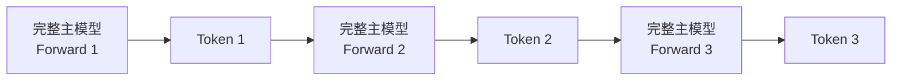
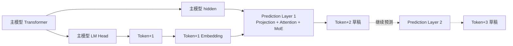
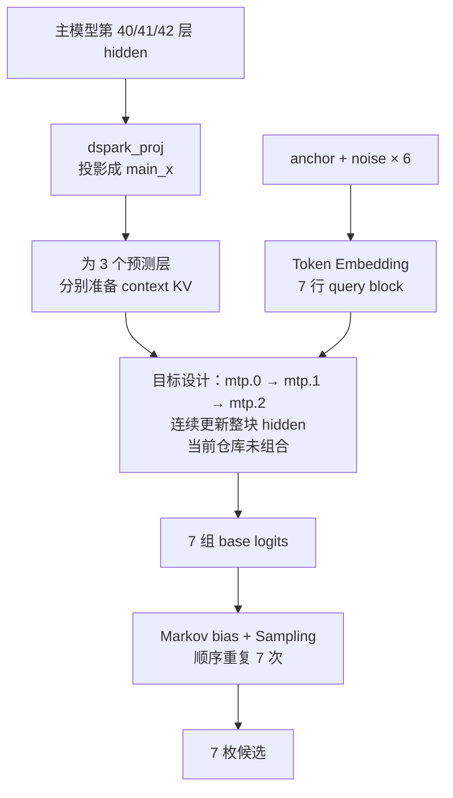
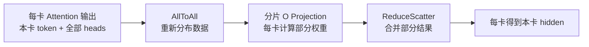

# 从 MTP 到 DSpark：DeepSeek 推测解码原理解析

> 归档日期：2026-09-15。来源：`pypto-lib/local_archive/20260817-main-cleanup/docs/models/deepseek_v4_flash_mtp_to_dspark_tp4.md`。
> 原文的实现、测量与计划保留其历史语境；阅读说明见[学习资料索引](../README.md)。

> 结合当前 PyPTO 的 V4-Flash 适配代码，重点说明 MTP(Multi-Token Prediction)  和 DSpark 的关系，以及 DSpark 为什么会带来现在这套 TP(Tensor Parallelism) 数据流。

## 今天主要回答两个问题

```text
MTP和 DSpark 到底是什么关系？
        │
        ▼
DSpark 为什么会带来现在这套 TP 数据流？
```

|   时间 | 内容               | 重点关注           |
| -----: | ------------------ | ---------------------------- |
|  5 min | 普通 Decode        | 为什么需要推测解码           |
|  8 min | MTP-1              | PyPTO 现有闭环是怎么跑起来的 |
| 10 min | 从 MTP-1 到 DSpark | DSpark 相比 MTP-1 改了什么   |
|  5 min | DSpark TP          | 512 行验证计算怎么拆到 TP4   |
|  2 min | 总结               | 从模型能力落到框架实现       |

> **可以先把三者放在不同层面理解：MTP 解决“怎么预测更多”，DSpark 解决“怎么利用这些预测”，TP 解决“这套计算怎么在多卡上高效执行”。**

---

## 1 · 从普通 Decode 说起：为什么需要推测解码？

### 自回归 Decode：前一个 token 出来后，才能继续下一个



普通 Decode 是严格自回归的：前一个 token 出来以后，下一轮才能继续。对我们现在这套 V4-Flash 来说，一次 target model forward 要过 43 层，而一轮通常只往前推进一个 token。

所以这里真正贵的是：**为了提交一个新 token，需要再跑一轮 target model。**

### 推测解码想做什么？

```text
普通 Decode：  1 次 target forward → 1 token
推测解码：     1 次 target forward → 尽可能提交多个 token
```

要做到这一点，前提是先有人把后面几个位置“猜”出来，再由 target model 一次性验证。MTP 和 DSpark 就从这里接上。

### 对应到当前代码：一次完整主模型 Forward 是什么？

```text
FWD_NUM_LAYERS = 43
        │
        ▼
decode_fwd_inline：执行 43 层主模型
        │
        ▼
HC Head → RMSNorm → LM Head → Sampling
```

当前 MTP-1 目录中保留了一条完整的 target model Decode：配置明确为
[43 层](https://github.com/hw-native-sys/pypto-lib/blob/c9ec1d9836ae647a6de36fc4a4500ed2507abb7c/models/deepseek_v4_flash_mtp/decode_fwd.py#L123-L131)，
[`decode_fwd_inline`](https://github.com/hw-native-sys/pypto-lib/blob/c9ec1d9836ae647a6de36fc4a4500ed2507abb7c/models/deepseek_v4_flash_mtp/decode_fwd.py#L197-L230)
展开主模型计算，最后进入
[HC Head、RMSNorm 和 LM Head Sampling](https://github.com/hw-native-sys/pypto-lib/blob/c9ec1d9836ae647a6de36fc4a4500ed2507abb7c/models/deepseek_v4_flash_mtp/decode_fwd.py#L713-L725)。
普通 Decode 慢，就是因为每提交一枚 token 通常都要重复这条长链。
这里引用它是为了展示完整主模型的计算成本；在当前 MTP-1 闭环中，它实际以
`S = 2` 执行主模型验证，不是一份独立的单 token 性能 baseline。

---

## 2 · MTP-1：先看 PyPTO 现有的推测解码闭环

### MTP 多了一条 Prediction Layer

普通模型由 target model 给出下一 token。MTP 在主模型之外增加额外的 Prediction Layer，让它基于主模型 hidden 和已知 token 继续往后预测。



### 为什么 Prediction Layer 不是简单的 LM Head？

因为更远位置的 token 不能只从同一份 hidden 做一次词表映射得到。Prediction Layer 还会继续做 Projection、Attention、MoE 等计算，再通过 LM Head 得到下一个预测。

### 当前代码落地的是 MTP-1

| 代码事实                                                     | 表达的含义                                                   |
| ------------------------------------------------------------ | ------------------------------------------------------------ |
| [`num_nextn_predict_layers = 1`](https://github.com/hw-native-sys/pypto-lib/blob/c9ec1d9836ae647a6de36fc4a4500ed2507abb7c/models/deepseek_v4_flash_mtp/config.py#L154-L170) | 只配置 1 个额外 Prediction Layer                             |
| [`DECODE_SEQ = 2`](https://github.com/hw-native-sys/pypto-lib/blob/c9ec1d9836ae647a6de36fc4a4500ed2507abb7c/models/deepseek_v4_flash_mtp/config.py#L241-L244) | 主模型每个请求同时处理“已知位置 + 1 枚候选”                  |
| [`verify_and_pack_mtp_tokens`](https://github.com/hw-native-sys/pypto-lib/blob/c9ec1d9836ae647a6de36fc4a4500ed2507abb7c/models/deepseek_v4_flash_mtp/decode_mtp_verify.py#L26-L65) | 比较候选与主模型结果，再打包本轮已提交 token                 |
| [`mtp_decode_layer_inline`](https://github.com/hw-native-sys/pypto-lib/blob/c9ec1d9836ae647a6de36fc4a4500ed2507abb7c/models/deepseek_v4_flash_mtp/decode_mtp.py#L168-L245) | 执行 Embedding/Hidden Projection、Attention、MoE、LM Head，产生下一枚草稿 |

### 当前 MTP-1 已经串成一个设备侧闭环

[`decode_fwd_mtp_l2`](https://github.com/hw-native-sys/pypto-lib/blob/c9ec1d9836ae647a6de36fc4a4500ed2507abb7c/models/deepseek_v4_flash_mtp/decode_fwd_mtp.py#L30-L45)
不是单个叶子算子，它已经按一轮推理的顺序串起主模型、验证、下一枚草稿和状态更新：


代码中先跑主模型、再产生草稿，是因为这是跨调用的流水闭环：本次主模型验证的草稿
由上一次调用产生，本次 Prediction Layer 则为下一次调用准备草稿。

这条调用链可以直接对照
[主模型与验证](https://github.com/hw-native-sys/pypto-lib/blob/c9ec1d9836ae647a6de36fc4a4500ed2507abb7c/models/deepseek_v4_flash_mtp/decode_fwd_mtp.py#L200-L216)、
[Prediction Layer](https://github.com/hw-native-sys/pypto-lib/blob/c9ec1d9836ae647a6de36fc4a4500ed2507abb7c/models/deepseek_v4_flash_mtp/decode_fwd_mtp.py#L217-L294)
以及
[状态更新](https://github.com/hw-native-sys/pypto-lib/blob/c9ec1d9836ae647a6de36fc4a4500ed2507abb7c/models/deepseek_v4_flash_mtp/decode_fwd_mtp.py#L295-L307)。

MTP-1 是最简单的 MTP 形态：它已经证明“候选→主模型验证→提交→再生成下一轮候选”
能在设备侧闭环，也是理解 DSpark 为什么要改成“多 token 候选”的起点。

> **看 MTP-1 时可以抓住这条闭环：上一轮准备 1 枚候选 → target model 验证 → 提交结果 → Prediction Layer 再为下一轮准备 1 枚候选。**

---

## 3 · 从 MTP-1 到 DSpark：变化在哪里？

MTP-1 每轮只向前提出 1 枚候选。DSpark 则会继续向前推测，把后续多个候选组织成一个 candidate block；当前配置 num_speculative_tokens=7，因此最多形成 7 枚候选，再交给 target model 一次性验证。并且希望用尽可能便宜的 draft 计算，得到足够高质量的候选。
### DSpark 的一轮怎么跑


### 为什么一轮可能提交多个 token？

7 枚候选对应连续的未来位置。target model 一次 Forward 给这 8 个位置判分，接受逻辑从前往后比较，遇到第一个不匹配位置就停止。

```text
DSpark 候选： d1  d2  d3  d4  d5  d6  d7
               │   │   │   │   │   │   │
主模型判分：   ✓   ✓   ✓   ✗   ·   ·   ·
               └──────────────► 本轮接受 d1 d2 d3
```

一次接受多少不是固定的：

- 前 3 枚命中，就接受 3 枚；
- 7 枚全部命中，就可以接受完整候选块；
- 第一枚就不匹配，则不能接受后面的候选。

### 直接和当前 MTP-1 对比

|                       | MTP-1                 | DSpark                                    |
| --------------------- | --------------------- | ----------------------------------------- |
| 每轮准备的候选        | 1 枚                  | 最多 7 枚                                 |
| target model 验证宽度 | 2 个位置              | 8 个位置                                  |
| 额外预测部分          | 1 个 Prediction Layer | 目标契约中 `mtp.0/1/2` 三层处理同一个 7 位置候选序列 |
| 框架侧变化            | 单候选闭环            | 候选生成、批量验证、连续前缀接受          |

### DSpark 候选生成的目标设计（当前未完整实现）

下图表示 [issue #935](https://github.com/hw-native-sys/pypto-lib/issues/935) 规定的 DSpark
候选生成模型契约，不表示当前 PyPTO 已经完成整图的顶层串联。其候选生成骨干使用 checkpoint 中
`mtp.0`、`mtp.1`、`mtp.2` 三层权重。三层处理的是同一个7位置候选块，每经过一层，这 7 个位置的 hidden 都会更新一次。



> **代码边界：** `dspark_attention` 已体现“单个预测层一次处理整个 7 行 hidden block”；
> 但当前仓库没有顶层函数把它连续调用三次，并分别绑定 `mtp.0`、`mtp.1`、`mtp.2` 权重。

### 对应到当前代码：已有什么？

| 当前代码                                                     | 已实现的职责                                                 |
| ------------------------------------------------------------ | ------------------------------------------------------------ |
| [DSpark 解码形状](https://github.com/hw-native-sys/pypto-lib/blob/c9ec1d9836ae647a6de36fc4a4500ed2507abb7c/models/deepseek_v4_flash_dspark/config.py#L241-L245) | 64 个请求、7 枚候选，主模型每轮验证 8 个位置                 |
| [`dspark_proj`](https://github.com/hw-native-sys/pypto-lib/blob/c9ec1d9836ae647a6de36fc4a4500ed2507abb7c/models/deepseek_v4_flash_dspark/dspark_proj.py#L25-L65) | 把主模型 3 个目标层的 hidden 拼接结果投影回一份 hidden；这里的 `TARGET_LAYERS = 3` 不是指 3 个预测层 |
| [`dspark_context_kv`](https://github.com/hw-native-sys/pypto-lib/blob/c9ec1d9836ae647a6de36fc4a4500ed2507abb7c/models/deepseek_v4_flash_dspark/dspark_context_kv.py#L49-L85) | 为一个预测层计算并写入 context KV                            |
| [`dspark_attention`](https://github.com/hw-native-sys/pypto-lib/blob/c9ec1d9836ae647a6de36fc4a4500ed2507abb7c/models/deepseek_v4_flash_dspark/dspark_attention.py#L37-L306) | 一次处理每个请求的 7 行 query block，不在层内逐 token 采样   |
| [`markov_head`](https://github.com/hw-native-sys/pypto-lib/blob/c9ec1d9836ae647a6de36fc4a4500ed2507abb7c/models/deepseek_v4_flash_dspark/markov_head.py#L20-L62) | 用已选 token 计算 rank-256 的词表偏置；本函数本身不包含 7 次采样循环 |

### 当前尚未组合的部分

上图是 DSpark 的模型流程，不是当前仓库已有的单个顶层函数。当前代码已经具备表中四类
独立叶子算子，但还没有把以下步骤串成端到端 DSpark Decode：

```text
3 层候选生成骨干 → base logits → 7 次 Markov 偏置/采样
                  → 主模型验证 → 连续前缀接受
```

因此，前面的“DSpark 一轮”和“连续前缀接受”说明的是算法契约；当前 PyPTO
代码还没有一个函数完整实现这个契约。

> **从框架视角看，DSpark 最直接的变化是：target model 的验证宽度从 MTP-1 的 2 个位置变成了 8 个位置。后面的 TP 适配就是从这个 shape 变化开始的。**

---

## 4 · DSpark 到 PyPTO：512 行验证计算怎么拆到 TP4？

### 先明确位置关系：TP 发生在 Target Verify 内部

TP 不是 DSpark 验证之后才发生，而是发生在 DSpark 的 **Target Verify 内部**。
DSpark 生成 7 枚候选后，会把它们交给 target model 一次性验证。当前配置下，
每个请求需要验证 8 个位置，batch 为 64，因此一次 Target Verify 实际处理：

```text
64 requests × 8 positions = 512 token rows
```

这 512 行会进入完整的 43 层 target model forward。TP=4 时，计算首先分布到 4 个 rank，
每卡初始处理 128 行。下面关注的是 **Target Model 每一层 Attention 中
O Projection 的 TP 数据流**：

```text
DSpark 生成 7 枚候选
        │
        ▼
Target Verify：64 × 8 = 512 rows
        │
        ▼
43 层 target model forward
        │
        └── 每一层 Attention 内部：
                512 rows
                   ↓
                TP4：每卡 128 rows
                   ↓
                QKV / Attention
                   ↓
                每卡 128 token × 64 heads × 512 dim
                   ↓
                AllToAll
                   ↓
                O Projection
                   ↓
                ReduceScatter
                   ↓
                每卡 128 token × 4096 hidden
```

> **因此，`AllToAll → O Projection → ReduceScatter` 不是 DSpark 之外额外增加的一步，而是 DSpark Target Verify 在多卡上执行 target model forward 时，其中一段 Attention TP 实现。**

#### O Projection TP 目标数据流



| 环节          | 在当前数据流里为什么需要它                                   |
| ------------- | ------------------------------------------------------------ |
| AllToAll      | 把“本卡 128 行、全部 O group”换成“全部 512 行、本卡 2 个 O group”，让数据和本卡权重分片对齐 |
| O Projection  | 每卡只用自己持有的 2 个 O group 权重，为 512 行计算部分和    |
| ReduceScatter | 四卡部分和求和，同时把结果重新切回每卡 128 行 hidden         |

#### 当前代码如何对应？

形状在
[`decode_o_proj.py`](https://github.com/hw-native-sys/pypto-lib/blob/c9ec1d9836ae647a6de36fc4a4500ed2507abb7c/models/deepseek_v4_flash_dspark/decode_o_proj.py#L24-L50)
中直接展开：512 个全局 token 行被 TP4 分成每卡 128 行，8 个 O Projection
group 被分成每卡 2 组。

| 目标环节          | 当前函数                                                     | 代码中真正做了什么？                                         |
| ----------------- | ------------------------------------------------------------ | ------------------------------------------------------------ |
| AllToAll          | [`attention_token_head_all_to_all_step`](https://github.com/hw-native-sys/pypto-lib/blob/c9ec1d9836ae647a6de36fc4a4500ed2507abb7c/models/deepseek_v4_flash_dspark/decode_o_proj.py#L291-L325) | 每卡把“本卡 token、全部 group”改分布为“全部 token、本卡 2 个 group” |
| 分片 O Projection | [`decode_sharded_o_projection`](https://github.com/hw-native-sys/pypto-lib/blob/c9ec1d9836ae647a6de36fc4a4500ed2507abb7c/models/deepseek_v4_flash_dspark/decode_o_proj.py#L508-L619) | 只用本卡的 2 个权重 group，为 512 行 token 计算一份 FP32 部分和 |
| ReduceScatter     | [`o_projection_reduce_scatter_step`](https://github.com/hw-native-sys/pypto-lib/blob/c9ec1d9836ae647a6de36fc4a4500ed2507abb7c/models/deepseek_v4_flash_dspark/decode_o_proj.py#L328-L361) | 对四卡部分和求和，每卡只取回自己的 128 行 BF16 hidden        |

> **所以这段 TP 代码不是独立出现的：DSpark 把验证宽度扩到 8，带来 512 行 target 计算；AllToAll 和 ReduceScatter 则负责把这批数据和 TP4 的 O Projection 权重布局接起来。**

完整 TP 路径还包括 hidden/KV 收集等环节，例如当前代码中的
[`kv_token_allgather_step`](https://github.com/hw-native-sys/pypto-lib/blob/c9ec1d9836ae647a6de36fc4a4500ed2507abb7c/models/deepseek_v4_flash_dspark/decode_o_proj.py#L261-L288)；
本次分享不展开。

#### 这三段目前还没有高层串起来

当前
[`decode_attention_collectives_fixture`](https://github.com/hw-native-sys/pypto-lib/blob/c9ec1d9836ae647a6de36fc4a4500ed2507abb7c/models/deepseek_v4_flash_dspark/decode_o_proj.py#L364-L392)
会调用 KV AllGather、AllToAll 和 ReduceScatter，但它接收的 `o_partial` 已经是外部准备好的，
中间没有调用分片 O Projection。分片 O Projection 由另一个独立测试验证；而
[主模型 SWA 高层函数](https://github.com/hw-native-sys/pypto-lib/blob/c9ec1d9836ae647a6de36fc4a4500ed2507abb7c/models/deepseek_v4_flash_dspark/decode_sparse_attn_swa.py#L434-L460)
仍直接调用本地完整 O Projection。

所以，这里展示的是目标数据流和已经分别实现的组件，不是一个已完整打通的
`AllToAll → O Projection → ReduceScatter` 高层调用链，更不能将单组件结果当成端到端
DSpark TP4 性能。

---

## 汇总图 · 没有 DSpark 与有 DSpark

Candidate Generation 和 Target Verify 是前后相接的两个阶段，不是两条并行路径。
TP 则位于 Target Verify 的 43 层 target model forward 内部。

```text
              没有 DSpark
                  │
                  ▼
            Target Model
                  │
                  ▼
               1 Token
                  │
                  ▼
            Target Model
                  │
                  ▼
               1 Token


════════════════════════════════════════


                有 DSpark
                   │
       ┌───────────┴────────────┐
       │                        │
       ▼                        ▼
 Candidate Generation      Target Verify
       │                        │
Target hidden                   │
       ↓                        │
dspark_proj                     │
       ↓                        │
Context KV                      │
       ↓                        │
mtp.0→mtp.1→mtp.2               │
       ↓                        │
Markov + Sampling               │
       ↓                        │
  7 candidates ────────────────►│
                                ▼
                      8 positions × batch64
                                ↓
                         512 token rows
                                ↓
                         Target Model
                                │
                         ┌──────┴──────┐
                         │             │
                     Attention       ...
                         │
                         ▼
                    O Projection
                         │
                   AllToAll / RS
                         │
                         ▼
                       Logits
                         │
                         ▼
                    Accept / Reject
                         │
                         ▼
                 一次接受多个 Token
```

> **读图方式：** DSpark 先生成 7 枚候选，再触发一次 512 行 Target Verify；
> `AllToAll → 分片 O Projection → ReduceScatter` 嵌套在这次 Target Verify 的每层 Attention 中。

---

## 最后 2 分钟 · 回到开头的两个问题

| 问题                              | 结论                                                         |
| --------------------------------- | ------------------------------------------------------------ |
| MTP 和 DSpark 什么关系？          | MTP 提供额外预测能力；当前 MTP-1 每轮准备 1 枚候选，DSpark 扩展为最多 7 枚候选并批量验证 |
| 为什么 DSpark 会带来现在这套 TP？ | 64×8 让 target model 一轮处理 512 行，TP4 下需要通过 AllToAll、分片 O Projection、ReduceScatter 完成数据与权重的重新分布和归并 |

> **如果只记一条链路：MTP-1 先建立单候选推测解码闭环，DSpark 把候选扩成 7 个位置，PyPTO 再解决这 8 位置验证如何高效跑在 TP4 上。**

## 当前代码状态

| 能力                        | 当前状态                                                     |
| --------------------------- | ------------------------------------------------------------ |
| MTP-1 设备侧推测解码闭环    | **已组合**：主模型、验证、下一枚草稿和状态更新已串联         |
| DSpark 草稿器基础算子       | **已实现**：Projection、Context KV、Block Attention、Markov 偏置 |
| DSpark 端到端 Decode        | **未组合**：缺少候选生成骨干、顺序采样、主模型验证和接受逻辑的顶层串联 |
| TP4 通信与分片 O Projection | **已分别验证**：AllToAll、分片 O Projection、ReduceScatter 已有组件代码 |
| TP4 高层 Attention 路径     | **未组合**：三段还没有在当前已提交代码中串成完整路径         |

## 分享边界

- 本文以 V4-Flash 为例：43 层、64 heads、每轮最多 7 枚候选、TP4。
- “一次接受多个”取决于草稿命中，DSpark 不保证每轮都接受 7 枚。
- 本次面向框架与推理研发，训练细节和完整 TP 数学推导放在扩展材料中。

## 代码索引（不占主讲时间）

### MTP

[MTP-1 配置](https://github.com/hw-native-sys/pypto-lib/blob/c9ec1d9836ae647a6de36fc4a4500ed2507abb7c/models/deepseek_v4_flash_mtp/config.py#L145-L189) ·
[Prediction Layer 完整计算链](https://github.com/hw-native-sys/pypto-lib/blob/c9ec1d9836ae647a6de36fc4a4500ed2507abb7c/models/deepseek_v4_flash_mtp/decode_mtp.py#L168-L243) ·
[MTP-1 验证与状态闭环](https://github.com/hw-native-sys/pypto-lib/blob/c9ec1d9836ae647a6de36fc4a4500ed2507abb7c/models/deepseek_v4_flash_mtp/decode_fwd_mtp.py#L200-L307)

### DSpark

[DSpark 形状：64 请求、7 草稿、验证宽度 8](https://github.com/hw-native-sys/pypto-lib/blob/c9ec1d9836ae647a6de36fc4a4500ed2507abb7c/models/deepseek_v4_flash_dspark/config.py#L241-L249) ·
[`dspark_proj`](https://github.com/hw-native-sys/pypto-lib/blob/c9ec1d9836ae647a6de36fc4a4500ed2507abb7c/models/deepseek_v4_flash_dspark/dspark_proj.py#L25-L65) ·
[`dspark_context_kv`](https://github.com/hw-native-sys/pypto-lib/blob/c9ec1d9836ae647a6de36fc4a4500ed2507abb7c/models/deepseek_v4_flash_dspark/dspark_context_kv.py#L49-L85) ·
[`dspark_attention`](https://github.com/hw-native-sys/pypto-lib/blob/c9ec1d9836ae647a6de36fc4a4500ed2507abb7c/models/deepseek_v4_flash_dspark/dspark_attention.py#L37-L306) ·
[`markov_head`](https://github.com/hw-native-sys/pypto-lib/blob/c9ec1d9836ae647a6de36fc4a4500ed2507abb7c/models/deepseek_v4_flash_dspark/markov_head.py#L20-L62)
