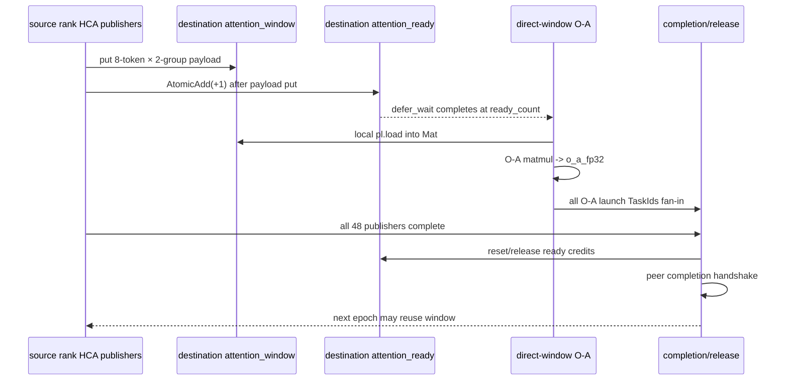

# 2026年8月26日 AllToAll 接收与 O-A 融合任务

> 归档日期：2026-09-15。来源：`pypto-lib/local_archive/2026年8月26日-AllToAll接收与O-A融合任务.md`。
> 原文的实现、测量与计划保留其历史语境；阅读说明见[学习资料索引](../README.md)。

- 日期：2026-08-26
- 前置方案：[PR #1034：Perf: fuse attention output with AllToAll](https://github.com/hw-native-sys/pypto-lib/pull/1034)
- 前置代码：`perf/fuse-attention-output-with-alltoall`，当前 head `0a4a1f1`
- 目标分支：`perf/pipeline-alltoall-into-o-a`
- 当前状态：任务书已定义，当前 head 上尚未实现、尚未完成基线测试
- 分支策略：以 PR #1034 当前 head 为直接父提交开发；PR #1034 合入后再 rebase 到其 merge commit，不提前 rebase 到 `main`
- 结构参考：[2026年8月26日-Attention输出与AllToAll融合任务.md](2026%E5%B9%B48%E6%9C%8826%E6%97%A5-Attention%E8%BE%93%E5%87%BA%E4%B8%8EAllToAll%E8%9E%8D%E5%90%88%E4%BB%BB%E5%8A%A1.md)
- 文档目的：明确 receive → O-A 的数据流、同步证明、实施范围和验收门槛，防止把旧原型或历史性能数字误写成当前结论

## 0. 如何阅读本文

本文使用四种证据标签：

- **代码事实**：可从 PR #1034 当前 head `0a4a1f1` 或当前仓库代码直接确认。
- **历史原型**：来自旧分支 `perf/pipeline-alltoall-into-o-a@c1f79b2`；该提交基于旧版 PR #1034 `7ea578b`，只能作为设计参考，不能直接作为当前实现或性能结论。
- **我的选择**：本任务暂定的工程方案，实施后仍需由代码、测试和 trace 验证。
- **待确定**：尚无足够证据，或需要负责人/reviewer 决定。

本文中的“完成”只表示满足第 6 节验收门槛。存在代码、能够编译，或旧原型曾经跑快，都不等于任务已经完成。

## 1. 要解决的问题

### 1.1 PR #1034 当前流程

**代码事实**：PR #1034 已经把 CSA、HCA、SWA 的 attention output finalization 与 AllToAll publish 融合。以 HCA distributed decode 为例，当前流程是：

```text
HCA stream attention
  -> inverse RoPE + BF16 output-group packing
  -> publisher 将 8-token group tile put 到 owner rank 的 attention_window
  -> 全部 48 个 publisher 完成后，各 rank 等待 ready >= 48
  -> o_group_a2a_gather 用 48 workers 把 window 复制到 attention_local_flat
  -> completion handshake：48 -> 49 -> 0
  -> reshape 为 attention_local_groups
  -> O-A
  -> O-A quant + O-B
  -> ReduceScatter
  -> hc_post
```

PR #1034 已消除了“完成整个 attention output 后再开始发送”的阶段边界，但 receive 侧仍然存在完整的本地 GM 中转：

```text
attention_window
  -> o_group_a2a_gather
  -> attention_local_flat
  -> O-A
```

### 1.2 具体问题

**代码事实**：当前 HCA 路径有以下边界：

- O-A 必须等待所有 remote publisher 的全局阈值 `48`。
- `o_group_a2a_gather` 将 active window 行逐行复制到 `attention_local_flat`。
- `decode_sharded_o_projection_reduce_scatter` 再从 `attention_local_flat` 读取相同 BF16 数据进入 O-A。
- `attention_local_flat` 仅用于这次 receive 后的 O-A 输入，不改变数学语义。

**我的选择**：下一步优化应让 O-A 直接消费本 rank 的 `attention_window`，并在安全的 ready 粒度上启动，删除 HCA 路径的 `o_group_a2a_gather` 和 `attention_local_flat`。

要验证的性能假设是：

1. 删除 `window -> local GM -> O-A` 的额外读写可以降低 GM/MTE 开销。
2. 按已到达的数据段启动 O-A，可以让 O-A 与仍在进行的 attention publish 重叠。
3. receive 与 O-A 融合后减少一个任务阶段和一次完整 fan-in，能够缩短真实设备墙钟时间。

以上三项的实际贡献必须由 before/after benchmark、`deps.json` 和 level-4 chip swimlane 区分，不能只根据代码结构推断。

### 1.3 本次目标

- 在独立堆叠分支上实现 HCA AllToAll receive → O-A。
- O-A 直接从本 rank 的 `DistributedTensor attention_window` 读取 BF16 tile。
- 为 O-A 增加细粒度 ready 协议，使已到达的数据段能够先启动。
- 删除 HCA distributed 路径中的 `attention_local_flat` 分配、gather 和 reshape。
- 保持 O-A 数学、per-group quant、O-B、ReduceScatter、TP1 路径和精度阈值不变。
- 支持 HCA TP2、TP4，以及 harness 已允许的动态 `local_t`。
- 在 wq3 环境中使用 frozen golden 做相同输入的 current-#1034 baseline 与 variant 对比。
- 在 PR #1034 合入前保持堆叠关系；合入后再 rebase，不修改或 force-push PR #1034 分支。

### 1.4 第一阶段范围

第一阶段只实现 **HCA**：

- 修改 `decode_sparse_attn_hca.py` 的 publisher ready 通知。
- 修改 `decode_o_proj.py` 的 direct-window O-A、公共 O-B/ReduceScatter tail 和 release 协议。
- 修改 `decode_hca.py` 的参数传递、window 分配和调用链。
- 增加能够覆盖 publish → ready → direct O-A → release 的定向 fixture 或等价测试。

第一阶段不修改：

- CSA、SWA 的调用顺序和 receive 路径；它们继续使用 PR #1034 的 `o_group_a2a`。
- TP1 路径。
- O-A/O-B 的数学、权重布局、quant 规则和精度 comparator。
- PR #1034 本身的分支历史。

CSA 的 publish tile 与 HCA 相近，可以在 HCA 方案证明后单独接入。SWA 的 `H_TILE=32` 在 TP4 会跨 output-group owner，ready 计数必须按 destination 拆分，不在第一阶段中顺带实现。

### 1.5 分支与旧原型

**代码事实**：仓库已有历史原型：

- 分支：`perf/pipeline-alltoall-into-o-a`
- 提交：`c1f79b2`
- 父提交：旧版 PR #1034 `7ea578b`
- 范围：HCA-only 的 per-tile ready、direct-window O-A 和 release

该原型不能直接视为当前任务完成，原因是：

- 当前 PR #1034 已 rebase 到 `7ac8e24`，head 为 `0a4a1f1`。
- publisher 命名、runtime buffer 初始化和当前 Simpler API 已变化。
- 旧性能数据使用 median-of-medians，不是当前任务要求的最终统计口径。
- 当前 head 尚未针对该原型重新编译、运行和检查依赖图。

实施时应从 `0a4a1f1` 建立干净的堆叠提交，按当前代码人工移植必要机制，不盲目 cherry-pick 旧提交。

## 2. 数据流

### 2.1 关键静态参数

Flash 配置和 O-A tiling：

| 符号 | 含义 | 值 |
|---|---|---:|
| `DECODE_TOKENS` | 一个 TP group 的总 token capacity | `512` |
| `H` | attention heads | `64` |
| `HEAD_DIM` | 每个 head 的 value width | `512` |
| `O_GROUPS` | output groups | `8` |
| `HEADS_PER_GROUP` | 每个 output group 的 heads | `8` |
| `O_GROUP_IN` | O-A 的每 group 输入宽度 | `4096` |
| `O_LORA` | O-A 的每 group 输出宽度 | `1024` |
| `HCA H_TILE` | 一个 HCA publish work 覆盖的 heads | `16` |
| `PUBLISH_GROUPS` | 一个 HCA publish work 覆盖的 output groups | `16 / 8 = 2` |
| `ATTENTION_PUBLISH_T_TILE` | publisher 的 token tile | `8` |
| `O_A_T_TILE` | O-A 的 token tile | `16` |
| `O_A_K_TILE` | O-A reduction tile | `256` |
| `O_A_N_TILE` | O-A output tile | `128` |

满 capacity 时的 TP 派生 shape：

| 项目 | TP2 | TP4 |
|---|---:|---:|
| `LOCAL_T` | `256` | `128` |
| `LOCAL_O_GROUPS` | `4` | `2` |
| `GROUP_T_PAD` | `512` | `512` |
| `LOCAL_O_WIDTH` | `4096` | `2048` |
| `attention_window` | `[2048, 4096]` BF16 | `[1024, 4096]` BF16 |
| `wo_a` | `[4, 1024, 4096]` BF16 | `[2, 1024, 4096]` BF16 |
| `o_a_fp32` | `[512, 4096]` FP32 | `[512, 2048]` FP32 |
| `attention_ready` | `[32, 1]` INT32 | `[32, 1]` INT32 |

`attention_ready` 的 32 行来自：

```text
ATTENTION_READY_ROWS = GROUP_T_PAD / O_A_T_TILE = 512 / 16 = 32
```

### 2.2 window 行布局

PR #1034 的目标行公式保持不变。对 source rank `s`、destination-local group `lg`、source-local token `t`：

```text
window_row = lg * GROUP_T_PAD + s * local_t + t
```

O-A 对 local group `lg`、group-token row `gt` 读取：

```text
src_row = lg * GROUP_T_PAD + gt
```

因此 direct-window O-A 不需要改变数据布局，只需把当前 `attention_local_flat` 的来源替换为本 rank 的 `attention_window`。

### 2.3 O-A tile

一个 O-A block 的数学仍是：

```text
attention_window[src_row : src_row + 16, 0 : 4096]
    @
wo_a[local_group, n0 : n0 + 128, 0 : 4096].T
    ->
o_a_fp32[t0 : t0 + 16, local_group * 1024 + n0 : ... + 128]
```

K 轴按 `256` 做 pipeline。direct-window 版本应显式把 window 和 weight tile load 到 `pl.MemorySpace.Mat`，然后复用当前 FP32 accumulator 和后续 quant 语义。

### 2.4 ready 行映射

publisher 写完一个 `8`-token × `2`-group tile 后，对 destination rank 的 ready counter 做一次 `AtomicAdd(+1)`：

```text
ready_row = (source_rank * local_t + source_token_start) // O_A_T_TILE
```

一个 `16`-token O-A row 需要：

```text
2 个 8-token 子块
  *
(LOCAL_O_GROUPS / PUBLISH_GROUPS) 个 head/group publish work
```

所以 ready 阈值为：

```text
ready_count = (O_A_T_TILE / ATTENTION_PUBLISH_T_TILE)
              * (LOCAL_O_GROUPS / PUBLISH_GROUPS)
```

| 配置 | 计算 | `ready_count` |
|---|---:|---:|
| TP2 | `(16 / 8) * (4 / 2)` | `4` |
| TP4 | `(16 / 8) * (2 / 2)` | `2` |

这项计数必须由代码循环结构和定向测试共同证明。阈值过小会早读，阈值过大会永久等待。

### 2.5 目标处理过程

1. HCA stream attention 生成 normalized heads 和 inverse-RoPE metadata。
2. 48 个 publisher workers 做 BF16 pack，并按 PR #1034 的布局 `put` 到 owner rank 的 `attention_window`。
3. 每个 publish work 在其全部 payload `put` 之后，对对应 O-A ready row 做 `AtomicAdd(+1)`。
4. destination rank 为待处理的数据段提交 `defer_wait` task；counter 达到 `ready_count` 后，该 TaskId 完成。
5. 独立的 O-A SPMD task 依赖 ready TaskId，直接从本地 window load 到 Mat 并计算。
6. 所有 O-A launch fan-in 后，window receive 已被完全消费，可以进入 completion/release。
7. O-A quant、O-B 和 ReduceScatter 复用当前实现，不改变数学。
8. release 协议确认所有 rank 已消费 window，随后才允许下一 epoch 覆盖。

输出保持：

- `o_local[local_t, 4096]` BF16，位于 token owner rank。
- `x_out[local_t, 4, 4096]` FP32，位于原 rank。

## 3. 方案选择

### 候选方案 A：全量 ready 后直接从 window 做 O-A

处理方式：

- 保留 PR #1034 的全局 `ready >= 48` wait。
- 删除 gather 和 `attention_local_flat`。
- wait 完成后，一次性让全部 O-A tasks 读取 window。

优点：

- 改动最小。
- 能明确测出“删除本地 GM copy”的收益。
- 不需要新增 per-tile ready window。

缺点：

- O-A 仍必须等全部 publishers 完成。
- 无法实现 publish 与 O-A 的流水。
- 如果 gather 不是主要瓶颈，收益上限可能较低。

### 候选方案 B：ready counter + source-sized direct-window O-A

处理方式：

- 新增 `attention_ready[GROUP_T_PAD / O_A_T_TILE, 1]` counter window。
- publisher 完成相关 `put` 后通知对应 ready row。
- 用 `defer_wait` 注册 ready 条件；wait task 后不再执行计算。
- 将 O-A 写为独立 `@pl.jit.incore`，通过 `pl.spmd_submit` 在 ready TaskId 后启动。
- 每个 launch 默认覆盖一个 source-sized token segment；具体 launch tile 以当前原型为起点，并通过 trace/benchmark确认。
- 所有 launch 完成后 release receive window，同时复用现有 O-B/ReduceScatter tail。

优点：

- 同时删除 gather 和本地 GM 中转。
- 能让已到达的数据段提前进入 O-A。
- 旧 HCA 原型已证明该结构至少能够在旧代码上编译和运行。

缺点：

- 需要新增 ready counter、显式 TaskId fan-in 和生命周期协议。
- `pl.no_dep` 会关闭一部分自动依赖，正确性完全依赖手写边。
- launch 太细会增加 AICPU 调度开销；launch 太粗会损失流水机会。
- dynamic `local_t` 下 source 边界可能落在一个 16-token O-A row 内，必须证明覆盖和 ready 计数仍正确。

### 候选方案 C：双缓冲或 monotonic ready/consumed epoch

处理方式：

- 为 receive window 使用双 buffer，或分别维护 monotonic `ready` 与 `consumed` counter。
- publisher 在覆盖 epoch `n+1` 前等待 epoch `n` 被消费。

优点：

- 生命周期关系更容易表达，避免 set/reset counter 的跨 epoch 竞态。
- 有机会让下一 epoch publish 与当前 epoch tail overlap。

缺点：

- window 内存、参数和协议范围明显扩大。
- 已超出“先删除 receive copy 并接入 O-A”的最小任务范围。

### 我的选择

第一阶段选择 **方案 B，HCA-only**。

理由：

- 它同时覆盖任务名称中的“receive → O-A”和真实的流水目标，而不只是删除 memcpy。
- 当前 HCA publisher 的 `8`-token、`2`-group tile 可以给出明确的 ready 计数。
- 历史原型 `c1f79b2` 提供了可参考的 current-DSL 结构。
- CSA/SWA 不需要随第一阶段一起改动，能够保持 PR #1034 的稳定路径作为对照。

方案 A 应保留为消融实验：如果方案 B 没有收益，可以用 A 区分“direct window 本身”与“ready/launch 调度”的影响。

方案 C 只在现有 completion/reset 协议无法给出完整 happens-before 证明，或多 epoch 测试暴露竞态时升级；不能用压力测试通过来代替协议证明。

## 4. 关键实现

| 函数/模块 | 输入输出 | 职责 | 为什么需要 |
|---|---|---|---|
| `decode_sparse_attn_hca.publish_hca_o_groups` | HCA heads/state → `attention_window`、`exchange_signal`、`attention_ready`、TaskIds | 在每个 publish work 的全部 `put` 后通知对应 ready row，并返回 direct consumer 所需依赖 | remote window 写入不会自动形成 O-A 的 TensorMap RAW 边 |
| `decode_o_proj.streaming_o_a_tile`（建议名称） | local distributed window + flattened `wo_a` → `o_a_fp32` | 用 `pl.load(..., target_memory=pl.MemorySpace.Mat)` 直接读取 receive window 并执行 O-A | 删除 `attention_local_flat` 中转 |
| `decode_o_proj.decode_streaming_o_projection_reduce_scatter`（建议名称） | window/ready + O weights → local hidden rows | 提交 `defer_wait`、O-A launches、fan-in、release，并调用公共 O-B/RS tail | 集中 receive consumer 的调度协议 |
| `decode_o_proj.o_group_a2a_release`（建议名称） | publish/consume TaskIds + signals | 在所有 publisher 和 O-A reads 完成后释放、重置 receive window/counters | 防止下一 epoch 覆盖仍在读取的数据 |
| `decode_o_proj._decode_streaming_o_projection_tail`（建议名称） | `o_a_fp32` → O-A quant、O-B partials | 复用当前 quant/O-B 代码 | 避免复制一整份 sharded O projection tail |
| `decode_o_proj._decode_sharded_o_projection_publish`（建议名称） | O-B partials → ReduceScatter output | 保持当前 O-B publish、wait、reduce、complete | streaming 与非 streaming 路径共用同一尾部语义 |
| `decode_hca.decode_hca` | layer inputs + windows → `x_out` | 删除 HCA 的 local gather，接入 streaming O projection | 真实 distributed HCA 集成点 |
| `decode_hca.l3_decode_hca` | host tensors → per-rank calls | 分配并传入 `attention_ready` window | ready counter 必须是各 rank 对称 window |
| 定向 fixture | deterministic publish/weights → O-A output | 覆盖 ready 阈值、direct load、padding、release 和多 epoch | full HCA 失败时能区分通信协议与 attention 数学 |

### 4.1 direct-window O-A 的实现约束

- receive window 对本 rank 是本地 tensor，应使用普通 `pl.load`，不是 `pld.tile.remote_load`。
- `defer_wait` 完成后不会恢复当前 kernel；O-A 必须是单独的依赖 task。
- `attention_window` 的 remote producer 不在本地 TensorMap 中，必须由 ready signal 建立 happens-before。
- 为避免 whole-window conservative dependency 抹掉流水，历史原型使用 `pl.no_dep(attention_window)`；采用该写法时，必须用 `deps.json` 证明每个 O-A launch 仍依赖正确的 ready task。
- 多个 launch 写 `o_a_fp32` 的不重叠区域。若使用 `pl.no_dep(o_a_fp32)` 去掉假 WAW，必须显式收集全部 launch TaskId，再 fan-in 后启动 consumer。
- 模块级 JIT 对 `pl.spmd_submit` 的 incore callee discovery 方式以当前 PyPTO 为准；旧原型中的 constant-false materialization 只能参考，不能直接假定仍需要或仍正确。

### 4.2 端到端调用变化

HCA 当前调用：

```text
publish_hca_o_groups
  -> o_group_a2a
  -> reshape attention_local_flat
  -> decode_sharded_o_projection_reduce_scatter
```

目标调用：

```text
publish_hca_o_groups
  -> decode_streaming_o_projection_reduce_scatter(
         attention_window,
         attention_signal,
         attention_ready,
         publish/registration TaskIds,
         wo_a/wo_b/scale,
         reduce window/signal,
     )
```

`o_group_a2a` 必须继续保留给 CSA、SWA 和现有 collective fixture，不能因为 HCA 不再调用就删除。

### 4.3 launch 粒度

历史原型使用：

```text
O_A_LAUNCH_T_TILE = LOCAL_T_PAD
```

即每个 launch 默认覆盖一个 source-sized segment，并等待该 segment 涉及的全部 ready rows。该选择在 TP2、TP4 的 block 数分别不同，且 dynamic `local_t` 时 segment 边界不一定等于 source 边界。

第一版可以从该值开始，但必须记录并比较：

- source-sized launch；
- 更细的 `16/32/64` token launch（仅在编译资源允许时）；
- 方案 A 的全量 launch。

最终保留值由未采样 wall time 和 level-4 trace 共同决定，不由“更细粒度看起来更流水”决定。

## 5. 同步与生命周期

### 5.1 目标协议



### 5.2 必须保持的 invariant

1. ready notify 在对应 publish work 的全部 `pld.tensor.put` 之后。
2. 一个 ready row 达到阈值时，该 row 对所有 local output groups 的 16 个 active token 已全部可见。
3. O-A launch 只能读取自己 ready 条件覆盖的 window 行。
4. 不同 O-A launches 写 `o_a_fp32` 的区域互不重叠。
5. O-A quant 只能在所需的全部 O-A launch TaskIds 完成后启动。
6. window 只有在所有 O-A reads 完成后才能向 peers 发送 consumed/completion。
7. 下一 epoch 的任何 `put` 不能覆盖上一 epoch 仍在读取的行。
8. padding/stale capacity 行不能进入 O-A、quant 或最终输出。
9. TP2、TP4 和所有合法 dynamic `local_t` 下，ready row、launch row和 active row 覆盖一致。
10. 本 rank 的 local put 与 remote put 使用同一 ready 语义，不能依赖“本地通常更快”。

### 5.3 dynamic `local_t`

HCA harness 要求 `local_t` 是 `8` 的倍数。因为本任务只覆盖 TP2/TP4：

```text
group_t = TP * local_t
```

始终是 `16` 的倍数，因此 active rows 能组成完整 O-A token tiles。

但是，当 `local_t % 16 == 8` 时，一个 O-A row 可能同时包含前一个 source rank 的最后 8 个 token和下一个 source rank 的前 8 个 token。此时：

- 两个 source rank 的 publisher 都会通知同一个 `ready_row`；
- `ready_count` 必须累计两个 8-token half 的全部 group contributions；
- launch 划分不能漏掉或重复该跨 rank row。

这必须通过手算例子和 sub-capacity fixture 验证，不能只测试满 capacity。

### 5.4 buffer 何时可以复用

PR #1034 当前使用单 `exchange_signal` 的 `48 -> 49 -> 0` 协议。历史 receive→O-A 原型还会把每个 ready row 从 `ready_count` 减回 `0`。

第一版可以沿用该协议，但合入前必须给出完整 happens-before：

1. epoch `n` payload put 先于 ready notify；
2. ready notify 先于对应 O-A read；
3. 所有 O-A reads 完成先于本 rank completion notify；
4. 所有 peer completion 被观察后，才 reset 本地 signal/ready counters；
5. epoch `n` reset 与 epoch `n+1` notify 即使存在 rank skew，也不会让 wait 误判或丢 credit；
6. 下一 epoch publisher 通过自动或显式依赖，确实晚于上一 epoch release。

如果第 5、6 项无法从任务图和 runtime 语义推出，必须改用独立 consumed counter 或 monotonic epoch；不能只凭多跑几轮未失败就认定协议安全。

### 5.5 典型故障表现

| 错误 | 可能结果 |
|---|---|
| ready_count 过小 | O-A 读取未完成或上一 epoch 的 window 数据，产生非确定性精度错误 |
| ready_count 过大或漏 notify | `defer_wait` TaskId 永不完成，后续 fan-in 卡死 |
| notify 早于 payload 可见 | O-A 在 signal ready 后仍读到旧值 |
| whole-window 自动依赖未关闭 | 结果正确但所有 O-A 仍等完整 publish，流水失效 |
| `pl.no_dep` 后漏显式 edge | 偶发错误、超时或错误的 O-A tile |
| disjoint O-A writes 被当成 WAW | launches 被无谓串行，性能下降 |
| release 早于最后一个 O-A read | 下一 epoch 覆盖正在使用的 window |
| ready reset 与下一 epoch notify 交错 | counter 丢增量、提前满足或永久 wait |
| dynamic row/launch 边界错误 | 只在 sub-capacity 或 rank 边界附近出现错误 |

## 6. 正确性与性能验证

### 6.1 当前证据状态

- PR #1034 当前 head：`0a4a1f1`。
- `decode_hca.py --tp 4 --help` 已在 wq3 当前环境通过，说明当前 head 不再被旧的 SWA TP4 import guard 阻塞。
- 当前 receive→O-A 尚未移植到 `0a4a1f1`。
- 上一次 current-#1034 baseline 在 golden 计算阶段被人工停止，device task 退出码为 `130`；该不完整输出和任何半成品 snapshot 不得用于性能对比。
- 当前没有一份已确认 PASS、可直接复用的 current-#1034 frozen golden。

### 6.2 正确性验证矩阵

| 场景 | 目的 | 第一阶段要求 |
|---|---|---|
| 定向 receive→O-A fixture，TP2，`local_t=8` | 最小 active tile、ready_count、padding | PASS |
| 定向 fixture，TP2，满 capacity | 全 window 覆盖 | PASS |
| 定向 fixture，TP2，`local_t=LOCAL_T-8` | 跨 source/O-A row 边界 | PASS |
| HCA a2a3sim，TP2 compile-only | JIT/ptoas/shape | PASS |
| HCA a2a3sim，TP4 compile-only | TP4 specialization | PASS |
| HCA a2a3 real device，TP2，`local_t=8` | 完整 publisher→O-A→O-B→RS 数值 | PASS |
| HCA a2a3 real device，TP2 满 capacity | 主要正确性与性能 shape | PASS |
| HCA a2a3 real device，TP2 sub-capacity | dynamic shape | PASS |
| HCA a2a3 real device，TP4 满 capacity | 部署配置 | PASS |
| 同一 window 连续多 epoch，含 rank skew | release/reset 安全 | PASS + 协议证明 |
| CSA/SWA 定向回归 | 确认保留的 `o_group_a2a` 未被破坏 | 原有入口 PASS |
| TP1 HCA 回归 | 确认 standalone 路径不变 | PASS |

完整 HCA 输出继续使用当前 comparator，不为让新方案通过而放宽阈值。

定向 O-A fixture 的 CPU golden 应使用相同 BF16 输入、FP32 accumulate 和当前 weight layout；若只比较 pure O-A FP32，应设置与当前 compiler 数值路径一致的明确容差，不能直接沿用整层 `x_out` 的比例阈值而不说明。

### 6.3 静态与仓库检查

- `python tests/lint/check_headers.py`
- `python tests/lint/check_english_only.py`
- `ruff check` 覆盖全部修改文件
- pre-commit 全量通过
- 不提交 `build_output/`、frozen golden、设备日志或本机路径
- kernel 代码通过 `fmt-coding-style` 检查：一行一语句、shape/view 靠近首个 consumer、注释说明 what、不加入结构性 narration

### 6.4 性能基线

性能测试固定使用：

- Python 环境：wq3。
- 设备：通过 `task-submit` 分配；baseline 与 variant 使用同一组 device IDs。
- PTOAS：按仓库 pin 选择，执行时记录精确版本。
- 输入：current-#1034 baseline 首次 PASS 后保存 frozen golden；variant 只 replay 这份 snapshot。
- 环境记录：pypto、simpler、ptoas、pto-isa、CANN、branch head、设备 IDs、`local_t`、`start-pos`。
- benchmark：同一次进程内 warmup + rounds，不用多次短进程代替。
- 生产数字：未开启 DFX 的 `PYPTO_BENCH`。
- 因果证据：单独收集 before/after level-4 chip swimlane 和 `deps.json`，不拿带 observer cost 的 trace 当最终 wall-time 数字。

至少报告：

- headline effective mean；
- 每 rank effective mean；
- fastest-rank effective mean；
- max-rank/fastest-rank spread；
- raw samples 是否存在启动漂移或离群点。

### 6.5 历史原型数据

**历史原型** `c1f79b2` 的 commit message 报告：

```text
TP2 HCA median 6434.6 -> 5910.6 us
devices 13,15
fixed golden
warmup=5, rounds=100
四次 run median 的 median
```

按数值约为 `8.1%` 改善。该数据只能说明方案值得在当前 head 上重测，不能作为本任务结果，因为：

- base 不是 `0a4a1f1`；
- 统计口径不是当前要求的 effective mean；
- 原始日志、snapshot 和当前环境 pins 未与本任务绑定；
- 没有当前 head 的 correctness/trace 证据。

### 6.6 性能验收

最低门槛：

1. HCA 路径中不再出现 `o_group_a2a_gather` 和 `attention_local_flat`。
2. `deps.json` 证明每个 direct O-A launch 依赖正确的 ready task。
3. level-4 trace 证明至少一个 O-A launch 在全部 48 publishers 完成前启动；如果没有发生，必须诚实记录方案只实现了 direct-window、没有实现流水。
4. 相同 frozen golden、相同设备、相同 rounds/warmup 下，variant 的未采样 wall time 不退化。
5. 建议性能通过线：fastest-rank effective mean 至少改善 `5%`；最终阈值由负责人确认。
6. headline/max-rank 不能出现无法解释的明显退化或 rank spread 扩大。

如果性能未达标，应依次做方案 A 消融、launch 粒度对比和泳道归因；不能通过删除验证、换输入或改统计口径保留代码。

## 7. 实施顺序与交付物

### 7.1 实施顺序

1. 在 PR #1034 `0a4a1f1` 上记录 current baseline commit、环境 pins 和 PASS frozen golden。
2. 在堆叠分支上移植 direct-window O-A，不先加入 per-row ready；完成方案 A 的定向正确性和性能消融。
3. 增加 HCA ready counter 和 publisher notify。
4. 增加 `defer_wait`、source-sized O-A launches、显式 fan-in 和 release。
5. 抽取公共 O-B/ReduceScatter tail，确认非 streaming 路径输出不变。
6. 完成 TP2 最小/full/sub-capacity 正确性。
7. 完成 TP4 compile、正确性和性能。
8. 收集 before/after `deps.json`、level-4 trace 和未采样 benchmark。
9. 按证据保留、调参或回退实验；只提交最终可辩护方案。
10. commit/push 到独立堆叠分支，创建 follow-up PR；PR #1034 合入后再 rebase。

### 7.2 必须交付

- 基于 `0a4a1f1` 的最小实现 diff。
- current-#1034 baseline 和 variant 的完整命令、commit、pins、device IDs 和原始 benchmark摘要。
- 一份已确认 PASS 的 frozen golden 元数据；snapshot 本体不提交。
- TP2/TP4、full/sub-capacity 的 correctness 结果。
- before/after `deps.json` 与 level-4 trace 结论。
- ready_count、row mapping、TaskId fan-in 和 window reuse 的书面证明。
- 对旧原型 `c1f79b2` 中保留/删除机制的说明。
- PR 描述中明确“基于 #1034，待 #1034 合入后 rebase”。

### 7.3 明确不交付

- 不把旧 `c1f79b2` 的性能数字冒充当前结果。
- 不把半成品或被终止的 baseline snapshot 用于 replay。
- 不在同一提交顺带接入 CSA/SWA。
- 不修改 PR #1034 的提交历史。
- 不提交 `build_output/`、`.pt` snapshot、设备 trace 或用户本地文件。

## 8. 我的判断与疑问

### 我的判断

- HCA 是 receive → O-A 的合适第一落点：publisher tile 与 O-A tile 的 ready 关系可以精确计数。
- direct-window 能删除一次完整 BF16 window 的本地 GM copy；是否成为墙钟收益仍要测。
- `defer_wait + separate O-A task` 是必要结构，因为 defer wait 不会恢复原 kernel。
- source-sized launch 是合理起点，但未必是最优粒度。
- `pl.no_dep` 只是一项手写依赖声明，不是性能开关；没有 `deps.json` 证据就不能接受。
- 保留 CSA/SWA 的 PR #1034 路径，可以提供清晰的回归边界和后续接入基线。

### 目前的担忧

- 当前 `48 -> 49 -> 0` 与新增 ready reset 的跨 epoch 安全性尚未完成证明。
- O-A source-sized launch 的 block 数可能过大，第一批 remote data ready 后仍要等待整个 segment，实际 overlap 可能有限。
- 细粒度 launch 可能把节省的 GM 时间换成更多 AICPU dispatch 开销。
- dynamic `local_t` 的 source 边界可能切开一个 O-A row，旧原型未提供完整的边界证明。
- 旧原型的约 `8.1%` 收益可能包含旧 base、环境或统计口径差异。
- full HCA golden 成本高，若没有定向 fixture，协议错误的定位成本会很大。

### 尚未确认

- 方案 A 单独删除 gather 的收益：待确定。
- source-sized launch 是否优于 16/32/64-token launch：待确定。
- 当前 PyPTO 是否仍需要旧原型的 incore callee materialization workaround：待确定。
- ready counter 应 reset 还是改为 monotonic epoch：待确定。
- 多层真实模型是否会让下一 epoch publisher 与上一 epoch release 发生危险交错：待确定。
- 最终性能通过阈值是否采用建议的 `5%`：待负责人确认。
- HCA 完成后是否按 CSA、SWA 顺序继续扩展：另行立项。

### 如果重新设计，我可能会

- 先用方案 A 得到 direct-window 的纯收益上限，再决定 ready 协议值得多复杂。
- 如果 source-sized launch overlap 不足，改为少量固定 token chunks，而不是直接退到每个 16-token row 一个 task。
- 如果 reset 协议不能严格证明，改成单独的 monotonic ready/consumed epoch，而不是继续叠加负数 reset。
- 如果 O-A 仍受 MTE 限制，进一步评估 publisher 到 O-A 的双 buffer 或 on-chip relay；这属于后续任务，不在第一阶段自动扩大。

## 9. AI 协作时必须由我回答的问题

这张表由任务负责人本人填写。AI 可以帮助定位代码、生成实验和整理证据，但不能代写“我的回答”或把推测填成结论。

| 检查问题 | 我的回答 | 代码/文档/实验依据 | 我主动寻找的反例 | 当前结论 |
|---|---|---|---|---|
| 画出一个 HCA 8-token × 2-group publish work 到一个 16-token O-A tile 的完整路径 | 待填写 | 待填写 | 待填写 | 待确定 |
| 推导 TP2 ready_count=4、TP4 ready_count=2 | 待填写 | 待填写 | 待填写 | 待确定 |
| 解释 dynamic `local_t % 16 == 8` 时跨 source-rank O-A row 如何 ready | 待填写 | 待填写 | 待填写 | 待确定 |
| 证明 notify 发生时 payload 对 destination 已可见 | 待填写 | 待填写 | 待填写 | 待确定 |
| 解释为什么本地 window 用 `pl.load` 而不是 `remote_load` | 待填写 | 待填写 | 待填写 | 待确定 |
| 列出每个 `pl.no_dep` 被移除的自动 edge，以及补回它的显式 TaskId | 待填写 | 待填写 | 待填写 | 待确定 |
| 证明所有 O-A launch 写入互不重叠，fan-in 后 quant 才能读取 | 待填写 | 待填写 | 待填写 | 待确定 |
| 写出 publish、ready、O-A read、completion、reset、下一 epoch 的完整 happens-before | 待填写 | 待填写 | 待填写 | 待确定 |
| 用 trace 证明 O-A 在全量 publish 完成前实际启动 | 待填写 | 待填写 | 待填写 | 待确定 |
| 区分 direct-window、ready 流水和 launch 粒度各自的性能贡献 | 待填写 | 待填写 | 待填写 | 待确定 |
| 证明 frozen golden 的 commit、shape、start-pos 和 specs 与两次 run 一致 | 待填写 | 待填写 | 待填写 | 待确定 |
| 说明 fastest-rank、headline 和 rank spread 各能支持什么结论 | 待填写 | 待填写 | 待填写 | 待确定 |

任何关键依据如果只有“AI 说如此”，该项仍然是：**待确定**。

## 10. 建议阅读顺序

1. [2026年8月26日-Attention输出与AllToAll融合任务.md](2026%E5%B9%B48%E6%9C%8826%E6%97%A5-Attention%E8%BE%93%E5%87%BA%E4%B8%8EAllToAll%E8%9E%8D%E5%90%88%E4%BB%BB%E5%8A%A1.md) 中 PR #1034 的所有权、行映射和现有 completion 协议。
2. `models/deepseek_v4_flash_dspark/decode_sparse_attn_hca.py` 中 `_sparse_attn_hca_stream` 与 `publish_hca_o_groups`。
3. `models/deepseek_v4_flash_dspark/decode_o_proj.py` 中 `o_group_a2a` 和 `decode_sharded_o_projection_reduce_scatter`。
4. `models/deepseek_v4_flash_dspark/decode_hca.py` 中 distributed HCA 调用和 host window 分配。
5. 历史原型 `c1f79b2` 中 `streaming_o_a_tile`、ready wait、fan-in 和 release；只对照机制，不复制结论。
6. `docs/pypto-coding/distributed-programming.md` 中 local window、`put` visibility、notify/wait、`defer_wait` 和复用协议。
7. `docs/debug-and-tune/dependency-and-scheduling.md` 中 TensorMap、`deps=`、`pl.no_dep`、level-4 trace 和 `deps.json`。
8. `.claude/rules/benchmarking.md`、`docs/debug-and-tune/performance-tuning.md` 和 `docs/run-and-validate/save-and-replay.md`。
9. 回到 current-#1034 baseline、variant diff、正确性输出和 trace，逐项关闭本文中的“待确定”。
