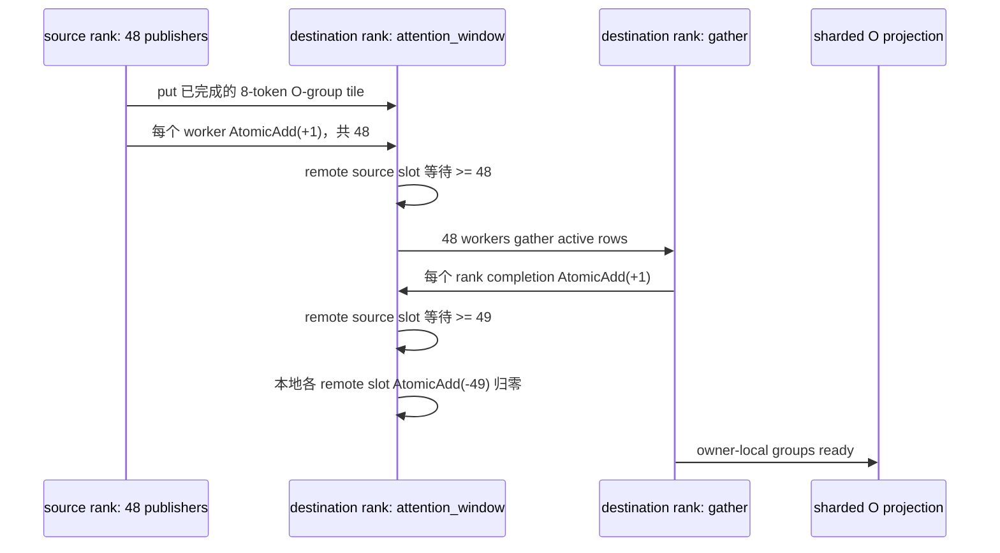

# 2026年8月26日 Attention 输出与 AllToAll 融合任务

> 归档日期：2026-09-15。来源：`pypto-lib/local_archive/2026年8月26日-Attention输出与AllToAll融合任务.md`。
> 原文的实现、测量与计划保留其历史语境；阅读说明见[学习资料索引](../README.md)。

- 日期：2026-08-26
- 当前方案：[PR #1034：Perf: fuse attention output with AllToAll](https://github.com/hw-native-sys/pypto-lib/pull/1034)
- 当前代码：`perf/fuse-attention-output-with-alltoall`，head `39048a0`
- 当前状态：PR 已实现候选方案，是否满足合入条件待确定
- 结构参考：[工作流程.md](../performance/%E4%BC%98%E5%8C%96%E4%BB%BB%E5%8A%A1%E8%AE%B0%E5%BD%95%E6%A8%A1%E6%9D%BF.md)
- 文档目的：记录事实、判断依据和未决问题，避免在 AI 辅助编码时只保留代码、丢失自己的判断过程

## 0. 如何阅读本文

本文使用四种证据标签：

- **代码事实**：可从当前 `39048a0` 代码或 diff 直接确认。
- **PR 报告**：PR 作者给出的结论或数据，本次没有独立复测。
- **我的判断**：基于代码与项目文档形成的判断，不等同于验证结论。
- **待确定**：尚未实现、尚未验证、缺少证据，或需要 reviewer/负责人决定。

任何没有证据的内容都不让 AI 自动补齐；统一保留为“待确定”。本文是任务判断记录，不是仓库公共技术规范。

## 1. 要解决的问题

### 原来的流程

**代码事实**：TP2/TP4 的 CSA、HCA、SWA attention output 原流程大致是：

```text
sparse attention
  -> 完成全部 merge / normalization / inverse RoPE / BF16 packing
  -> 在本 rank 物化完整 attention_grouped
  -> 独立 o_group_a2a 发送各 output group 的全部 local_t 行
  -> rank 间 barrier
  -> 将本 rank window 逐行复制到 local_groups_out
  -> 第二次 barrier + signal reset
  -> sharded O projection + reduce-scatter
  -> hc_post
```

原 `o_group_a2a` 是一个独立的 `@pl.jit.incore` 阶段。它必须等 attention tail 全部完成后，才发送完整 group slab；O projection 又必须等 A2A 和本地 gather 全部完成。

### 具体问题

**我的判断**：原流程在 `attention finalization -> A2A -> O projection` 之间形成了完整阶段交接，限制了 finalization 与通信的重叠，并把本地 gather 放在相对串行的路径上。

**待确定**：还没有 before/after level-4 chip swimlane 或消融实验，证明原关键路径中分别有多少时间来自：

- attention tail 与 A2A 之间的 dispatch/依赖间隙；
- 完整 slab 发送造成的通信串行；
- 原 `o_group_a2a` 的本地逐行 gather；
- scope 调整或其他同时发生的调度变化。

因此，目前不能把全部加速都归因于“融合”这一个词。

### 本次目标

- 将完成的 attention output tile 尽早发布到 output-group owner rank。
- 缩短真实设备上的 distributed decode 墙钟时间。
- 保持 CSA、HCA、SWA 的数学语义、输出布局、TP1 路径和精度要求不变。
- 支持当前 TP2、TP4 配置。
- 通过 frozen golden 复用输入与期望输出，降低重复性能测试成本。

完整 CI、全 shape 正确性、A5 兼容性和 reviewer 最终认可：**待确定**。

### PR 范围

**代码事实**：当前 PR 相对当前 merge base `7ac8e24` 修改 7 个文件，共 `+868/-151`：

- `models/deepseek_v4_flash_dspark/decode_csa.py`
- `models/deepseek_v4_flash_dspark/decode_hca.py`
- `models/deepseek_v4_flash_dspark/decode_swa.py`
- `models/deepseek_v4_flash_dspark/decode_o_proj.py`
- `models/deepseek_v4_flash_dspark/decode_sparse_attn_csa.py`
- `models/deepseek_v4_flash_dspark/decode_sparse_attn_hca.py`
- `models/deepseek_v4_flash_dspark/decode_sparse_attn_swa.py`

## 2. 数据流

### 2.1 关键静态参数

当前 Flash 配置：

| 符号 | 含义 | 值 |
|---|---|---:|
| `DECODE_TOKENS` | 一个 TP group 的总 decode token capacity | `64 * 8 = 512` |
| `H` | attention heads | `64` |
| `HEAD_DIM` | 每个 head 的 value width | `512` |
| `O_GROUPS` | output groups | `8` |
| `HEADS_PER_GROUP` | 每个 output group 的 heads | `8` |
| `O_GROUP_IN` | 一个 output group 的拼接宽度 | `8 * 512 = 4096` |
| `D` | hidden size | `4096` |
| `HC_MULT` | hyper-connection 分支数 | `4` |

满 capacity 时的 TP 派生 shape：

| 项目 | TP2 | TP4 |
|---|---:|---:|
| `LOCAL_T = 512 / TP` | `256` | `128` |
| `T_PAD` | `256` | `128` |
| `LOCAL_O_GROUPS = 8 / TP` | `4` | `2` |
| `GROUP_T_PAD = TP * T_PAD` | `512` | `512` |
| `attention_grouped` | `[2048, 4096]` BF16 | `[1024, 4096]` BF16 |
| 每 rank 的 `attention_window` | `[2048, 4096]` BF16 | `[1024, 4096]` BF16 |
| gather 后的逻辑布局 | `[4, 512, 4096]` | `[2, 512, 4096]` |
| O projection 后的本地输出 | `[256, 4096]` BF16 | `[128, 4096]` BF16 |

同一份源码支持 `--tp 1/2/4`，但 TP-derived shape 在 import 时专门化；TP2、TP4 两列代表两次独立 specialization，不是同一个已编译程序在运行时动态切换 TP。

注意：`T_PAD` 和 `GROUP_T_PAD` 是编译期 capacity；运行时 `local_t` 可以小于 `LOCAL_T`。通信只处理 active `local_t` 行，padding 行不应进入结果。

### 2.2 输入与所有权

- 整层输入：每个 TP rank 持有本地 token 的 `x_hc[local_t, 4, 4096]` FP32。
- attention tail 输入：每个 source rank 对本地 `local_t` 个 token 计算全部 `64` 个 heads。
- source-rank 本地暂存：逻辑上是 `attention_grouped[O_GROUPS, T_PAD, O_GROUP_IN]`。
- destination-rank 所有权：每个 rank 拥有连续的 `LOCAL_O_GROUPS` 个 output groups，但需要这些 groups 在所有 source rank 上的 token 行。
- A2A 后布局：`[local_group, source_rank-major token, O_GROUP_IN]`。
- reduce-scatter 后：每个 rank 重新得到自己本地 token 的 `attn_out[local_t, 4096]`。
- 整层输出：`x_out[local_t, 4, 4096]` FP32，仍位于原 token owner rank。

这里交换的是 **output-group 所有权**，不是简单地把 token 均分后互换。

### 2.3 行映射

对 source rank `s`、全局 output group `g`、本地 token `t`：

```text
destination_rank = g // LOCAL_O_GROUPS
local_group       = g % LOCAL_O_GROUPS
source_row        = g * T_PAD + t
target_row        = local_group * GROUP_T_PAD + s * local_t + t
```

这条公式是需要亲自证明的核心：不同 `(g, s, t)` 必须映射到不同的目标行，而且所有 active 行都必须刚好覆盖一次。

TP4 例子：`s=2, g=5, t=16` 时，`LOCAL_O_GROUPS=2`：

```text
destination_rank = 5 // 2 = 2
local_group       = 5 % 2 = 1
source_row        = 5 * 128 + 16 = 656
target_row        = 1 * 512 + 2 * 128 + 16 = 784
```

因此，这个 tile 从 source rank 2 的 group 5 发布到 destination rank 2 的本地 group 1。

### 2.4 当前处理过程

1. CSA/HCA/SWA 先完成各自的 sparse-attention 主体，生成 private partial/state。
2. `48` 个 publisher workers 按 `8` 个 token 一块处理 attention tail。
3. publisher 完成该变体尚未完成的 finalization、inverse RoPE 和 BF16 pack 后，先写本地 `attention_grouped` 暂存，再立即用 `pld.tensor.put` 发布该 tile。HCA 的 merge/normalization 已在前面的 stream 阶段完成。
4. destination rank 等待所有 remote publisher workers 完成。
5. `48` 个 gather workers 将 window 的 active 行复制到 `attention_local_flat`。
6. 经过 completion handshake 后释放并重置信号。
7. `decode_sharded_o_projection_reduce_scatter` 对 owner-local groups 做 O projection，并把 token 输出 reduce-scatter 回 token owner。
8. `hc_post` 生成最终 `x_out`。

**关键边界**：当前方案不是 zero-copy。`attention_grouped` 仍然存在，publisher 仍先写本地 GM 暂存，再 `put`。**我的判断**：代码设计允许更早发布，并试图让发送与其他 worker 的 pack 工作重叠，同时并行化 gather；实际是否发生重叠、各部分贡献多少，待 swimlane/消融确认。O projection 仍要等全部 remote publishers ready，并没有逐 tile 流式启动。

## 3. 方案选择

### 当前方案：PR #1034

核心做法：

- 将 CSA、HCA、SWA 私有的 attention finalization/publisher 留在各自 sparse-attention 模块。
- 将通用的 wait、gather、completion 和 reset 集中在 `decode_o_proj.o_group_a2a`。
- distributed 路径调用新的 publisher；TP1 和 standalone golden 继续保留原 `sparse_attn_*` 入口。
- HCA、CSA 增加 `--save-data` 和 `--golden-data` 转发；SWA 原本已有。

优点：

- tile 完成后可立即发出，不必等待整个 `attention_grouped` 完成。
- 代码允许 `put` 与其他 worker 的 finalization/packing 重叠；实际重叠待 trace 确认。
- gather 从原来的相对串行循环改为 `48` workers。
- CSA/HCA/SWA 的 private state 不泄露到通用 O-projection 模块。
- 通用的接收端协议只有一份。

缺点与风险：

- 三个 publisher 都维护 group/rank 映射、`put` 和 notify，重复逻辑需要同步审查。
- `48` workers、`8`-token tile、head tile 与 output-group 划分存在强约束。
- 仍保留本地 `attention_grouped`，不是直接从 producer tile 到消费计算。
- O projection 仍有全 publisher ready 屏障，不能消费先到的 group/tile。
- scope、依赖和 worker 数同时变化，没有消融实验区分各自贡献。
- 跨多轮复用时 `49/-49` reset 是否无竞态，待确定。

### 其他候选方案

- 保留独立 A2A，只并行化 gather：待确定。
- 让 O projection 直接消费 distributed window 或做双缓冲流水：待确定。
- 使用框架级 collective：待确定；当前仓库更常用 `put + notify/wait` 与生产者融合。

### 我的选择

**我的判断**：把 PR #1034 作为当前验证方案是合理的，因为它保持了各 attention 变体的模块所有权，数据映射可以由代码公式解释，且 PR 报告了明显的 TP2/TP4 墙钟改善。

是否最终采纳：**待确定**。在完整 CI、正确性矩阵、重复窗口复用验证、性能归因和 reviewer 认可之前，不把“已有加速数字”等同于“方案已经正确并可合入”。

## 4. 关键实现

| 函数/模块 | 输入输出 | 职责 | 为什么需要 |
|---|---|---|---|
| `_sparse_attn_csa_state` | `q/cache/index` -> sparse block partials、RoPE metadata、task IDs | 暴露 CSA merge 前的 private state | 让 distributed publisher 接管 merge/normalize/pack，同时保留 standalone 入口 |
| `publish_csa_o_groups` | 完整 CSA attention inputs -> grouped BF16 tiles + remote window | 内部调用 `_sparse_attn_csa_state`，再 merge sparse blocks、sink normalization、inverse RoPE、pack、`put`、notify | 把 CSA attention tail 与发布合并 |
| `_sparse_attn_hca_stream` | HCA inputs -> 已归一化 stream heads、RoPE metadata | 完成 HCA stream attention 主计算 | HCA 的 merge/normalization 已在 stream 阶段完成 |
| `publish_hca_o_groups` | 完整 HCA attention inputs -> grouped BF16 tiles + remote window | 内部调用 `_sparse_attn_hca_stream`，再做 inverse RoPE、pack、`put`、notify | 将 HCA pack 与通信合并，但不把 HCA private state 移到 O-proj |
| `_sparse_attn_swa_prepare` | SWA inputs -> sparse partials、RoPE metadata | 准备 SWA merge 所需状态 | 复用 standalone 与 distributed 两条路径的主体计算 |
| `publish_swa_o_groups` | 完整 SWA attention inputs -> grouped BF16 tiles + remote window | 内部调用 `_sparse_attn_swa_prepare`，再做 normalization、inverse RoPE、pack、逐 group owner `put`、notify | SWA 的 32-head tile 在 TP4 会跨两个 owner，必须逐 group 算 destination |
| `decode_o_proj.o_group_a2a` | distributed window -> owner-local group rows | wait、48-worker gather、completion、signal reset | 统一三个 attention 变体的接收端协议 |
| `decode_sharded_o_projection_reduce_scatter` | owner-local groups -> token-owner hidden rows | sharded O-A/O-B、发布 partial、reduce-scatter | 恢复每个 rank 本地 token 的 hidden 输出 |
| `decode_{csa,hca,swa}` | 完整 layer inputs -> `x_out` | 串起 publisher -> gather -> O projection -> `hc_post` | 将新协议接入真实 distributed decode 路径 |
| `decode_attention_collectives_fixture` | 人工 grouped data -> exchanged groups | 用新 publisher/finish 协议覆盖 collective fixture | 检查布局与 padding 的独立入口；当前覆盖范围待确定 |

### 评审反馈与当前处理

- 人类 reviewer [要求新实现替换旧实现但保留 `o_group_a2a` 名称](https://github.com/hw-native-sys/pypto-lib/pull/1034#discussion_r3852217358)。当前代码已这样处理；review thread 仍是 outdated/unresolved，是否认可待确定。
- 人类 reviewer [建议把 HCA A2A 逻辑移动到 `decode_o_proj.py`](https://github.com/hw-native-sys/pypto-lib/pull/1034#discussion_r3852233854)。当前 head 采用替代边界：三种 private publisher 都留在各自 sparse-attention 模块，`decode_o_proj.py` 只保留通用 finish。reviewer 是否接受待确定。
- CodeRabbit 指出 CSA distributed replay 在 `--golden-data` 未配 `--start-pos` 时可能静默使用错误 fixture shape。HCA 已有 guard，当前 CSA 仍没有；处理状态待确定。
- 当前 CodeRabbit check 虽显示 success，但最新 head 的 incremental review 被配置为 disabled/skipped，不代表 `39048a0` 已被完整复审；现有 finding 来自旧 head `dd7c75c`，本文只在当前代码中重新核对了该 finding 仍有效。

## 5. 同步与生命周期

### 5.1 当前协议



同步事实：

- 每个 publisher worker 都会向每个远端 destination notify 一次，即使这个 worker 没有实际 tile。因此每个 remote source slot 的 ready 阈值是 `48`，不是 tile 数。
- 本 rank 不等待自己的 signal slot；本地可见性依赖 `publish_tid` 和任务图依赖。
- remote rank 依赖同一个 worker 内 `pld.tensor.put` 先于 notify 的程序顺序。
- gather 完成后，每个 rank 再发送一次 completion，阈值从 `48` 变成 `49`。
- 所有 remote completion 都观察到后，本 rank 对各 remote source slot 加 `-49`，代码意图是恢复为 `0`。

### 5.2 必须保持的 invariant

1. 每个 `(global_group, source_rank, token)` 的目标区域唯一且不重叠。
2. publisher worker 数与 ready 阈值一致；所有 worker 最终都必须执行 notify。
3. notify 不能早于该 worker 的全部 `put` 完成。
4. gather 只能读取 active `group_t = TP * local_t` 行，不能把 padding/stale 行带入 O projection。
5. SWA TP4 的一个 `H_TILE=32` tile 覆盖 4 个 groups，而每 rank 只拥有 2 个 groups，因此 destination 必须按每个 group 重算。
6. CSA/HCA 的 `H_TILE=16` 覆盖 2 个 groups，且当前配置要求 `LOCAL_O_GROUPS` 能被 2 整除。
7. 下一轮覆盖 window 前，所有 peer 必须已经完成上一轮 gather。

### 5.3 buffer 何时可以复用

**代码意图**：`o_group_a2a` 返回前已经完成 gather、互相发送 completion、等待到 `49`，并将本地 remote slots 减回 `0`，此后可复用 attention window/signal。

**待确定**：首先需要写出完整的 happens-before 证明，而不是用压力测试代替证明：

1. epoch `n` 的每个 payload `put` 先于对应 ready notify；
2. 每个 rank 观察全部 ready 后完成 gather，再发送 completion；
3. 每个 rank 观察全部 completion 后执行本地 reset；
4. 对每个 receiver，epoch `n` 的 reset 必须先于任意 peer 的 epoch `n+1` ready notify，或者协议必须证明两者即使交错也不会误判。

当前代码能直接说明前 3 项的本 rank 顺序；第 4 项能否由现有协议推出，待确定。重复多轮、主动制造 rank skew 和 signal/window trace 只能作为证明后的佐证，不能证明没有竞态。项目公开文档的一般建议是 monotonic epoch 或独立 ready/consumed counter；当前单 counter 的 `49/-49` 协议需要额外论证。

### 5.4 典型故障表现

| 错误 | 可能结果 |
|---|---|
| 某 worker 漏 notify，或阈值大于实际 worker 数 | 永久 wait / runtime hang |
| notify 早于 payload 可见 | gather 读到旧值或未完成数据 |
| 两个 source 映射到相同目标行 | 静默覆盖，最终精度错误 |
| 阈值过小 | 数据未全部到齐就开始 gather |
| completion/reset 过早 | 下一轮误判 ready 或覆盖仍在消费的数据 |
| dynamic `local_t` 与 frozen golden shape 不匹配 | 验证结果失真，可能把错误性能数据当成有效结果 |

## 6. 正确性与性能验证

### 6.1 正确性门槛

当前代码中的主要 `x_out` compare：

| 路径 | 当前 compare |
|---|---|
| SWA | `ratio_reldiff(diff_thd=3e-3, pct_thd=0.008, max_diff_hd=1)` |
| HCA real device | `ratio_reldiff(diff_thd=3e-3, pct_thd=0.008, max_diff_hd=1)` |
| HCA a2a3sim distributed | `diff_thd=4e-3, pct_thd=0.008, max_diff_hd=2` |
| CSA real device | 自定义 comparator：`diff_thd=4e-3`、`pct_thd=0.008`、hard cap `1`，有限放宽近零符号翻转 |
| CSA simulator | `error_distribution` 路径；其验收语义是否符合本任务门槛待确定 |

应完成的验证矩阵：

| 场景 | 当前证据 | 合入前要求 |
|---|---|---|
| CSA/HCA/SWA，TP1 | standalone 入口仍保留 | 当前 head 全部 PASS 输出待确定 |
| CSA/HCA/SWA，TP2 满 capacity | PR 报告做过真实设备 frozen-golden 性能运行 | 原始 correctness 输出待确定 |
| CSA/HCA/SWA，TP4 满 capacity | PR 报告做过真实设备 frozen-golden 性能运行 | 原始 correctness 输出待确定 |
| sub-capacity / dynamic `local_t` | HCA/SWA harness 有相关形状路径 | 当前 CI 覆盖和 PASS 输出待确定 |
| 最小合法 `local_t=8` | 待确定 | 验证映射、8-token tile 和 padding |
| 同一 window 连续运行不同 `local_t` | 待确定 | 重复、rank-skew 压力测试 |
| a2a3sim | CI 在文档快照时仍运行中 | PASS 待确定 |
| a2a3 real device | CI 当前失败 | 失败根因与重新 PASS 待确定 |
| a5/a5sim | a5sim 当前失败 | 失败原因与兼容性待确定 |
| CSA cached replay 不带 `--start-pos` | 当前缺 guard | 修复或明确禁止，待确定 |
| signal 最终回到 0 | 代码意图如此 | 多轮 trace/断言证据待确定 |

### 6.2 PR 报告的性能结果

以下全部是 **PR 报告**，本次没有独立复测。

#### a2a3 TP2

条件：`local_t=256`，devices `1,3`，100 rounds，5 warmup，1 GiB ring，每条 path 使用一个 frozen golden；指标为 **fastest-rank effective mean**。

| Path | Baseline | PR variant | PR 报告降幅 |
|---|---:|---:|---:|
| HCA | `6375.8 us` | `4785.9 us` | `24.9%` |
| CSA | `7069.5 us` | `4775.9 us` | `32.4%` |
| SWA | `2919.4 us` | `1797.7 us` | `38.4%` |

CSA baseline 有 `25.95 ms` 和 `37.44 ms` raw outliers。PR 同时报告 fastest-rank median 从 `6412.0 us` 到 `4755.6 us`，降幅 `25.8%`。

#### a2a3 TP4

同样使用 frozen golden；指标为 **fastest-rank effective mean**。

| Path | Baseline | PR variant | 轮数 / warmup | Devices | 按报告数值计算的降幅 |
|---|---:|---:|---:|---|---:|
| HCA | `3879.8 us` | `3012.5 us` | `20 / 5` | `3,5,7,9` | `约 22.4%` |
| CSA | `3295.6 us` | `2642.7 us` | `100 / 5` | `1,9,11,13` | `约 19.8%` |
| SWA | `2308.5 us` | `1180.7 us` | `100 / 5` | `1,9,11,13` | `约 48.9%` |

### 6.3 性能数据能说明什么

- fastest-rank 可以弱化多卡启动偏斜，适合比较 kernel tuning 方向。
- fastest-rank 不是每轮最慢 rank 的 headline，也不是完整端到端 step latency。
- 这些数字支持“当前 variant 在给定机器与输入上更快”的初步判断。
- 这些数字不能单独证明：所有 rank 都改善、没有负载不均、所有 shape 都正确、加速只来自融合，或当前 `39048a0` 在不同环境仍有同样收益。

尚缺的性能证据：

- baseline 和 variant 的精确 commit；
- pypto/simpler/ptoas/pto-isa/CANN pins；
- 完整命令、原始 benchmark 输出和 frozen golden 元数据；
- 当前 `39048a0` 是否就是 TP2 数字对应的精确代码；
- before/after level-4 chip swimlane；
- rank-by-rank 分布和 raw samples；
- 将 publisher fusion、gather 并行化、scope 调整分别消融的结果。

以上均为：**待确定**。

### 6.4 PR/CI 快照

截至本文创建时（[CI run](https://github.com/hw-native-sys/pypto-lib/actions/runs/33032576722)）：

- PR：Open，`MERGEABLE`，但 merge state 为 blocked，review decision 为 `CHANGES_REQUESTED`。
- 已通过：pre-commit、unit-tests、detect-changes、Docs build。
- 失败：`sim (a5sim)` 有 10 个 DeepSeek Flash case 标为 FAIL，包含三个 changed decode、三个 sparse-attention、`decode_layer` 和三个 prefill；`a2a3` 有 5 个模型 case 标为 FAIL，包含 changed `decode_csa`、`decode_layer` 和三个 prefill。annotations 没有给出具体错误，根因待确定，不能直接归因于本 PR 的通信改动。
- 仍在运行：`sim (a2a3sim)`。
- 最终 CI 全绿：待确定。
- 人类 reviewer 最终 approval：待确定。

该状态会变化；做合入判断前必须重新检查 PR，而不是依赖本文快照。

## 7. 我的判断与疑问

### 我的判断

- 当前数据所有权和目标行公式是可解释的，TP2/TP4 满 capacity 下没有发现明显的行重叠。
- 将 private finalization 留在 CSA/HCA/SWA 模块、将通用接收协议留在 O-proj，模块边界比把所有 private state 拉进 O-proj 更容易维护。
- 真实性能收益很可能同时来自“提前 put”和“48-worker gather”，不能只写成一句“融合 AllToAll”。
- 使用 `pld.tensor.put` 而不是 non-draining `remote_store`，与 notify 覆盖 payload 可见性的项目规则一致。
- 当前性能结果足以继续验证这个方向，但不足以做最终正确性或合入判断。

### 目前的担忧

- `48` workers 和 `8`-token tile 是否只对 A2/A3 合理；A5/a5sim 兼容性待确定。
- `49/-49` 单 signal reset 在多轮、rank skew 下是否无竞态，待确定。
- CSA cached replay 缺少 `--start-pos` guard，可能让错误 shape 的 frozen golden 静默参与验证或计时。
- reviewer 对模块边界替代方案尚未重新认可。
- 当前 CI 尚未完成且 a5sim、a2a3 已失败。
- 没有 trace/消融，无法严谨归因加速来源。

### 尚未确认

- 原流程的精确关键路径和空隙：待确定。
- 当前 head 的完整正确性矩阵：待确定。
- repeated window reuse 的协议安全性：待确定。
- TP2 报告数字是否对应当前 head：待确定。
- a5sim、a2a3 失败根因：待确定。
- baseline/variant 环境 pins 与完整复现命令：待确定。
- 最终 reviewer approval 和 CI 全绿：待确定。

### “待确定”的优先级

“待确定”不等于都可以留到以后。下面是我的暂定分级；最终级别仍需本人和 human reviewer 确认。

| 事项 | 我的暂定级别 | 关闭该项所需证据 | 最终决策人 |
|---|---|---|---|
| a2a3、a5sim CI 失败 | 合入阻塞候选 | 定位根因；证明与本 PR 无关或修复；required CI 重新通过 | 仓库 merge 规则 + human reviewer，具体人员待确定 |
| TP2/TP4 正确性矩阵 | 合入阻塞候选 | 当前 head 的原始 PASS 输出、shape、平台和环境 pins | 我先做技术判断；human reviewer 最终确认 |
| CSA replay 缺 `--start-pos` guard | 合入阻塞候选 | 修复并验证，或明确证明当前流程不可能错配 | 我 + human reviewer |
| `49/-49` 跨轮复用 | 对“可复用”声明的阻塞候选 | happens-before 证明 + 多轮 rank-skew 佐证 | 我 + distributed runtime reviewer，具体人员待确定 |
| 模块边界替代 reviewer 建议 | 合入决策项 | reviewer 明确接受当前 owner-specific publisher 设计 | human reviewer |
| 性能 baseline/variant 可复现 | 性能结论门槛 | commits、pins、命令、raw output、golden metadata | 我先复核；human reviewer 确认 |
| swimlane 与消融归因 | 学习/后续项；是否阻塞待确定 | before/after trace 和单变量实验 | 我决定需要多强的归因证据 |
| direct-window、双缓冲等替代方案 | 学习项，不应自动扩大本 PR | 新问题定义、收益上限和独立任务 | 我/任务负责人 |

### 如果重新设计，我可能会

待确定。至少先做消融和泳道分析，再判断是否值得进一步尝试 direct-window consumption、双缓冲或更细粒度的 O-projection 流水；不能只因为 AI 能生成代码就提前选择复杂方案。

## 8. AI 协作时必须由我回答的问题

这张表由我本人填写。AI 可以帮助定位代码和证据，但不能代写“我的回答”或“当前结论”。

| 检查问题 | 我的回答 | 代码/文档/实验依据 | 我主动寻找的反例 | 当前结论 |
|---|---|---|---|---|
| 画出一个 tile 从 source rank 到 output-group owner，再到 reduce-scatter token owner 的完整路径 | 待填写 | 待填写 | 待填写 | 待确定 |
| 解释为什么等待值是 `48`，以及空闲 worker 为什么也必须 notify | 待填写 | 待填写 | 待填写 | 待确定 |
| 解释为什么使用 `tensor.put`，以及 notify 覆盖 payload 可见性的条件 | 待填写 | 待填写 | 待填写 | 待确定 |
| 写出 `48 -> 49 -> 0` 和下一 epoch 的完整 happens-before 关系 | 待填写 | 待填写 | 待填写 | 待确定 |
| 证明 TP2、TP4、sub-capacity 和最小 shape 下 source/target 区域不重叠且无遗漏 | 待填写 | 待填写 | 待填写 | 待确定 |
| 解释 SWA 32-head tile 在 TP4 跨 owner，而 CSA/HCA 不跨 owner 的原因 | 待填写 | 待填写 | 待填写 | 待确定 |
| 证明 frozen golden 的 commit、shape、`start-pos`、spec 和数学语义匹配当前 run | 待填写 | 待填写 | 待填写 | 待确定 |
| 说明 fastest-rank 指标能支持和不能支持的结论 | 待填写 | 待填写 | 待填写 | 待确定 |
| 区分 fusion、并行 gather、scope 变化等性能贡献 | 待填写 | 待填写 | 待填写 | 待确定 |
| 删除 AI 解释后，仍用代码、测试和 trace 为关键结论辩护 | 待填写 | 待填写 | 待填写 | 待确定 |

任何依据只能是“AI 说如此”时，该项仍然是：**待确定**。

## 9. 建议阅读顺序

1. 本文的数据映射公式和 TP4 手算例子。
2. `models/deepseek_v4_flash_dspark/decode_sparse_attn_{csa,hca,swa}.py` 中三个 `publish_*_o_groups`。
3. `models/deepseek_v4_flash_dspark/decode_o_proj.py` 中 `o_group_a2a` 和 sharded O projection。
4. `docs/pypto-coding/distributed-programming.md` 中 window、`put`、notify/wait、复用协议和 visibility。
5. `.claude/rules/benchmarking.md` 与 `docs/debug-and-tune/performance-tuning.md` 中 distributed benchmark 指标。
6. `docs/run-and-validate/save-and-replay.md` 中 frozen golden 的适用范围和失效条件。
7. 回到 PR 的 diff、review threads 和最新 CI，逐项更新本文中的“待确定”。
