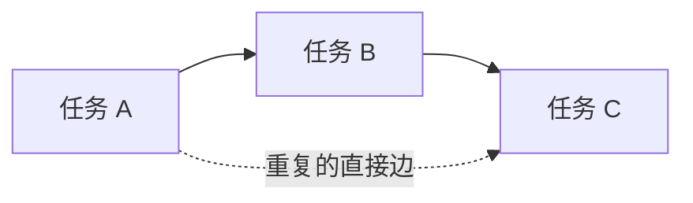

# 多余依赖是什么、如何影响性能、怎样删除

> 归档日期：2026-09-15。来源：`pypto-lib/local_archive/2026年9月9日-DSpark HCA多余依赖删除指南-PR1172.md`。
> 原文的实现、测量与计划保留其历史语境；阅读说明见[学习资料索引](../README.md)。

更新日期：2026-09-09。以 [DSpark HCA PR #1172](https://github.com/hw-native-sys/pypto-lib/pull/1172) 为代码实例。

本文围绕三个问题：哪些依赖是多余的；它们怎样影响性能；应该使用什么语法删除。PR 用于解释具体写法，实验过程和完整记录放在文末的参考资料中。

**开始修改代码前，先用 `deps_viewer` 检查基线。** 文档先解释概念和性能机制；实际操作按“工具识别 → 判断依据 → 修改源码 → 同工具复查 → 精度与性能验证”进行。

语法示例中 `...` 表示省略的计算主体或参数，不能作为独立脚本运行。通用契约见 [依赖与调度](https://github.com/hw-native-sys/pypto-lib/blob/d6f2920046df7a19c28a5079c096a53b7e600219/docs/debug-and-tune/dependency-and-scheduling.md) 和 [编码规范](https://github.com/hw-native-sys/pypto-lib/blob/d6f2920046df7a19c28a5079c096a53b7e600219/docs/pypto-coding/l2-programming.md)。

## 1. 什么是多余依赖

### 1.1 依赖表达什么

任务图中的 `A → B` 表示 B 需要等待 A 满足相应的完成条件。依赖通常用于保证：

- B 读取的数据已经由 A 写好。
- 下一次覆盖缓冲区前，上一次使用已经完成。
- 通信数据已经到齐，或者通信窗口已经可以复用。
- B 引用的张量及其所属分配仍然存活。

这些约束有不同职责，不能只按图上的箭头长短判断是否必要。一个 SPMD 任务可以有多个 block；一个 TaskId 代表整个任务，不是某个 block。

最终的依赖由两部分组成：

```text
最终依赖 = 根据张量访问自动推导的依赖 ∪ deps 显式声明的依赖
```

在本次 HCA 使用的默认 TensorMap runtime 路径中，具体的自动依赖边主要在 **AICPU 执行编排、提交任务时** 建立。编译器先确定张量参数的访问属性，`DeriveCallDirections` 将每个调用的参数方向落实为 Input、InOut、OutputExisting、NoDep 等，随后 codegen 生成 `add_input(t)`、`add_inout(t)`、`add_output(t)` 或 `add_no_dep(t)`。这些语句描述提交参数；实际查询生产者发生在 runtime 的任务提交流程中。

```text
编译期：参数方向分析 → 生成 add_input / add_output 等编排代码
运行期：提交 A 并登记其输出 T → 提交 B 时查询 T 的重叠生产者 → 建立 A → B
```

runtime 使用具体张量的底层地址、范围等信息查 TensorMap，先计算当前任务的前驱，再登记当前任务的输出。A 提交时即可登记为生产者，无需等 A 计算完成；B 的执行顺序由生成的边保证。A2/A3 对应入口是 [compute_task_fanin](https://github.com/hw-native-sys/simpler/blob/15f5cbd922494c62444e75fa1585e39f86a64a78/src/a2a3/runtime/tensormap_and_ringbuffer/runtime/dep_compute.h) 和 [orchestrator 的任务提交流程](https://github.com/hw-native-sys/simpler/blob/15f5cbd922494c62444e75fa1585e39f86a64a78/src/a2a3/runtime/tensormap_and_ringbuffer/runtime/orchestrator.cpp)。

这也解释了 NoDep 的作用：它让指定参数跳过自动生产者查询；`manual_dep=True` 还跳过该张量的普通生产者登记。默认 AUTO 路径中的 creator 保留检查是另一项步骤，不应把这些标记理解成关闭全部生命周期保护。

可选的 `AutoDeriveTaskDependencies` pass 能在编译期推导部分依赖，但本次版本的 AUTO-scope 分析开关默认关闭，详见附录 A。`DeriveCallDirections`、runtime TensorMap 和这个可选 pass 分别负责不同环节。

因此 `deps=[tid]` 表示“添加对 tid 的依赖”，不表示“只依赖 tid”。源码中先后书写两个任务，也不能代替任务之间的依赖。

### 1.2 第一类：已有传递路径的重复边



因为 `A → B → C` 已经保证 C 在 A 后执行，所以直接的 `A → C` 在执行顺序上是重复的。删掉它后，必要的先后关系仍然存在。这类边称为传递冗余边。

PR 中的例子是：

```text
push → payload_wait → readback
```

`payload_wait` 已经等待 push，readback 再直接等待 push，没有增加新的执行顺序保证。

但上述推理针对调度顺序。如果 `A → C` 还包含 `creator` 生命周期保留关系，仅有另一条执行路径不能证明它可以删除；需要另行证明内存生命周期仍正确。

### 1.3 第二类：不相关数据之间的无关等待

两个任务访问独立的数据，却因为共用大张量、保守的范围推导，或者共用一个就绪句柄，被连在了一起。

PR 中有两个例子：

| 情况 | 多等了什么 | 真正需要等待什么 |
|---|---|---|
| raw gather 和 compressed gather 共用 cache-ready dummy | raw gather 也等 compressed cache，反之亦然 | 各自的 cache writer |
| 不同 local group 共用 O projection 中间张量的不同列段 | group1 的 quant 等了 group0 的 A | 同一个 group 的 A |

这类边不一定有替代路径。删除它会放宽原图允许的执行顺序，因此必须用张量读写范围、索引和数据流证明两个任务独立。

`deps_viewer` 擅长识别第一类传递冗余；第二类还需要结合模型代码分析。工具显示 0 条，不等于所有不相关的数据分支都已经完全解开。

### 1.4 哪些依赖不能凭感觉删除

“这个任务很早就结束了”“箭头跨得很远”“它不在本次关键路径上”都不是充分依据。尤其要检查：

- 真实的数据生产者，以及合并任务需要的全部输入。
- 同一缓冲区的跨轮次读完、覆盖和复用顺序。
- 分配/creator 保留关系。
- 跨卡的 payload 到达、完成通知与信号回收协议。

删除的是不必要的约束；每一个必要条件都必须仍由直接依赖或已证明充分的任务链保证。

## 2. 多余依赖会怎样影响性能

### 2.1 传递冗余边：可能增加依赖处理开销

对于 `A → B → C` 加一条 `A → C`，理想情况下 C 原本就必须等 B，因此直接边不会额外推迟 C 的逻辑就绪时间。不能把它解释为“C 又完整等待了一次 A”。

不过，运行时仍需要建立和维护真实存在的依赖边：记录前驱、连接后继、处理任务完成后的依赖释放，以及检查消费者是否就绪。多余边可能增加这些工作和元数据量。

当任务很短、任务数很多、编排或调度开销较明显时，减少这些工作可能有价值。它通常不会直接减少 matmul、向量计算或数据搬运量，也不能按“删一条边节省固定多少微秒”估算收益。

直接前驱集合还可能影响提前派发资格。额外祖先边可能改变 `allow_early_resolve` 的资格判断，但必须结合具体前驱标记和泳道证明实际提前派发发生，不能只看删边数量。

### 2.2 无关等待：可能推迟启动，损失并行机会

普通就绪条件可以理解为：

```text
任务的就绪时刻 = 所有必要前驱完成时刻的最大值
实际启动还受调度、核资源和其他门控条件影响
```

假设 raw cache 在 10 µs 写好，compressed cache 在 30 µs 写好。以下只是说明机制的假设例子，不是实测数据：

| cache 就绪条件 | raw gather 最早能满足该条件的时刻 |
|---|---:|
| 同时等待两种 cache | 30 µs |
| 只等待 raw cache | 10 µs |

删除无关等待可以释放 20 µs 的潜在提前空间，让两个分支更多地重叠。但如果 raw gather 还有其他未完成的输入，或者没有可用核，它不一定真的提前 20 µs；整个 HCA 也不一定因此快 20 µs。

这种优化更直接地改变任务启动机会和流水并行程度，是否缩短总耗时还取决于关键路径和后续汇合点。

### 2.3 边更少，为什么也可能不变快甚至变慢

提前启动可能改变并发任务组合，增加内存带宽、缓存或核资源竞争。因此会出现：

- 某个任务更早开始，但单 block 执行时间变长。
- 某个分支完成更早，但另一个分支仍决定整体完成时间。
- 图变简单，依赖处理减少，但这部分成本太小，整体性能没有可测变化。

例如观察 `hca_cmp_qk_pv` 时，应该区分计算量、单 block 耗时和整个算子的跨度。核代码没有增加计算，不代表在不同并发状态下耗时完全不变。

重构代码还可能改变编译结果。本 PR 抽出 helper 后，`o_group_a2a_gather` 的循环上界变成标量参数，存在标量参数处理差异；不能把“模型计算量没增加”扩大成“所有机器指令完全一致”。

### 2.4 用什么证明效果

| 想证明的结论 | 应查看的证据 |
|---|---|
| 多余边确实减少 | 新旧 `deps.json`，同一 `deps_viewer` 模式的报告 |
| 任务确实更早启动 | 同 case 泳道的就绪、派发、开始和结束时间 |
| 核本身执行时间改变 | 单 block 耗时及分布，结合同时执行的其他任务 |
| 整体性能提升 | 同一物理卡组、同一输入与口径，关闭 profiling 后的交替计时 |

本 PR 已确认图更简单，但没有确认稳定提速。性能结论与依赖图结论应分别报告。

## 3. 如何删除多余依赖：流程与语法

### 3.1 动手第一步：用现成工具检查基线

加载匹配的 PyPTO/simpler 环境，选择准备修改版本的 `deps.json`。保存完整基线目录，核对程序、TP、B/S、context 和 rank，保留相邻的名字映射。已有图时直接分析，无需为识别依赖重新采集泳道。

```bash
DEPS_JSON="path/to/baseline/dfx_outputs/rank3/d0/deps.json"

python -m simpler_setup.tools.deps_viewer "$DEPS_JSON" \
    --edge-mode omitted -o baseline_omitted.txt
python -m simpler_setup.tools.deps_viewer "$DEPS_JSON" \
    --edge-mode omitted_dataflow -o baseline_omitted_dataflow.txt
```

`path/to/baseline` 是待替换路径；本 PR 可直接使用的文件见文末。用 `python -m` 加载包内模块。工具可以自动查找同目录 `name_map*.json`，也可用 `--func-names` 明确指定。

| 模式 | 判断范围 |
|---|---|
| `omitted` | 识别传递冗余调度边，保护带 creator 注解的任务对 |
| `omitted_dataflow` | 在完整数据流证据支持时，进一步允许省略部分 INOUT creator 边 |

dataflow 模式会保留 `OUTPUT_EXISTING` 复用边界，无法证明完整访问范围时也会保留。两种模式建议一起看；图有环会告警并跳过约简，需要同时检查 stderr。

**工具只改变分析输出，不会删除源码或实际调度图里的边。** 如需图形化定位，可加 `--format html`；`reduced` / `reduced_dataflow` 用于查看隐去对应候选边后的图。

### 3.2 根据边的来源选择语法

先在 `deps.json` 中看该任务对的注解：`explicit` 来自手写依赖，`tensormap` 来自自动推导，`creator` 涉及生命周期保留。同一任务对可能同时有多个来源。

| 语法 | 作用范围 | 什么时候用 |
|---|---|---|
| `with ... as tid` | 一次任务提交 | 捕获 TaskId，供真正的消费者使用 |
| `deps=[tid]` | 当前任务 | 显式保留必要前驱；有传递保证时删掉重复祖先 |
| `pl.at(..., no_dep_args=[t])` | 当前任务的指定参数 | 该参数引出的自动依赖已由另一条链充分保证 |
| `pl.no_dep(t)` | 一次显式提交的指定参数 | 与上面相同，用于参数传递的位置 |
| `pl.create_tensor(..., manual_dep=True)` | 该张量的整个生命周期 | 审计全部读写后，由明确的任务链负责顺序 |

优先选影响范围小的写法。`deps` 不会关闭自动推导，`spmd_submit` 也不会自动进入手工依赖模式。关闭某个参数或张量的推导后，它需要的顺序必须仍然存在。

下面用 PR 的四种处理说明具体语法。

### 3.3 语法一：删掉 deps 中已有传递保证的祖先

原来 readback 显式等待 push 和 payload_wait：

```python
with pl.spmd(
    READBACK_WORKERS,
    name_hint="cp_hca_projection_allgather_readback",
    deps=[_push_tid, _payload_wait_tid],
) as _readback_tid:
    ...
```

`payload_wait` 已经通过 `deps=[_push_tid]` 等待 push，因此 readback 所需的显式依赖可以变为：

```python
deps=[_payload_wait_tid]
```

保留的顺序是 `push → payload_wait → readback`。同理，retire 的显式依赖从 `[_readback_tid, _readback_wait_tid]` 缩为 `[_readback_wait_tid]`。

**这一步只处理显式来源。** 如果 readback 访问的窗口又自动引出了 push → readback，还需要处理这个参数的自动推导。

### 3.4 语法二：在一个任务上关闭指定参数的自动推导

`pl.at` 的写法：

```python
with pl.at(
    level=pl.Level.CORE_GROUP,
    name_hint="cp_hca_projection_allgather_readback_wait",
    deps=[_readback_tid],
    no_dep_args=[gather_signal],
) as _readback_wait_tid:
    ...
```

这里明确保留 readback → readback_wait，并且不再通过 `gather_signal` 自动补依赖。核内对信号的真实 wait 仍保留。

在显式 SPMD 提交中，对应写法是 `pl.no_dep(...)`：

```python
group_out, _readback_tid = pl.spmd_submit(
    self.cp_hca_projection_allgather_readback,
    group_out, pl.no_dep(gather_window), pl.no_dep(gather_signal),
    group_base, tp_rank, group_rows, full_rows,
    core_num=READBACK_WORKERS, deps=[_payload_wait_tid],
)
```

这表达的是：窗口数据到齐由 payload_wait 保证，该提交不再通过窗口和信号参数添加重复生产者边。数据仍被读取、搬运，notify/wait 仍会执行；`NoDep` 改变的是依赖登记。

当前 PR 的通信链完整保留为：

```text
pack → push → payload_wait → readback → readback_wait → retire → unpack
```

其中 readback 把本卡通信窗口里的数据复制到 `projection_full`，并通知其他卡本卡已读完。它在改动前就存在，不是为了删边新增加的一次搬运。

源码：[HCA all-gather 的提交位置](https://github.com/hw-native-sys/pypto-lib/blob/8145e36df471ce2ae2728ee159714248bcf9b335/models/deepseek_v4_flash_dspark/decode_cp_allgather.py#L270)。

### 3.5 语法三：manual_dep=True 配合同组 TaskId 链

O projection 的不同 local group 使用同一个中间张量的不同列段。证明这些列段独立后，先关闭两个中间张量的自动推导：

```python
own_a_fp32 = pl.create_tensor([LOCAL_T_PAD, LOCAL_O_WIDTH], dtype=pl.FP32, manual_dep=True)
own_a_i8 = pl.create_tensor([LOCAL_T_PAD, LOCAL_O_WIDTH], dtype=pl.INT8, manual_dep=True)
```

然后在每个 `owner/local_group` 的循环体里连接本组任务：

```python
with pl.spmd(own_a_rows * (O_LORA // O_A_N_TILE), name_hint="tp_o_a") as pa_tid:
    ...

with pl.spmd(O_A_QUANT_WORKERS, name_hint="tp_o_a_quant", deps=[pa_tid]) as q_tid:
    ...

with pl.spmd(own_b_rows * (D // O_B_D_TILE), name_hint="tp_o_b", deps=[q_tid]):
    ...
```

`pa_tid` 和 `q_tid` 都属于当前 group，不是把多个 group 合起来的句柄。实际读写的列起点由 `o_a_col = local_group * O_LORA` 决定。

```text
A_group0 → quant_group0 → B_group0 ─┐
                                  ├→ dequant
A_group1 → quant_group1 → B_group1 ─┘
```

`own_b_i32` 继续使用自动依赖，所以 dequant 仍等待该 owner 的全部 B 组。不能只加 `manual_dep=True`，却漏掉上述组内链。

同一种语法也用于已经有充分传递路径的张量。例如 `post_t` 加 `manual_dep=True`，去掉 split_pre_post → hc_post 的直接边，已有 norm → attention → O projection 链仍保证顺序。`projection_full` 也使用该标记，而 unpack 继续显式等待 retire。

源码：[O projection 的 owner/group 链](https://github.com/hw-native-sys/pypto-lib/blob/8145e36df471ce2ae2728ee159714248bcf9b335/models/deepseek_v4_flash_dspark/decode_o_proj.py#L530)、[post_t](https://github.com/hw-native-sys/pypto-lib/blob/8145e36df471ce2ae2728ee159714248bcf9b335/models/deepseek_v4_flash_dspark/decode_hca.py#L209)。

### 3.6 语法四：拆开被 dummy 合并的就绪条件

原来把两种 cache 的 writer 合并：

```python
cache_ready_dep = pl.system.task_dummy(deps=[ori_cache_write_tid, cmp_cache_write_tid])
```

两个 gather 都等待这个联合句柄。改为分别传递 writer 句柄：

```python
with pl.spmd(raw_gather_count, name_hint="hca_gather_kv", deps=[ori_cache_ready_dep]) as raw_gather_tid:
    ...

with pl.spmd(cmp_gather_count, name_hint="hca_cmp_work_gather", deps=[cmp_cache_ready_dep]) as cmp_gather_tid:
    ...
```

这样 raw gather 只受 raw cache 就绪条件限制，compressed gather 使用自己的条件。后续 merge 仍等待 `raw_tid`、`cmp_tid` 和 `rope_tid`；Q 等其他输入的依赖也保留。

这是选择更精确的等待范围。不要把所有 `task_dummy` 都当成多余任务：如果消费者确实需要全部生产者，联合句柄就有实际用途。

本例还有一个重要的报告解读问题：工具在原图中会把 writer → 自身 gather 报为传递冗余，因为存在 writer → dummy → gather。PR 最终保留直接边，删除 dummy 及其 4 条周边边。**识别清单帮助选择改法，不等于必须逐条删除被列出的边。**

源码：[cache writer 句柄的传递](https://github.com/hw-native-sys/pypto-lib/blob/8145e36df471ce2ae2728ee159714248bcf9b335/models/deepseek_v4_flash_dspark/decode_hca.py#L309)、[两个 gather 的入口](https://github.com/hw-native-sys/pypto-lib/blob/8145e36df471ce2ae2728ee159714248bcf9b335/models/deepseek_v4_flash_dspark/decode_sparse_attn_hca.py#L128)。

### 3.7 改完以后怎样验证

重新编译并生成新图，用相同模式再次检查，报告另存，保留基线：

```bash
DEPS_JSON="path/to/final/dfx_outputs/rank3/d0/deps.json"

python -m simpler_setup.tools.deps_viewer "$DEPS_JSON" \
    --edge-mode omitted -o final_omitted.txt
python -m simpler_setup.tools.deps_viewer "$DEPS_JSON" \
    --edge-mode omitted_dataflow -o final_omitted_dataflow.txt
```

还需要完成三类核对：

| 核对内容 | 判断标准 |
|---|---|
| 修改是否真正生效 | 生成编排代码里的参数登记和 `set_dependencies` 符合预期；目标边在新图中实际消失 |
| 正确性是否保留 | 纯传递删边保持可达关系；有意解除无关等待后，其余必要链、全部输入、内存生命周期和通信复用关系仍正确；相应 golden 与边界用例通过 |
| 性能是否改善 | 同物理卡组、同输入和工具链，关闭 profiling 后交替计时；泳道用于解释启动间隔、block 时长和并发变化 |

原始时间记录应通过 `swimlane_converter.read_perf_data()` 关联 AICore/AICPU 数据，检查各 rank 与 block/subslot 的完整性。计时与 dep-gen 分开；不要用不同卡、不同输入或挑选的单次泳道直接计算加速比。

当前 case 的两个模式都为 0 后，不需要继续为了减少计数而删边。如果仍有明显串行，再查数据独立性、调度间隔和资源竞争。

## 附录 A：with pl.spmd、spmd_submit 与本 PR 的适配

| 对比项 | `with pl.spmd(N, ...) as tid` | `out, tid = pl.spmd_submit(self.kernel, ..., core_num=N)` |
|---|---|---|
| 计算代码 | 可写在块内，由编译器提取成 kernel；也支持调用已有 kernel | 提前定义在独立 kernel 函数里 |
| 参数 | 编译器收集块内使用的外部变量 | 调用处显式传递 |
| block 数 | 位置参数 N | `core_num=N` |
| 任务句柄 | `as tid` | 与结果一起返回 |
| 运行时粒度 | 一项任务、N 个逻辑 block | 相同 |

两种写法都支持显式依赖并参与正常自动依赖。`with` 结束不代表 CPU 同步等待；`spmd_submit` 本身也不保证提速。

本 PR 验证的 PyPTO `f1bb0860` / simpler `15f5cbd9` 中，嵌套 SPMD 的部分 NoDep 标记在编译时丢失，生成代码仍是 `add_input(...)`。显式 `pl.spmd_submit(..., pl.no_dep(...))` 能生成正确的 `add_no_dep(...)`，因此抽出了 readback、O-group gather 和 O reduce 三个已有计算主体。

该 `@pl.jit` 写法在真实提交前用一次假分支调用，让 JIT 根据参数生成、登记 helper：

```python
if False:
    readback_specialize = pl.create_tensor([group_rows, 2560], dtype=pl.BF16)
    cp_hca_projection_allgather_readback(
        readback_specialize, gather_window, gather_signal,
        group_base, tp_rank, group_rows, full_rows,
    )
```

运行时不会执行这次调用、分配这个 scratch 或多启动一次 readback。真正执行的是后面的 `spmd_submit`。**`if False` 是这次编译器适配办法，不是通用删边语法，也不是 spmd_submit 的常规必需条件。**

问题与最小复现见 Known PyPTO Issues（本地证据：`KNOWN_PYPTO_ISSUES.md#spmd-outlining-drops-per-consumer-nodep-argument-annotations`；未随文归档） 和 spmd_no_dep_args.py（本地证据：`KNOWN_PYPTO_ISSUES/spmd_no_dep_args.py`；未随文归档）。工具链升级后应重新确认适配是否仍必要。

另有 `AutoDeriveTaskDependencies` 编译 pass，开启 `analyze_auto_scopes_for_deps=True` 后可推导依赖并在满足条件时自动改写部分 NoDep/OutputExisting；该版本默认关闭。它与分析 `deps.json` 的工具不同，本 PR 未验证开启后能否替代手工改动，见 [pass 说明](https://github.com/hw-native-sys/pypto/blob/f1bb0860885247ecdcaf2ccddcc45c9f1eb14382/docs/en/dev/passes/39-auto_derive_task_dependencies.md)。

## 附录 B：PR 结果与复查入口

源码快照为 `8145e36df471ce2ae2728ee159714248bcf9b335`，父提交为 `3e380c8c49f3bd8443df756a93002984d5aab02a`。主要 case 为 A2A3、TP4、每 rank B16/S8、start=256。以下工具数值是对保存图的复核结果。

| 指标，每 rank | 原版 | 修改后 |
|---|---:|---:|
| 工具 `omitted` 识别的边 | 9 | 0 |
| 工具 `omitted_dataflow` 识别的边 | 9 | 0 |
| 非分配依赖边 | 103 | 84 |
| 完整图边数，含 allocation | 233 | 214 |
| 计算及 dummy 任务 | 72 | 71 |
| AIC/AIV 物理执行记录 | 1040 | 1040 |

19 条净删除包括 7 条直接重复边、4 条 cache join 周边边、8 条 O projection 跨组边。工具报出的 9 条与最终净删的 19 条采用不同分类，不能混为一谈。

当时完整 HCA 层及所记录边界 case 的 golden 比较通过；TP1 仅覆盖编译，完整多层 forward 未验证。性能交替计时没有确认稳定提升，图简化结果不能作为提速结论。完整比较器、case、样本与性能口径保留在原记录中。

可复查的资料：

- [原优化记录](../case-studies/2026%E5%B9%B49%E6%9C%887%E6%97%A5-DSpark%20HCA%E6%B3%B3%E9%81%93%E5%88%86%E6%9E%90%E4%B8%8E%E4%BC%98%E5%8C%96%E6%96%B9%E5%90%91.md)：第 14 节的精度、边界和性能记录。
- 工具复核结果（本地证据：`pypto-lib-hca-cache-ready-20260908/build_output/dependency_cleanup/deps_viewer_check/results.json`；未随文归档）：两种模式的基线 9 条、修改后 0 条。
- 生成图与必要依赖审计（本地证据：`pypto-lib-hca-cache-ready-20260908/build_output/dependency_cleanup/rebased/audit.json`；未随文归档）：删边、可达性和 allocation 保留关系。
- 原始交替计时结果（本地证据：`pypto-lib-hca-cache-ready-20260908/build_output/dependency_cleanup/rebased/results.json`；未随文归档）：采样配置与原始样本。
- 基线 rank3 deps.json（本地证据：`pypto-lib-hca-cache-ready-20260908/build_output/dependency_cleanup/rebased/profiles/00_baseline/dfx_outputs/rank3/d0/deps.json`；未随文归档）：检查前使用。
- 最后一次偶数卡 rank3 deps.json（本地证据：`pypto-lib-hca-cache-ready-20260908/build_output/_jit_l3_decode_hca_20260908_013915/dfx_outputs/rank3/d0/deps.json`；未随文归档）：最终版，rank3 对应物理卡 8。
- [工具说明](https://github.com/hw-native-sys/simpler/blob/15f5cbd922494c62444e75fa1585e39f86a64a78/simpler_setup/tools/README.md)：完整命令与模式定义。

如需复现本 PR 的检查，在 `pypto-lib-hca-cache-ready-20260908` 根目录执行 `source build_output/dependency_cleanup/env.sh` 加载原实验环境，再把上面的 deps.json 路径赋给 `DEPS_JSON`。这些构建产物属于本地归档，源码长期复查使用固定提交链接。
