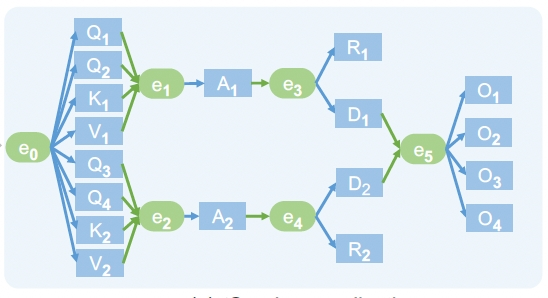
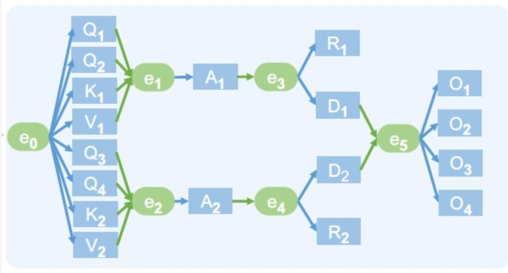

# PyPTO 数据依赖与事件同步

> 归档日期：2026-09-15。来源：`pypto-lib/local_archive/问题描述.md`。
> 原文的实现、测量与计划保留其历史语境；阅读说明见[学习资料索引](../README.md)。

原始问题记录：
提问者：一个task是不是就类似一个算子，GM->GM，执行的数据量就是所有输入的数据
回答者：一个 Task 类似一次 Kernel dispatch，可能对应一个算子、算子的一块，或者多个融合算子。普通计算 Task 通常从 GM 读取所需 slice，在片上计算后写回 GM；它实际处理的数据量由各 block 的 TLOAD/TSTORE 决定，不等于所有输入 Tensor 的总大小。
提问者：能做到类似效果嘛，绿色块是同步，蓝色块是数据，同步事件满足了，就可以执行下一步，没有依赖的部分，可以并行



回答者：看了一下，可以做到类似效果。PyPTO的调度simpler 采用基于 Task DAG 的调度模型：蓝色块可以对应数据的生产/消费 Task，绿色同步点可以用 TaskId 和 deps 表达；多个前置 Task 都完成后，下游 Task 才会进入 ready 状态。没有依赖关系的 Task 可以并行调度，但实际是否同时执行还取决于 AIC/AIV 核资源。

  如果蓝色块只是数据，数据依赖通常可以由 TensorMap 根据 Tensor 的读写区域自动推导；纯控制同步或多路汇合可以使用显式 deps 或pl.system.task_dummy(deps=[...])。

另外：需要注意，默认同步粒度是整个 Task 完成，不是 Task 内某一小块数据就绪；如果需要 tile 级流水，通常要拆分 Task，或者在 mixed kernel 内使用 TPUSH/TPOP。


提问者：需要 tile 级流水，通常要拆分 Task，我也在想，怎么拆分能比较好，simd的优势是处理连续大数据，所以一般咱们都是开double Buffer，不会有10Buffer这种东西，如果咱们也学gpu，拆的这么细，会不会性能还不如整块数据处理
回答者：我们有spmd 也有MPMD呀
回答者：我理解不应该一个tile一个task，这样调度开销太大。可以一组提了拆成chunk，每个task处理一个chunk，task内部是spmd；不同计算阶段再用mpmd和依赖形成流水
提问者：宏观上看是这样的，微观上看，其实不然，一条指令处理100个数据，和100条指令分别处理一个数据，性能差异是很大的
回答者：微观上不能把原来一次向量化处理的大块连续数据，拆成很多 Task 分别处理单个元素，否则会损失 SIMD 利用率，而且调度开销会显著增加。
我说的拆分不是沿连续的 SIMD维度拆，而是沿 token、batch、head 等外层独立维度按 chunk 拆。每个 Task 内部仍然使用 SPMD worker、完整 tile、向量指令和 double buffer；MPMD 只负责让不同阶段的chunk 建立依赖和重叠执行。也就是宏观上拆阶段，微观上仍保持大块向量化。


## 1. 问题

希望实现下图所示的执行效果：

- 蓝色块表示数据或者处理这些数据的计算节点。
- 绿色块表示同步事件。
- 一个同步事件的所有前置条件满足后，才允许执行后续节点。
- 互相之间没有依赖的节点可以并行执行。



## 2. 结论

PyPTO/simpler 可以实现类似效果。它们使用基于 Task DAG（有向无环图）的调度模型：

> 前置 Task 全部完成后，下游 Task 的依赖被释放，然后进入 ready queue。没有未满足依赖的 Task 都允许被并行调度。

图中概念可以按下表映射：

| 图中概念 | PyPTO/simpler 中的表达 |
|---|---|
| 蓝色计算块 | `pl.at` / `pl.spmd` 产生的 Task |
| 蓝色数据 | GM Tensor、Tensor view 或 Tensor slice |
| 绿色同步点 | TaskId、`deps` 或 `pl.system.task_dummy` |
| 数据依赖箭头 | TensorMap 根据内存区域和读写方向自动推导的边 |
| 纯控制依赖箭头 | 用 `deps=[task_id]` 显式声明的边 |

## 3. 首先区分“数据”和“Task”

严格来说，数据本身不会被调度执行。如果图中的 `Q1`、`K1`、`V1` 只表示一块数据，那么真正的 DAG 节点是“生产这块数据的 Task”和“消费这块数据的 Task”。

因此，更准确的表达是：

```text
上游计算 Task
    └── 写出 Q1/K1/V1 等 GM Tensor 或 slice
             ↓ 数据依赖
下游计算 Task
    └── 读取这些 Tensor 或 slice
```

Task 是 runtime 的调度节点，数据是 Task 的参数及依赖载体。

## 4. 依赖是如何建立的

PyPTO 中有两种建立 Task 依赖的方式，最终依赖集合是两者的并集：

```text
最终依赖 = TensorMap 自动推导的依赖 ∪ 用 deps 声明的显式依赖
```

### 4.1 数据依赖：TensorMap 自动推导

Task 提交时，runtime 会根据 Tensor 参数的内存区域及 `In` / `Out` / `InOut` 方向建立依赖。

例如：

```python
with pl.at(level=pl.Level.CORE_GROUP, name_hint="producer") as producer_tid:
    intermediate[...] = produce(...)

with pl.at(level=pl.Level.CORE_GROUP, name_hint="consumer"):
    result[...] = consume(intermediate)
```

如果 consumer 读取的 `intermediate` 区域与 producer 写入的区域重叠，TensorMap 会自动建立：

```text
producer ───► consumer
```

这种情况下通常不需要再写一条重复的 `deps`。

### 4.2 纯同步依赖：TaskId + deps

如果两个 Task 之间没有可见的共享 Tensor，但在逻辑上必须保持先后关系，可以显式声明：

```python
with pl.at(level=pl.Level.CORE_GROUP, name_hint="producer") as producer_tid:
    ...

with pl.at(
    level=pl.Level.CORE_GROUP,
    name_hint="consumer",
    deps=[producer_tid],
):
    ...
```

这表示 consumer 必须等待 producer 完成。

## 5. 绿色同步块如何表达

### 5.1 多路汇合点

图中 `e1` 需要同时等待 `Q1/Q2/K1/V1`，可以用零计算的 dummy Task 汇合：

```python
e1 = pl.system.task_dummy(deps=[q1_tid, q2_tid, k1_tid, v1_tid])
```

`task_dummy` 不执行 Tensor 计算，它的主要作用是把多个前置 TaskId 合并成一个新的 TaskId。

### 5.2 单入多出点

图中 `e3` 只等待 `A1`，然后同时解锁 `R1` 和 `D1`。这种情况下通常不需要额外的 dummy：

```python
with pl.at(..., name_hint="r1", deps=[a1_tid]) as r1_tid:
    ...

with pl.at(..., name_hint="d1", deps=[a1_tid]) as d1_tid:
    ...
```

两个 consumer 直接依赖同一个 `a1_tid`，就已经等价于：

```text
A1 ───► e3 ─┬──► R1
              └──► D1
```

这样可以避免为纯扇出额外增加一个 runtime Task。

## 6. 整张图的概念代码

下面代码主要用于说明依赖关系，省略了每个 Task 内的具体 Tensor 计算：

```python
# 第一组无相互依赖的 Task，允许并行调度。
with pl.at(level=pl.Level.CORE_GROUP, name_hint="q1") as q1_tid:
    ...
with pl.at(level=pl.Level.CORE_GROUP, name_hint="q2") as q2_tid:
    ...
with pl.at(level=pl.Level.CORE_GROUP, name_hint="k1") as k1_tid:
    ...
with pl.at(level=pl.Level.CORE_GROUP, name_hint="v1") as v1_tid:
    ...

# 第二组也没有相互依赖。
with pl.at(level=pl.Level.CORE_GROUP, name_hint="q3") as q3_tid:
    ...
with pl.at(level=pl.Level.CORE_GROUP, name_hint="q4") as q4_tid:
    ...
with pl.at(level=pl.Level.CORE_GROUP, name_hint="k2") as k2_tid:
    ...
with pl.at(level=pl.Level.CORE_GROUP, name_hint="v2") as v2_tid:
    ...

# e1/e2：多路汇合。
e1 = pl.system.task_dummy(deps=[q1_tid, q2_tid, k1_tid, v1_tid])
e2 = pl.system.task_dummy(deps=[q3_tid, q4_tid, k2_tid, v2_tid])

with pl.at(level=pl.Level.CORE_GROUP, name_hint="a1", deps=[e1]) as a1_tid:
    ...
with pl.at(level=pl.Level.CORE_GROUP, name_hint="a2", deps=[e2]) as a2_tid:
    ...

# e3/e4 可以直接由 a1_tid/a2_tid 表示。
with pl.at(level=pl.Level.CORE_GROUP, name_hint="r1", deps=[a1_tid]) as r1_tid:
    ...
with pl.at(level=pl.Level.CORE_GROUP, name_hint="d1", deps=[a1_tid]) as d1_tid:
    ...

with pl.at(level=pl.Level.CORE_GROUP, name_hint="d2", deps=[a2_tid]) as d2_tid:
    ...
with pl.at(level=pl.Level.CORE_GROUP, name_hint="r2", deps=[a2_tid]) as r2_tid:
    ...

# e5 只等待 D1/D2，不等待 R1/R2。
e5 = pl.system.task_dummy(deps=[d1_tid, d2_tid])

# O1/O2/O3/O4 在 e5 满足后同时变为 ready。
with pl.at(level=pl.Level.CORE_GROUP, name_hint="o1", deps=[e5]):
    ...
with pl.at(level=pl.Level.CORE_GROUP, name_hint="o2", deps=[e5]):
    ...
with pl.at(level=pl.Level.CORE_GROUP, name_hint="o3", deps=[e5]):
    ...
with pl.at(level=pl.Level.CORE_GROUP, name_hint="o4", deps=[e5]):
    ...
```

对应的简化 DAG 是：

```text
Q1 Q2 K1 V1 ─► e1 ─► A1 ─┬─► R1
                         └─► D1 ─┐
                                  ├─► e5 ─► O1 O2 O3 O4
Q3 Q4 K2 V2 ─► e2 ─► A2 ─┬─► D2 ─┘
                         └─► R2
```

## 7. Runtime 中“事件满足”的具体含义

普通调度的时间线是：

```text
submit ─► ready ─► dispatch ─► start ─► end ─► finish ─► 释放下游
```

其中：

1. Orchestrator 把 Task 提交到任务图。
2. 只有所有前置依赖都释放后，Task 才会进入 ready queue。
3. Scheduler 在存在合适空闲 core 时调度 Task。
4. AICore 执行完成后产生 FIN。
5. AICPU scheduler 观察到 FIN，把 Task 标记为 finish。
6. 该 Task 的下游 consumer 计数被释放；最后一个 producer 释放后，consumer 才会 ready。

因此，图中的“同步事件满足”在普通 Task DAG 里表示：

> 所有直接 producer Task 已经 finish，而不仅仅是计算指令已经返回。

## 8. “没有依赖可以并行”的准确含义

没有未满足依赖的 Task 可以同时进入 ready queue，但这只代表“调度允许并行”，不保证它们一定在同一时刻执行。

实际并行度还受以下条件限制：

- AIC Task 需要 Cube core。
- AIV Task 需要 Vector core。
- MIX Task 同时需要对应的 AIC/AIV 资源。
- 同类 ready Task 数量大于空闲 core 数时会排队。
- SPMD Task 的 block 数超过 core 数时会分波执行。
- Task 还可能因调度优先级、可用 slot 和 runtime 背压而延后。

所以对外讲解时应该说：

> 没有依赖的 Task 允许并行调度，实际是否同时执行还取决于硬件资源和 runtime 调度状态。

## 9. 同步粒度的限制

普通 `deps` 的同步粒度是整个 Task，不是 Task 内的某个 tile 或某个 SPMD block。

例如：

```python
for block_idx in pl.spmd(16, name_hint="producer"):
    ...
```

这在 DAG 中仍然是一个 Task，只是该 Task 包含 16 个 logical block。下游 Task 默认等待整个 16-block fan-out 完成，不能在 block 0 刚完成时就只消费 block 0 的结果。

如果需要更细粒度的流水，可以考虑：

1. **拆分 Task**：每个数据分块单独建立 producer/consumer 依赖。优点是 DAG 粒度细，缺点是 Task 数和 AICPU 调度开销上升。
2. **合并为 mixed Task**：Cube 和 Vector 之间使用 `TPUSH/TPOP` 在片上传递 tile，避免每个 tile 都经过 GM 和 Task 调度。

可以简单记忆为：

```text
TaskId + deps     适合 Task/阶段级 DAG 同步
TPUSH/TPOP         适合一个 mixed Task 内的 tile 级流水
notify/wait        适合跨卡或特殊 GM 通信协议
```

## 10. 完成事件与任意运行时事件的区别

如果绿色块表示“前置 Task 已经完成”，那么 TaskId 和 `deps` 能直接表达。

如果绿色块表示一个任意的动态条件，例如：

- GM 中某个标志变为 1。
- 一个动态计数器达到 N。
- 根据输入数据的值决定是否执行下游。

那么它不再是普通的静态 Task 完成依赖，可能需要 predicated dispatch、notify/wait、GM 原子计数或 AICPU/host 控制流。

## 11. 不建议为了“画出绿色块”而添加过多 dummy

`pl.system.task_dummy` 虽然不做 Tensor 计算，但它仍然是 runtime Task，会占用任务槽、依赖表项并增加一次调度 hop。

因此建议：

- 真实数据流依赖优先交给 TensorMap。
- 没有数据流的控制依赖使用 `deps`。
- 只在需要多路汇合或缩短 TaskId 列表时使用 `task_dummy`。
- 单入多出时让多个 consumer 直接依赖同一个 producer TaskId。

## 12. 怎样验证实际执行与设计一致

不能只根据 Python 源码的书写顺序判断 Task 是否存在依赖。PyPTO 中，相邻书写的两个 Task 不代表一定串行。

运行时可以打开：

```python
runtime_cfg=dict(
    enable_dep_gen=True,
    enable_chip_swimlane=4,
)
```

重点检查：

| 产物 | 用途 |
|---|---|
| `deps.json` | 确认 Task 节点、block 数、每条依赖边及其来源 |
| `chip_swimlane_records.json` | 确认没有依赖的 Task 是否真正重叠执行 |
| `merged_swimlane*.json` | 把依赖图与物理执行时间线合并查看 |

需要特别检查是否出现了非预期依赖。TensorMap 会保守处理无法证明互不重叠的内存区域，所以两个实际处理不同 slice 的 Task，也可能因为 runtime 无法证明它们不重叠而被串行化。

## 13. 讲解时可以直接使用的回答

### 简短版

> 可以。PyPTO/simpler 可以构建这种基于 Task DAG 的执行图：前置事件全部满足后，下游 Task 进入 ready 状态；没有依赖的 Task 允许并行调度。数据依赖可以由 TensorMap 自动推导，纯同步关系可以用 TaskId 和 `deps` 表达，多路汇合可以使用 `pl.system.task_dummy`。但默认同步粒度是整个 Task，实际并行度还受 AIC/AIV 硬件资源限制。

### 稍微展开的版本

> 这张图可以映射到 PyPTO 的 Task DAG。蓝色计算块对应 Task，蓝色数据对应 Task 读写的 GM Tensor 或 slice，绿色同步点对应 TaskId 依赖。对于真实的 Tensor 数据流，runtime 可以通过 TensorMap 自动建立 producer-consumer 依赖；如果只是控制同步，可以用 `deps` 显式指定；如果多个分支要汇合，可以用 `task_dummy` 收集多个 TaskId。依赖满足的 Task 会进入 ready queue，由 scheduler 根据 AIC/AIV 空闲资源调度。因此“无依赖”表示允许并行，不代表硬件一定能让它们同时开始。

## 14. 相关资料

- `docs/debug-and-tune/dependency-and-scheduling.md`：Task DAG、TensorMap、`deps`、scheduler 和 early dispatch。
- `docs/pypto-coding/pypto-coding-style.md`：`pl.at`、`pl.spmd`、`pl.parallel` 及 mixed kernel。
- `docs/run-and-validate/compile-runtime-workflow.md`：从 Python 编译到 runtime 执行的完整流程。
- PyPTO 上游 `docs/en/user/tasks/`：Task 模型、scope、submit 和调度调优。

## 15. 关于 Task 拆分、SIMD、SPMD 和 MPMD 的讨论记录

### 15.1 讨论背景

在讨论 tile 级流水时，提出了一个问题：

> 需要 tile 级流水时，通常要拆分 Task。但 SIMD 的优势是处理连续大数据，我们一般开 double buffer，不会开十层 buffer。如果像 GPU 一样拆得非常细，会不会还不如整块数据处理？PyPTO 同时有 SPMD 和 MPMD，应该如何组合？

同事对微观执行效率提出了补充：

> 宏观上看是这样，微观上其实不然。一条指令处理 100 个数据，和 100 条指令分别处理一个数据，性能差异很大。

这两个观点并不矛盾，它们说的是不同层次的粒度。

### 15.2 同事的意思

同事反对的是把原本向量化的计算拆成大量标量计算。

例如，原来硬件能够用一条向量指令同时处理 100 个连续元素：

```text
一条向量指令 ──► 同时处理 data[0:100]
```

如果拆分后变成：

```text
Task 0  ──► 一条指令只处理 data[0]
Task 1  ──► 一条指令只处理 data[1]
...
Task 99 ──► 一条指令只处理 data[99]
```

那么会同时损失：

- SIMD 向量利用率。
- 连续访存效率。
- Tile 内数据复用。
- Double buffer 覆盖搬运延迟的能力。
- Kernel/Task 初始化开销的摊薄效果。

同时还会增加 AICPU 的 Task 提交、依赖管理、调度和 FIN 检测开销。因此，“一个元素或一个很小的 tile 对应一个 Task”通常不是好的拆分方式。

### 15.3 这里所说的“拆 Task”是什么

这里建议的不是沿 SIMD 处理的连续元素维度拆分，而是沿外层相互独立的维度分成少量较大的 chunk。

假设数据形状是：

```text
[100 个 token, 每个 token 有 4096 个连续元素]
```

不推荐沿 `hidden=4096` 拆成大量小 Task。可以沿 token 维度分组：

```text
Task 0 处理 token  0～7
Task 1 处理 token  8～15
Task 2 处理 token 16～23
...
```

每个 Task 内部处理一个 token 时，仍然对连续的 4096 个元素进行 tile 化和向量化：

```text
外层：按 token 或行分 chunk
    └── 内层：按合适的向量 tile 处理连续 4096 元素
            └── 使用 SIMD + double buffer
```

因此，拆的是“哪些行/token 由哪个 Task 处理”，不是把一条向量指令拆成很多标量指令。

### 15.4 用 100 个数据理解三种方案

假设 100 个数据需要依次执行 A 和 B 两个阶段。

#### 方案一：完全不拆

```text
A 处理全部 100 个数据 ──► B 处理全部 100 个数据
```

好处是单个 Task 较大，开销容易摊薄；问题是 B 必须等待 A 把所有数据处理完。

#### 方案二：一个数据拆成一个 Task

```text
A(data0) ─► B(data0)
A(data1) ─► B(data1)
...
A(data99) ─► B(data99)
```

这种方案流水粒度很细，但 SIMD 利用率和 Task 调度效率通常很差，就是同事担心的情况。

#### 方案三：按较大 chunk 拆分

例如每 25 个数据一组：

```text
A(chunk0: data  0～24) ─► B(chunk0)
A(chunk1: data 25～49) ─► B(chunk1)
A(chunk2: data 50～74) ─► B(chunk2)
A(chunk3: data 75～99) ─► B(chunk3)
```

时间线可能形成：

```text
时间 ──────────────────────►

A: [chunk0][chunk1][chunk2][chunk3]
B:         [chunk0][chunk1][chunk2][chunk3]
```

A 处理完 chunk0 后，B 就可以开始处理 chunk0，不必等待 A 的全部工作。与此同时，每个 chunk 内部仍然使用向量 tile 和 double buffer。

方案三不一定比方案一快，因为它会增加 Task 数量和可能的对齐/尾块开销。只有当 A/B 的重叠收益大于这些开销时，拆分才值得。

### 15.5 Double buffer 与 Task 拆分解决的问题不同

Double buffer 用于一个 Task 或 block 内部：

```text
加载 tile i+1
      ↕ 重叠
计算 tile i
      ↕ 重叠
写回 tile i-1
```

按 chunk 拆分 Task 用于不同计算阶段之间：

```text
A 计算 chunk i+1
      ↕ 重叠
B 计算 chunk i
```

因此两者可以同时使用：

- Task 内用 double buffer 隐藏 GM 搬运延迟。
- Task 间用 chunk 依赖让不同阶段重叠。

一般不需要为了让多个 Task 并行而把单个 block 的本地流水改成十层 buffer。“有多个 SPMD block/ready Task”和“一个 block 内有十个 buffer slot”是两件事。

### 15.6 SIMD、SPMD 和 MPMD 各自解决什么

```text
MPMD：不同计算阶段之间的并行和依赖
  └── 例如 A 阶段生产 chunk，B 阶段消费 chunk

SPMD：多个 block 执行同一份程序，处理不同数据分区
  └── 例如不同 worker 处理不同 token/行/head

SIMD：一个 block 内的一条向量指令同时处理多个连续元素
  └── 例如对一个连续 tile 执行 add/mul/cast/reduce
```

建议的组合方式是：

```text
MPMD Task DAG
    └── 组织不同阶段和 chunk 依赖
        └── 每个 Task 使用 SPMD 扩展多个 worker
            └── 每个 worker 内使用 SIMD + tile + double buffer
```

SPMD 和 MPMD 只是可用机制，并不会自动保证性能。例如 `pl.spmd(100)` 如果每个 block 只处理一个元素，同样会因工作太小而效率很低。

### 15.7 应该沿哪个维度拆

通常适合沿外层独立维度拆：

- batch
- token 或行
- head
- expert
- M/N block
- 由多个 tile 组成的 chunk

通常不适合拆：

- 一条 Vector 指令覆盖的连续元素。
- 已经很小的 tile。
- 单个标量。
- 拆分后只能通过 GM 交换、原本可以在 UB/L1/L0 复用的中间数据。

最核心的原则是：

> 拆的是阶段和外层数据分区，不是把一条向量指令拆成很多标量指令。

### 15.8 什么时候值得拆，什么时候不值得

值得尝试拆分的情况：

- Producer 很长，Consumer 可以提前消费部分结果。
- 大 Task 数量少于可用 core，设备无法被吃满。
- Producer 和 Consumer 使用不同资源，例如一个偏 AIC，一个偏 AIV。
- 各 chunk 相互独立，可以建立 `producer_chunk_i → consumer_chunk_i` 依赖。
- 一个大 Task 导致片上内存超限或明显负载不均。

通常不值得拆分的情况：

- 拆分后每个 Task 只有几微秒左右的工作。
- 中间数据原本可以留在片上，拆后必须先 store GM 再 load GM。
- 前后操作容易放在同一个 kernel 中融合。
- 相邻 tile 能复用权重、KV、常量或 scratch。
- AICPU 泳道已经持续繁忙，再增加 Task 只会加重调度瓶颈。

如果 Producer 是 Cube 计算、Consumer 是 Vector 计算，而且中间 tile 能够在片上传递，应优先考虑 mixed Task 和 `TPUSH/TPOP`，而不是拆成两个 Task 并把中间结果落到 GM。

### 15.9 本次讨论的最终共识

```text
细粒度计算：SIMD
核间数据并行：SPMD
阶段间并行：MPMD
Task 内流水：double buffer
Task 间流水：按较大 chunk 建立 DAG
```

对同事可以这样总结：

> 微观上确实不能把原来一次向量化处理的连续大块数据，拆成很多 Task 分别处理单个元素，否则会损失 SIMD 利用率并引入大量调度开销。这里建议的拆分是沿 token、batch、head 等外层独立维度，将数据分成少量较大的 chunk。每个 Task 内部仍然使用 SPMD worker、完整 tile、SIMD 和 double buffer；MPMD 只用来组织不同阶段之间的 chunk 依赖。这样才能在保留微观向量化效率的同时，尝试获得宏观流水重叠。但是 chunk 拆分不保证一定变快，最终需要用真实设备的 wall time、Task 泳道和 PMU 数据对比完整处理与不同 chunk 粒度。
