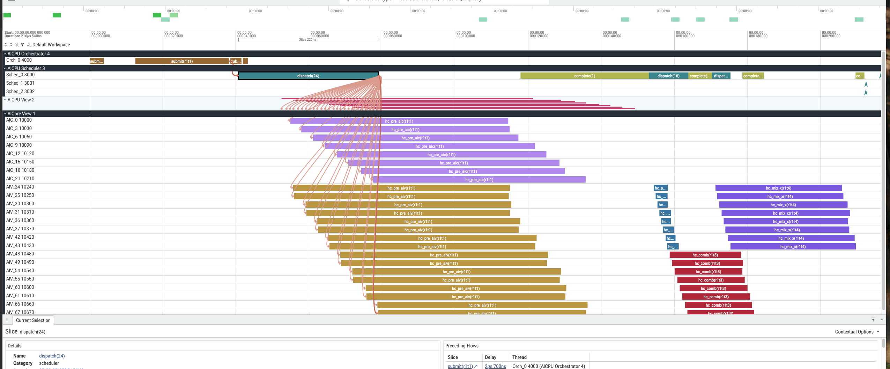

# 泳道图入门：怎么看懂一张 swimlane

这份文档教你**从零看懂泳道图（swimlane）**：每个专业名词是什么、它们怎么串起来、
一张图该从哪看起。配套的"具体调优怎么改代码"见 [`swimlane-tuning-log.zh.md`](./swimlane-tuning-log.zh.md)。

全程用一个真实例子贯穿：DeepSeek-V4 的 `hc_pre` kernel（4 个 `pl.spmd` scope 版本），
泳道文件为：

```
build_output/_jit_hc_pre_test_20260615_111320/dfx_outputs/merged_swimlane_20260615_111324.json
```

---

## 0. 一句话先建立直觉

把整个 kernel 在芯片上的执行，想象成一家**餐厅出餐**：

| 餐厅角色 | 芯片里的对应 | 干的事 |
|---|---|---|
| 前台收银，把订单录入系统 | **Orchestrator（编排器）** | `submit`：把每个任务组投到队列 |
| 叫号员，看哪桌备齐了就喊后厨开做 | **Scheduler（调度器）** | `dispatch`：依赖满足就放行；`complete`：确认做完 |
| 后厨灶台，真正炒菜 | **AICore（计算核）** | 真正跑 kernel 计算 |

记住三个动词的顺序：**submit（投递）→ dispatch（放行）→ 在 AICore 上 execute（执行）**。
看图最大的误区就是把这三个混为一谈——它们发生在**不同泳道、不同时刻**。

---

## 1. 泳道图的文件长什么样

泳道图是 [Perfetto](https://ui.perfetto.dev/) 的标准 trace 格式：一个 JSON，顶层只有一个
`traceEvents` 数组。把它拖进 https://ui.perfetto.dev/ 就能可视化。

数组里每个事件靠字段 `ph`（phase，事件种类）区分，只有 4 种：

| `ph` | 叫什么 | 是什么 | 在图上 |
|---|---|---|---|
| `M` | metadata | 定义泳道名字、上下排序 | 不画，只命名轨道 |
| `X` | duration | 一段有起点 `ts` 和时长 `dur` 的区间 | **时间轴上的一根条** |
| `s` | flow start | 一条因果箭头的**尾巴** | 箭头起点 |
| `f` | flow finish | 箭头的**头**（用 `bind_id` 连到目标） | 箭头终点 |

> 口诀：**X 是"条"，s/f 是"箭头"，M 只是"贴标签"。** 你 90% 的时间在看 X 条。

---

## 2. 四条泳道（从上到下 = 从软件到硬件）

`M` 事件里的 `process_name` + `sort_index` 决定了图上从上到下的四条进程泳道：

| 上下序 | 泳道名 | 里面的线程 | 这条轨上的 X 条 |
|---|---|---|---|
| 1（最上） | **AICPU Orchestrator** | `Orch_0` | `submit(r1tN)` |
| 2 | **AICPU Scheduler** | `Sched_0..3` | `dispatch(N)` / `complete(N)` |
| 3 | **AICPU View** | AIC/AIV 镜像 | 48 个 kernel（**调度器视角**的区间） |
| 4（最下） | **AICore View** | `AIC_0..21`、`AIV_24..67` | 48 个 kernel（**硬件实际**执行） |

几个术语先认脸：

- **AICPU**：芯片上的控制核，跑编排和调度（不做矩阵计算）。
- **AICore**：真正干活的计算核，又分两种：
  - **AIC**（Cube 核）：跑矩阵乘 `matmul`。例子里 `AIC_0..21`。
  - **AIV**（Vector 核）：跑向量逐元素运算（sigmoid、add、softmax 等）。例子里 `AIV_24..67`。
- **AICore View vs AICPU View**：同一批 48 个任务的两个视角。最下面的 AICore View 是
  kernel **纯在核上跑的时间**；上面的 AICPU View 是调度器记录的**派发→结束**区间。
  两条对比，中间多出来的就是调度开销（见第 5 节 head/tail OH）。

---

## 3. 一个 spmd 在板上会变成几根条？

源码里一个 `pl.spmd(T // TILE)`，这里 `T=128, TILE=16`，所以 `spmd(8)` —— 切 **8 个 block**。
每个 block 再按核类型展开成任务：

- **AIC**（cube，跑 matmul）：8 个任务。
- **AIV**（vector）：`SplitVectorKernel` 把每个 vector block 拆成 2 条 subblock 车道 → 16 个任务。

所以 hc_pre 这 4 个 scope，在 AICore View 上一共 **48 根条**：

| kernel 名字 | 根数 | 来自哪个 scope |
|---|---|---|
| `hc_pre_aic(r1t1)` | 8 | scope① 的 cube 部分 |
| `hc_pre_aiv(r1t1)` | 16 | scope① 的 vector 部分 |
| `hc_post(r1t2)` | 8 | scope② |
| `hc_comb(r1t3)` | 8 | scope③ |
| `hc_mix_x(r1t4)` | 8 | scope④ |

> 看名字里的 `(r1tN)`：意思是 **run 1, task N**。同一个 `tN` 的条都属于同一次 `submit`，
> 这是把"硬件上的条"和"上面的 submit"对应起来的钥匙。

---

## 4. 主线剧情：submit → dispatch → complete

这是整张图的灵魂，三件事发生在不同泳道、不同时间。下面全是例子里的真实数字（时间从 0 对齐）。

### 4.1 submit（Orchestrator 轨）—— 软件侧"投订单"

```
ts=  0.00  dur= 3.80   submit(r1t0)
ts= 12.52  dur=25.52   submit(r1t1)   ← payload 最大（matmul scope，24 个任务）
ts= 38.48  dur= 3.00   submit(r1t2)
ts= 41.92  dur= 0.54   submit(r1t3)
ts= 42.60  dur= 0.72   submit(r1t4)
```

要点：

- **submit 一共 5 个，不是 4 个**：`r1t0` 是一个**根/序言任务**（没有任何 AICore kernel，
  是编排入口），`r1t1`~`r1t4` 才一一对应你的 4 个 spmd scope。
  所以规律是：**submit 数 = scope 数 + 1 个 t0 根任务**。
- 5 个 submit 全挤在最前面（0–43us），**早于任何 kernel 执行**。Orchestrator 只管把
  任务组一次性投进队列，不管谁先谁后——谁先跑由下面的 Scheduler 按依赖决定。
- `t1` 的 `dur` 特别大（25.5us），因为 matmul scope 要组装的 payload 最大（24 个任务）。

### 4.2 dispatch（Scheduler 轨）—— 硬件侧"按依赖放行"

```
ts= 40.74  dur=38.22   dispatch(24)   ← 第 1 波
ts=117.90  dur=35.18   complete(1)
ts=153.08  dur=10.76   dispatch(16)   ← 第 2 波
ts=170.34  dur= 5.02   dispatch(8)    ← 第 3 波
...        dispatch(0) ×3             ← 收尾空转
```

**`dispatch(N)` 里的 N = 这一波放行了多少个任务。** 三波正好 24 / 16 / 8：

| 波 | dispatch(N) | 放行的任务 | 对应 scope |
|---|---|---|---|
| 1 | dispatch(24) | `hc_pre_aic`(8) + `hc_pre_aiv`(16) | ① hc_pre |
| 2 | dispatch(16) | `hc_post`(8) + `hc_comb`(8) | ② + ③ **一起放行** |
| 3 | dispatch(8) | `hc_mix_x`(8) | ④ hc_mix_x |

### 4.3 关键结论：为什么"4 个 scope 却只有 3 波 dispatch"

因为 **dispatch 的波数 = 依赖图的深度（关键路径），不是 scope 个数。**

看 4 个 scope 的数据依赖（谁写、谁读）：

```
        ① hc_pre  (写 mixes_gm)
         /        \
   ② hc_post     ③ hc_comb     ← 都只读 mixes_gm、彼此无依赖 → 同一波放行
        |
   ④ hc_mix_x   (读 ② 写的 pre_val_gm)
```

scope② 和 scope③ 都只依赖 scope①、互相之间没有读写关系，所以 ① 一完成，调度器就把
②③ 的 16 个任务**并到第 2 波一起放行**（这就是 `dispatch(16) = 8+8`）。于是 4 个 scope
压成 3 波。

> 反过来：**submit 数看的是"有几个任务组"（5）；dispatch 波数看的是"依赖链多深"（3）。**
> 这两个数不一样，恰恰是泳道图最值得讲的一课。

### 4.4 complete（Scheduler 轨）—— 确认做完、解依赖

每波 dispatch 后面跟一个 `complete`：调度器轮询握手信号、确认上一波真的跑完了、
再解析下游依赖放行下一波。第 1 波后的 `complete` 时长最长（35us），因为要等 24 个长任务全部收工。

---

## 5. 怎么判断"快不快"：Exec / Latency / OH

每根 kernel 条的"生命周期"可以拆成三段（统计表里的列）：

```
 dispatch ──► [Head OH] ──► [Exec 真正在算] ──► [Tail OH] ──► finish
 └────────────────── Latency（派发到结束）──────────────────┘
```

| 术语 | 含义 | 大白话 |
|---|---|---|
| **Exec** | kernel 在 AICore 上纯计算的时间 | 灶台真正炒菜的时间 |
| **Latency** | 从 dispatch 到 finish 的总时间 | 从喊号到端上桌 |
| **Head OH** | dispatch 后、开算前的开销 | 端锅热油 |
| **Tail OH** | 算完到调度器"发现它完成"的间隔 | 菜炒好了等叫号员来收 |
| **Exec%** | `Exec / Latency` | 生命周期里真正在干活的比例,**越高越好** |

用例子里的统计表（4-scope 版）感受一下哪个 scope"亏"：

```
Func        Count  Exec(us)  Latency(us)  Exec%
hc_post       8      3.01      10.81       27.8%   ← 反面教材
hc_comb       8     18.64      21.69       85.9%
hc_mix_x      8     34.51      36.71       94.0%
```

`hc_post` 只算 3us，却要付 7.8us 的 head+tail 开销 —— **72% 的时间在等,不在算**。
一个 3us 的小 kernel 不值得单独派发 8 次。这正是"把它融进别的 scope"的动机
（详见 fusion 那篇）。

> 看图找瓶颈的第一眼：**哪一行 Exec% 低、哪一行 Count 多但 Exec 小。** 那就是碎任务，
> 调度开销吃掉了收益，优先合并或加大 tile。

---

## 6. 用 flow 箭头追因果（s / f 事件）

`s`/`f` 成对出现，画出一条箭头，把"谁导致了谁"连起来。例子里的 dispatch 箭头：

```
{ph:'s', name:'dispatch', id:0, pid:3(Scheduler), tid:3000, ts:73.42}   ← 尾：调度器发起
{ph:'f', name:'dispatch', id:0, pid:1(AICore),    tid:10600, ts:75.56}  ← 头：落到某个核
```

意思是：**Sched_0 在 73.42us 派发了一个任务，落到 AICore 的某个核上、75.56us 开始。**
顺着箭头你能回答"这根 kernel 条是哪个调度线程、什么时候放行的"。

> 注意：本例 runtime 提示 `no usable deps.json`，所以箭头里**只有 dispatch 因果，没有数据依赖**
> （mixes_gm / pre_val_gm 那种 RAW 边）。想看数据依赖箭头，跑的时候加 `--enable-dep-gen`
> 生成 `deps.json`，再 `--deps-json <path>`。

---

## 7. 时间轴对照：三波是真重叠的

最后用 AICore View 上每组 kernel 的起止时间，验证前面说的"波"：

```
kernel        count  start    end     波
hc_pre_aic      8    54.92   135.70   ┐ 波 1
hc_pre_aiv     16    55.70   136.20   ┘
hc_post         8   154.42   161.16   ┐ 波 2（时间上重叠！）
hc_comb         8   158.76   181.78   ┘
hc_mix_x        8   171.30   209.62     波 3
```

两个能看出门道的细节：

1. **hc_post 与 hc_comb 在时间上重叠**（154–161 vs 158–181）—— 实锤了 `dispatch(16)` 把它俩
   并行放行。
2. **hc_mix_x 在 171.30 就开跑，而 hc_comb 要到 181.78 才结束** —— mix_x 只依赖 hc_post
   （161 已完成），不依赖 comb，所以**没等 comb 就抢跑了**。依赖一满足就启动，不是死等上一波全完。

---

## 8. 看图速查（口诀）

1. **从上往下读 = 从软到硬**：Orchestrator（投递）→ Scheduler（放行）→ AICPU/AICore View（执行）。
2. **submit 数看 scope，dispatch 波数看依赖**：`submit(r1tN)` ≈ scope 数 + 1 个 t0；
   `dispatch(N)` 的波数 = 关键路径深度，N = 该波任务数。
3. **找瓶颈先看统计表**：Exec% 低、Count 多而 Exec 小的行 = 碎任务,优先合并。
4. **用名字 `(r1tN)` 串联**：把 AICore 上的条 ↔ 上面的 submit 对应起来。
5. **追因果看 flow 箭头**；要数据依赖箭头就 `--enable-dep-gen`。

---

## 附：自己从 JSON 里捞数字

不开 Perfetto，也能用一段 Python 把上面这些表算出来：

```python
import json
from collections import Counter, defaultdict

d = json.load(open("merged_swimlane_xxx.json"))
ev = d["traceEvents"]
t0 = min(e["ts"] for e in ev if e.get("ph") == "X")

# 各泳道的 X 条
byp = defaultdict(list)
for e in ev:
    if e.get("ph") == "X":
        byp[e["pid"]].append(e)

# pid 4 = Orchestrator 的 submit 列表
for e in sorted(byp[4], key=lambda x: x["ts"]):
    print(f"{e['ts']-t0:8.2f}  dur={e['dur']:6.2f}  {e['name']}")

# pid 3 = Scheduler 的 dispatch / complete（看波数）
for e in sorted(byp[3], key=lambda x: x["ts"]):
    print(f"{e['ts']-t0:8.2f}  dur={e['dur']:6.2f}  {e['name']}")
```

`pid`：1=AICore View，2=AICPU View，3=Scheduler，4=Orchestrator。
