# 泳道图调优记录

逐条记录由泳道图（swimlane）驱动的性能改动。每条只放：**改动前代码 / 改动后代码 / 简短原因 / 前后泳道图**。

---

## 1. Decode Compressor 逐 batch 循环 coarsening

> `models/deepseek/v4/decode_indexer_compressor.py`，B=64, POST_CHUNK=16。

**改动前**

```python
BATCH_CHUNK_1 = 1

# rope cos/sin
rope_even = pl.cast(pl.sub(pl.col_expand_mul(even_acc, cos_b), pl.col_expand_mul(odd_acc, sin_b)), pl.BF16, "rint")
rope_odd  = pl.cast(pl.add(pl.col_expand_mul(even_acc, sin_b), pl.col_expand_mul(odd_acc, cos_b)), pl.BF16, "rint")

# kv / cache write
kv_row_fp32 = kv_final[0 : BATCH_CHUNK_1, 0 : HEAD_DIM]
kv_flat = pl.assemble(kv_flat, kv_row_fp32, [c_idx * S, 0])
cache_row = c_idx * IDX_KV_LEN + cache_col
kv_cache_flat = pl.assemble(kv_cache_flat, pl.cast(kv_row_fp32, pl.BF16, "rint"), [cache_row, 0])
```

**改动后**

```python
BATCH_CHUNK_1 = POST_CHUNK          # 1 → 16，分组到 matmul 的 box 行数

# rope cos/sin：每个 batch 自带 cos，改逐行 elementwise
rope_even = pl.cast(pl.sub(pl.mul(even_acc, cos_b), pl.mul(odd_acc, sin_b)), pl.BF16, "rint")
rope_odd  = pl.cast(pl.add(pl.mul(even_acc, sin_b), pl.mul(odd_acc, cos_b)), pl.BF16, "rint")

# kv / cache write：batch 跨步写拼不成连续 tile，逐 batch 散写
for r in pl.range(0, BATCH_CHUNK_1):
    kv_row_fp32 = kv_final[r : r + 1, 0 : HEAD_DIM]
    kv_flat = pl.assemble(kv_flat, kv_row_fp32, [(c_idx + r) * S, 0])
    cache_row = (c_idx + r) * IDX_KV_LEN + cache_col
    kv_cache_flat = pl.assemble(kv_cache_flat, pl.cast(kv_row_fp32, pl.BF16, "rint"), [cache_row, 0])
```

**原因**：后处理 matmul 的 tile 本就 box 到 `POST_CHUNK=16` 行，`BATCH_CHUNK_1=1` 时 15/16 行是 padding 空算。把逐 batch 并行维分组到 16，免费吃满 padding——matmul 单 task 耗时不变、task 数 ÷16，中段碎任务消失。配套：cos/sin 改逐行 `pl.mul`（每 batch 不同），kv/cache 的 batch 跨步写改内层逐行散写。同组需 start_pos 相同。结果：AICore span 3783→1303us（−65.5%），Total 1312us，精度全 PASS。

**泳道图**

| 改动前（BATCH_CHUNK_1=1, span 3783us） | 改动后（Total 1312us） |
|---|---|
| `build_output/_jit_indexer_test_20260528_105336/dfx_outputs/merged_swimlane_20260528_105345.json` | `build_output/_jit_indexer_test_20260528_111516/dfx_outputs/merged_swimlane_20260528_111524.json` |

---

## 2. qr_proj / rope_fused 任务翻倍（关键路径头）

> `models/deepseek/v4/decode_indexer.py`，T=128, IDX_N_HEADS=64。改前 qr_proj~20us(64 task)、rope~17us(32 task) 仍偏细。

**改动前**

```python
Q_OUT_CHUCK = 128                       # qr_proj 输出列 tile / parallel 步长

HEAD_GROUP_ROPE = 4 if T >= 4 else HEAD_GROUP
HEAD_ROWS_ROPE = IDX_N_HEADS * HEAD_GROUP_ROPE
# qr_hadamard 与 rope 共用 HEAD_ROWS_ROPE
for o0 in pl.parallel(0, T * IDX_N_HEADS, HEAD_ROWS_ROPE):   # qr_hadamard
    ...
    for ro in pl.range(0, HEAD_ROWS_ROPE, HEAD_ROWS):
        ...
```

**改动后**

```python
Q_OUT_CHUCK = 256                       # 翻倍：64→32 task，单 task ~34us（512 爆 buffer，见下）

HEAD_GROUP_ROPE = 16 if T >= 16 else HEAD_GROUP  # 4→8→16：32→8 task，单 task ~67us
HEAD_ROWS_ROPE = IDX_N_HEADS * HEAD_GROUP_ROPE
# hadamard 解耦出独立组（L0C 限制，不能跟 rope 一起涨）
HEAD_GROUP_HAD = 4 if T >= 4 else HEAD_GROUP
HEAD_ROWS_HAD = IDX_N_HEADS * HEAD_GROUP_HAD
for o0 in pl.parallel(0, T * IDX_N_HEADS, HEAD_ROWS_HAD):    # qr_hadamard 保持 GRP=4
    ...
    for ro in pl.range(0, HEAD_ROWS_HAD, HEAD_ROWS):
        ...
```

**原因**：`qr_proj`/`rope_fused` 在关键路径头，单 task ~20us 偏细。
- `qr_proj`：输出列 tile 128→256，task 数 64→32。UP_DOWN 把 `[T,256]` INT32 L0C acc 行切成 `[T/2,256]=64KB/子块`，仍放得下；dequant 收尾按行切（`QR_PROJ_ROW_CHUNK`）不受影响。
- `rope_fused`：`HEAD_GROUP_ROPE` 4→8→16，task 数 32→8。内层 `pl.range(IDX_N_HEADS)` 把每片固定在 64 行，**buffer 不随组增长**，所以能自由翻倍。GRP=8 单 task ~34us / GRP=16 ~67us。
- `qr_hadamard`：matmul 输出 `[HEAD_ROWS,128]FP32` 整块占 L0C，GRP=4 已 128KB 顶满，**不能跟 rope 一起涨** → 解耦成独立的 `HEAD_GROUP_HAD=4`。
- **天花板**：`qr_proj` 试 512 时 `qr_acc [T,512] INT32 = 256KB > 192KB` 直接爆（UP_DOWN 行切**不缩**这个 create_tensor），256 是上限。

结果：Total **1312→951us**（qr_proj256+rope8）**→~905us**（rope16，三跑 923/911/881）。rope16 比 rope8 稳定低 ~5%（min 881），是真实收益非噪声；精度全 PASS。

**泳道图**

| 改动前（=case1 后, Total 1312us, qr_proj 64/rope 32 task） | 改动后（qr256+rope16, ~905us, qr_proj 32/rope 8 task） |
|---|---|
| `build_output/_jit_indexer_test_20260528_111516/dfx_outputs/merged_swimlane_20260528_111524.json` | `build_output/_jit_indexer_test_20260528_114841/dfx_outputs/merged_swimlane_20260528_114849.json` |

---

## 3. compressor state_scatter / state_shift 折叠（scope 包住循环）

> `models/deepseek/v4/decode_indexer_compressor.py`，每个 batch group 内这些 scope 还是 2-3us 的碎 task。

**改动前**（`for o0`/`for s` 在 `pl.at` 外 → 每次迭代一个独立 task，4 task/group）

```python
for o0 in pl.range(0, OUT_DIM, OUT_CHUNK):
    with pl.at(level=pl.Level.CORE_GROUP, name_hint="state_scatter_exact_boundary"):
        for s in pl.range(S):
            ...  # 写 kv_state_flat / score_state_flat 的不相交切片

for s in pl.range(0, COMPRESS_RATIO, 1):
    with pl.at(level=pl.Level.CORE_GROUP, name_hint="state_shift"):
        ...
```

**改动后**（`pl.at` 包住循环，循环放进 scope 体 → 单 task 内串行，1 task/group）

```python
with pl.at(level=pl.Level.CORE_GROUP, name_hint="state_scatter_exact_boundary"):
    for o0 in pl.range(0, OUT_DIM, OUT_CHUNK):
        for s in pl.range(S):
            ...

with pl.at(level=pl.Level.CORE_GROUP, name_hint="state_shift"):
    for s in pl.range(0, COMPRESS_RATIO, 1):
        ...
```

**原因**：`with pl.at` 在 `pl.range` 里 → 每次迭代一个 task；移到外面、循环放进 scope 体 → 内层 `pl.range` 在**单 task 内串行**，task 数从 4→1/group。各 (o0,s) 写 kv_state/score_state 的不相交列切片，无 RAW（state_shift 读 back 槽、写 front 槽，也不相交），**bit-identical**。对 4 个 scatter 变体（no_compress/exact_boundary/crossing_pre/crossing_next）+ state_shift 同样处理。

结果：scatter/shift 各 16→4 task、2-3us→~10us；Total **~905→846us**，精度全 PASS。

**泳道图**

| 改动前（=case2 后, scatter/shift 各 16 task） | 改动后（Total 846us, scatter/shift 各 4 task） |
|---|---|
| `build_output/_jit_indexer_test_20260528_114841/dfx_outputs/merged_swimlane_20260528_114849.json` | `build_output/_jit_indexer_test_20260528_115355/dfx_outputs/merged_swimlane_20260528_115404.json` |

---

## 4. compressor POST_CHUNK 16→32 + topk 折叠

> 上一步后 state_scatter_exact/rmsnorm_rope_slice/softmax_pool 仍 4-16 task、<12us；topk 还是 128 个 ~6us 碎 task。

**改动前**

```python
# decode_indexer_compressor.py
POST_CHUNK = 16          # == BATCH_CHUNK_1，每个 parallel 迭代处理的 batch 数

# decode_indexer.py
for t in pl.parallel(T):                      # topk：T=128 个 task
    with pl.at(level=pl.Level.CORE_GROUP, name_hint="topk"):
        ...  # 每行 sort32/mrgsort/gather
```

**改动后**

```python
# decode_indexer_compressor.py
POST_CHUNK = 32          # 16→32：B=64 → 组数 4→2，compressor 各 scope 行数 2x

# decode_indexer.py
TOPK_GROUP = 8 if T % 8 == 0 else 1
for t0 in pl.parallel(0, T, TOPK_GROUP):      # 128→16 个 task
    with pl.at(level=pl.Level.CORE_GROUP, name_hint="topk"):
        for ti in pl.range(0, TOPK_GROUP):
            t = t0 + ti
            ...  # 每行 sort32/mrgsort/gather（行独立，bit-identical）
```

**原因**：
- `POST_CHUNK`（= `BATCH_CHUNK_1`）16→32：per-batch 循环每迭代处理 32 个 batch，组数 4→2，把 state_scatter_exact、rmsnorm_rope_slice、softmax_pool、state_shift 等**一起放大 2x**。matmul tile 行数随之 ×2（仍在 buffer 内），cos/sin、kv/score state 都是逐行，自由 scale。
- `topk` 用 `TOPK_GROUP=8` 内层 `pl.range` 折叠：每行的 sort 独立，bit-identical，128→16 task。

结果：state_scatter 4→2(12us)、softmax_pool 16→8(23us)、state_shift 4→2(15us)、topk 128→16(23us)；Total **846→735.70us（−13%）**，精度全 PASS。

> 注：topk 折叠在更早的 ~1759us 基线上曾是 **neutral**（leaf 完全 overlap）；在本步更低的基线 + 更少的总 task 数下**变成有收益**——leaf 折叠是否赚取决于当时调度是否还有 overlap 余量。

**泳道图**

| 改动前（=case3 后, scatter 4/topk 128 task） | 改动后（Total 735.70us, scatter 2/topk 16 task） |
|---|---|
| `build_output/_jit_indexer_test_20260528_115355/dfx_outputs/merged_swimlane_20260528_115404.json` | `build_output/_jit_indexer_test_20260528_121259/dfx_outputs/merged_swimlane_20260528_121307.json` |

---

## 5. qr_hadamard 解耦 L0C 累加器（内层 row-tile）+ score_fused 减半

> `models/deepseek/v4/decode_indexer.py`。qr_hadamard 卡在 GRP=4（13us×32 task），score_fused 单 task ~102us 偏大。

**改动前**（matmul 在 `for ro` 外：整个 `[HEAD_ROWS_HAD,128]` 累加器常驻 L0C，256 行=128KB 顶满 → 封顶 GRP=4）

```python
SCORE_B_GROUP = 8
HEAD_GROUP_HAD = 4

for o0 in pl.parallel(0, T * IDX_N_HEADS, HEAD_ROWS_HAD):
    with pl.at(UP_DOWN, name_hint="qr_hadamard"):
        qh_acc = pl.matmul(qr_proj_flat[o0:o0+HEAD_ROWS_HAD, :NOPE], hadamard[:NOPE])
        qr_hadamard_acc = pl.matmul_acc(qh_acc, qr_rope_out[o0:o0+HEAD_ROWS_HAD], hadamard[NOPE:])  # [256,128]FP32=128KB
        for ro in pl.range(0, HEAD_ROWS_HAD, HEAD_ROWS):
            ...  # 量化 qr_hadamard_acc[ro:ro+HEAD_ROWS]
```

**改动后**（matmul 挪进 `for ro`：每片各自算+量化+写回，累加器只常驻一片 64KB）

```python
SCORE_B_GROUP = 4            # 减半：单 task 102→55us，16→32 task（critical-path 下限降低）
HEAD_GROUP_HAD = 8           # 4→8：32→16 task

for o0 in pl.parallel(0, T * IDX_N_HEADS, HEAD_ROWS_HAD):
    with pl.at(UP_DOWN, name_hint="qr_hadamard"):
        for ro in pl.range(0, HEAD_ROWS_HAD, HEAD_ROWS):
            qh_acc = pl.matmul(qr_proj_flat[o0+ro:o0+ro+HEAD_ROWS, :NOPE], hadamard[:NOPE])
            qr_hadamard_acc = pl.matmul_acc(qh_acc, qr_rope_out[o0+ro:o0+ro+HEAD_ROWS], hadamard[NOPE:])  # [128,128]=64KB
            ...  # 量化 qr_hadamard_acc[0:HEAD_ROWS]，写回 GM
```

**原理（关键）—— 解耦「task 大小」与「L0C 常驻累加器大小」**：
- 瓶颈不是算力/总 buffer，而是 matmul 输出 `[rows,128]FP32` 常驻 **L0C(~128KB)**；改前 task 大小和这块累加器 1:1 绑死，256 行封顶。
- 把 matmul 挪进内层 `for ro`：每个 HEAD_ROWS(128) 行块**算完即量化写回、释放**，累加器任意时刻只常驻一片 `[128,128]=64KB`，被各片**顺序复用**。task 大小由「分几片」决定，与累加器脱钩 → `HEAD_GROUP_HAD` 可自由长。
- **bit-identical**：行间无 reduction（matmul 按行、amax per-row），分片顺序处理数值等价。
- **反例 qr_proj 为何不能这么做**：它的累加器是 **K-reduction(Q_LORA) 的产物**，必须常驻到 K 累加完才能 flush；被卡的维（N=`Q_OUT_CHUCK`）恰好就是 task 分组维，内层切 N = 直接调小 Q_OUT_CHUCK，无解耦空间 → N=256 硬上限（512 爆 256KB）。

> **通用法则**：task 粒度被「每次迭代的常驻 buffer」卡住时，把 buffer 大小的活塞进内层顺序循环（复用同一块 buffer）、让外层 grouping 长——**前提是被卡维上没有跨迭代 reduction**。同 rope_fused 的 `ROPE_ROW_CHUNK`、compressor scatter 折叠。

结果：qr_hadamard 32→16 task(13→22.7us)、score_fused 16→32 task(102→55us)、topk 8 task(`TOPK_GROUP` 8→16, 43us)；Total **735.70→698.52us**，精度全 PASS。本会话累计 **1312→698.52us（−46.8%）**。

**泳道图**

| 改动前（=case4 后, qr_hadamard 32/score_fused 16 task） | 改动后（Total 698.52us, qr_hadamard 16/score_fused 32 task） |
|---|---|
| `build_output/_jit_indexer_test_20260528_121259/dfx_outputs/merged_swimlane_20260528_121307.json` | `build_output/_jit_indexer_test_20260528_122928/dfx_outputs/merged_swimlane_20260528_122935.json` |

---

## 6. kv_score_proj 串→并 + rope 粒度，以及「早期窗口是并行饱和/停顿-bound，非 HBM 带宽」的关键发现

> `decode_indexer_compressor.py` 的 kv_score_proj、`decode_indexer.py` 的 rope_fused。两者在时间上重叠、都在 kernel 早期。

**改动前**

```python
# kv_score_proj：4 个 o0 chunk 串行（pl.range），230us 串行块卡住下游
for o0 in pl.range(0, OUT_DIM, OUT_CHUNK):
    with pl.at(CORE_GROUP, name_hint="kv_score_proj"): ...

# rope：HEAD_GROUP_ROPE = 16（8 task @ ~67us）
HEAD_GROUP_ROPE = 16 if T >= 16 else HEAD_GROUP
```

**改动后**

```python
# kv_score_proj：改 pl.parallel（4 个 chunk 独立：disjoint 列 + 只读 x/w）
for o0 in pl.parallel(0, OUT_DIM, KV_SCORE_PROJ_N):   # KV_SCORE_PROJ_N=64
    with pl.at(CORE_GROUP, name_hint="kv_score_proj"): ...

# rope：HEAD_GROUP_ROPE = 8（16 task @ ~34us，窗口 ~51us）
HEAD_GROUP_ROPE = 8 if T >= 8 else HEAD_GROUP
```

**结果**：kv_score_proj 串→并 是真实大赢 —— **705 → ~582us（−17%）**，230us 串行块铺成 120us 并行窗口；精度全 PASS。

**kv_score_proj task 数扫了一圈，4（N=64）是拐点**：

| o0 task 数 | N | Total |
|---|---|---|
| 2 | 128 | 621us（差）|
| **4** | **64** | **582us（最优）**|
| 8 | 32 | 598us（≈持平/略差）|

- **它不是 HBM 带宽-bound（曾经误判，已纠正）**：N=128（2 task）把 x 重读 4×→2×、单 task 也确实从 118→100us（局部有效），**但 Total 反而退化 582→621us**。如果真是带宽 bound，减重读就该变快——没有。
- **真因是并行饱和 + 延迟/停顿**：每 task 的 ~100-120us 是 M=B*S=128 小 matmul + 串行 K-tile 的延迟；cube 才 21% 忙，核是空的。4 个 task 已经把能重叠的活铺满 → 再加（8）不降反略升，减到 2 个则丢重叠、变差。所以 4 是拐点。
- **rope 粒度被量化**：`HEAD_GROUP_ROPE` 必须整除 T=128 → 只能 GRP=8(~34us) 或 16(~67us)，**没有 50us 这一档**。GRP=16 在 kv_score 串行时比 GRP=8 快 5%，但 kv_score 改并行后这个差缩到 ~2%（582 vs 593，噪声内）→ 保留 GRP=8 取 ~50us 粒度。

**最关键的结论（解释了为什么 Total 一直卡在 582–598）**：
- 量了早期窗口的 **cube 利用率只有 ~21%**（24 个 AIC 核，窗口[140,400us] busy 21%；AIV 16%）。**这段不是 cube-bound、也不是 HBM 带宽-bound（N=128 减带宽反退化），而是依赖/调度停顿 + 延迟 bound。**
- 「加 task 又不重读」在本 scope 的结构里做不到：拆 N 重读 x、拆 M 重读权重（更糟）；唯一无重读的多 task 路是 **K-split + 部分和归约**（读 x/权重各一次、沿 K 分核、再归约），但要加归约 scope + 依赖，复杂。
- 所以 cube 空闲 + 停顿是瓶颈时，**re-tile / 加 task 对 Total 近似零和**——试过的所有 rope/kv 粒度组合 Total 都在 582–598 噪声带里。

> **法则**：调一个 scope 之前，先量它所在**窗口的 cube 利用率**。低利用率（<~30%）= 不是 cube-bound；再用 **split test**（tile 砍半看单 task 是否砍半）区分 compute-bound vs 停顿/延迟-bound。停顿-bound 时 re-tile/加 task 是零和，**减 HBM 重读也未必有用（实测 N=128 反退化）**——真杠杆是**缩依赖链 / 融合**。粒度旋钮（HEAD_GROUP_ROPE / KV_SCORE_PROJ_N）相互独立，但运行时通过共享调度/延迟耦合（rope 67→82→100us 随 kv_score 并行度涨的「此消彼长」即此）。

结果：本会话累计 **1312 → ~582us（−55.6%）**，精度全 PASS。

**泳道图**（注：kv_score 串行/并行的 task 数相同，无法靠计数区分，此对按时间戳定位）

| 改动前（kv_score 串行, ~689us） | 改动后（kv_score pl.parallel, 578us） |
|---|---|
| `build_output/_jit_indexer_test_20260528_142812/dfx_outputs/merged_swimlane_20260528_142820.json` | `build_output/_jit_indexer_test_20260528_144233/dfx_outputs/merged_swimlane_20260528_144241.json` |

---

## 7. score_fused：KV 量化去重 + 单 K=128 matmul（cube+vec 双砍）

> `models/deepseek/v4/decode_indexer.py`，S=2（MTP）, IDX_HEAD_DIM=128, HEAD_DIM_CHUCK=32, CACHE_TILE=32。score_fused 单 task ~60us，是全 kernel 最大头（占总 Exec ~41%）。

**改动前**（KV 在 `for s` 内逐 (s, h-chunk) 重新量化；matmul 沿 K 分 4 片累加）

```python
for s in pl.range(S):                                    # 每个 query token
    score_acc_s = pl.create_tensor([CACHE_TILE, IDX_N_HEADS], pl.INT32)
    for h in pl.range(0, IDX_HEAD_DIM, HEAD_DIM_CHUCK):  # K 分 4 片(32)
        kv_q_f32 = pl.cast(kv_cache_flat[kv0+cache0:kv0+cache0+CACHE_TILE, h:h+HEAD_DIM_CHUCK], pl.FP32)
        kv_q_i8  = <5 个 cast/scale 把这片 KV 量化>      # 逐 (s,h) 重复，共 S*4=8 次
        qr_chunk = qr_hadamard_i8[q0+s*IDX_N_HEADS:q0+(s+1)*IDX_N_HEADS, h:h+HEAD_DIM_CHUCK]
        score_acc_s = matmul / matmul_acc(score_acc_s, kv_q_i8, qr_chunk, b_trans=True)  # K=32 ×4
    ... dequant / relu / 加权 reduce → score_flat[t0+s] ...
```

**改动后**（整块量化一次；单个 K=128 matmul）

```python
# KV 与 query token s 无关：整块 [CACHE_TILE, IDX_HEAD_DIM] 量化一次，两 token 复用
kv_q_full_f32 = pl.cast(kv_cache_flat[kv0+cache0:kv0+cache0+CACHE_TILE, 0:IDX_HEAD_DIM], pl.FP32)
kv_q_i8_full  = <5 个 cast/scale 把整块 KV 量化>          # 一次（原来 8 次）
for s in pl.range(S):
    qr_full = qr_hadamard_i8[q0+s*IDX_N_HEADS:q0+(s+1)*IDX_N_HEADS, 0:IDX_HEAD_DIM]
    score_acc_s = pl.matmul(kv_q_i8_full, qr_full, out_dtype=pl.INT32, b_trans=True)   # 单 K=128
    ... dequant / relu / 加权 reduce → score_flat[t0+s] ...   （不变）
```

**原因**：KV 的量化只依赖 KV block，与 query token `s` 无关（只有 `qr` 依赖 s），原结构却把它塞在 `for s` 内逐 chunk 重做，共 `S * IDX_HEAD_DIM/HEAD_DIM_CHUCK = 8` 次。提出来整块量化一次后，K 分片失去意义（分片本来只为「逐 chunk JIT 量化喂进 K 累加」服务），顺手把 4× K=32 `matmul_acc` 合成单个 K=128 `matmul`。**两路都砍**：vec(aiv) 去掉 S× 重复量化；cube(aic) 把每 task 8 个小 matmul 降到 2 个大 matmul（少 launch、单次 K=128 更高效）。**bit-identical**：per-row scale 不变、切片量化值逐位相同，INT32 累加与 K 顺序无关精确——精度全 PASS。

> **去重的三条路里有两条是雷，只有「整块量化 + 单 matmul」能走通**（都在真机/ptoas 上验过）：
> 1. 两个并存累加器（`score_acc_0/1` 跨 `pl.range(h)` 累加，喂同一个 `kv_q_i8`）→ **AICPU 死锁**（`aclrtSynchronizeStreamWithTimeout` 507018 流同步超时）。NONE 混合 scope 里两条 cube 累加链 + 两段 vec 收尾会成依赖环。
> 2. 整块量化后**列子视图读** `kv_q_i8_full[:, h:h+C]` 喂 matmul → ptoas `'pto.tmov' op expects A2/A3 non-mat tmov to use matching src/dst shapes`。从宽 tile 里抠列片做算子输入也踩雷（读和写都不行）。
> 3. 逐 chunk **列子视图写**拼一个整块 INT8 tile → ptoas `valid_row`（NONE idle 子块 valid_row=0）。
>
> → 单 K=128 matmul **整块读、完全不切列**，三个雷一次绕开。注释里旧称「whole-tile quant overflows Vec ([32,128] FP32 temps)」在当前 GROUP-chunk 规模（SCORE_B_GROUP=4, CACHE_TILE=32）下不再成立。

结果：`score_fused_aic` 59.64→**24.94us**、`score_fused_aiv` 59.01→**24.09us**（**−59%**，三跑中位 aic 24.84 / aiv 24.09，远超噪声带）；Total 624.80→**553.54us** 中位数（三跑 545.60 / 553.54 / 553.88，~1.5% 抖动），精度全 PASS。本会话累计 **1312 → 553.54us（−57.8%）**。

> 注：基线 build 150007 与 case6 同一代码态（score_fused 自 case5 后未动），本次窗口负载略高（624.80 vs case6 时的 578us）；score_fused 的 **scope 级 60→24us 与机器负载无关**，是确定的归因信号，Total 差则含 session 抖动。

**泳道图**

| 改动前（原 score_fused, aic/aiv 各 ~60us, Total 624.80us） | 改动后（整块量化+单 K=128 matmul, aic/aiv 各 ~24us, Total 553.54us） |
|---|---|
| `build_output/_jit_indexer_test_20260528_150007/dfx_outputs/merged_swimlane_20260528_150015.json` | `models/deepseek/v4/build_output/_jit_indexer_test_20260528_160038/dfx_outputs/merged_swimlane_20260528_160046.json` |

---

## 8. Compressor per-batch 循环：串行化诊断 + 散射折叠（−43%）

> `models/deepseek/v4/decode_indexer_compressor.py`（被 decode_indexer.py 调用）。B=64, S=2, POST_CHUNK=16。
> 起因：泳道图中段全是「细碎的核」。**第 1 节的逐 batch coarsening 改不了**——#405 之后 state/cache 走分页 block-table，16 个 batch 落在 16 个不相邻物理块，拼不成连续 tile（即"上面的 api 不能动"）。

### 诊断：不是 padding 空算，是串行化

| 区域 | span | AIC 占用 | AIV 占用 |
|---|---|---|---|
| HEAD | 372us | 57.6% | 51.8% |
| **MIDDLE** | **1500us（72%）** | **1.9%** | **5.8%** |
| TAIL | 145us | 44.3% | 52.3% |

中段核 ~95% 空闲。每个 compressor scope 虽几百 task，却只落在 1-6 核（kv_hadamard 1 核）。**根因**：per-batch `pl.parallel` 循环体里对共享 GM 张量原地 `pl.assemble` 重新赋值（`compress_state_flat` 读+写、`kv_flat`、`idx_kv_cache_flat`），跨迭代串成链 → 64 batch 串行；连不碰 block-table 的计算 scope 也被同一循环体连坐。

> **法则**：先量窗口 cube/AIV 占用率，<30% = 不是 compute-bound 是停顿/串行 bound。task 多 ≠ 并行。

### 三次实验定位（全真机，standalone compressor）

| 版本 | Total | 关键现象 |
|---|---|---|
| baseline（全融合单循环） | 1815us | 整循环钉 ~5-7 核，但跨 batch 流水把串行散射藏在计算下面 |
| 3-pass（拆出计算） | 1866us | 计算 scope 解放 24-48 核（如预期）**但计算非瓶颈**；scatter+softmax 1243us 成新底，且失去重叠反略升 |
| 4-pass（scatter 单独成 pass） | 2593us | softmax 只读 → **解放 48 核** ✓；scatter 单独 → **塌成 1 核 1723us** ✗ |
| **3-pass + 折叠 scatter** | **~1025us** | scatter 512→128 task、**5→42 核**、span 1602→197us |

要点：
- **scatter 必须和 softmax 留在同一 pass**——串行 WAW 链需要同循环体的兄弟 task 填核，单独成 pass 就塌 1 核。
- **softmax 只读 compress_state → 能自由铺开**（读读不冲突），写 `pooled_all` 落在可证不相交的 `c_idx` 行。
- 计算 scope（rmsnorm/rope/hadamard）只是被串行循环体连坐；3-pass 经连续 hand-off buffer（`pooled_all[B,HEAD_DIM]` / `kv_final_all[B,HEAD_DIM]`，无分页间接）解放它们——但它们本就不是瓶颈。

### 真正的赢点：折叠散射 scope（不动 api）

**改动前**（`for o0` 在 `pl.at` 外 → 每 batch 4 个独立 scope，各自重新赋值 `compress_state_flat` 句柄）

```python
for o0 in pl.range(0, OUT_DIM, OUT_CHUNK):
    with pl.at(level=pl.Level.CORE_GROUP, name_hint="state_scatter_paged"):
        for s in pl.range(S):
            ...
            compress_state_flat = pl.assemble(compress_state_flat, kv_tile, [state_row, o0])
            compress_state_flat = pl.assemble(compress_state_flat, score_tile, [state_row, OUT_DIM + o0])
```

**改动后**（`pl.at` 包住 `for o0` → 每 batch 1 个 scope，o0 在单 task 内串行）

```python
with pl.at(level=pl.Level.CORE_GROUP, name_hint="state_scatter_paged"):
    for o0 in pl.range(0, OUT_DIM, OUT_CHUNK):
        for s in pl.range(S):
            ...
            compress_state_flat = pl.assemble(compress_state_flat, kv_tile, [state_row, o0])
            compress_state_flat = pl.assemble(compress_state_flat, score_tile, [state_row, OUT_DIM + o0])
```

**原因**：分页 block-table 的 WAW **不是硬串行**——把散射写成「每 batch 4 个碎 scope」、每个都重新赋值同一 GM 句柄，才把链拉长钉死调度（同第 1/3 节、memory 的 in-place-rw 串行化）。折成单 scope/ batch 后链变短，不相交行的 batch 自由铺到 42 核。配套结构 = 3-pass 拆分 + 折叠散射。

结果：Total **1815→~1025us（−43%）**（两跑 1039.7 / 1012.0），uniform + hetero start_pos 精度全 PASS。当前最大头变成 Pass 2 计算（span ~580us，~10-18 核）。

**泳道图**

| 改动前（baseline 全融合, Total 1815us, scatter 5 核/kv_hadamard 1 核） | 改动后（3-pass + 折叠散射, ~1025us, scatter 42 核） |
|---|---|
| `build_output/_jit_compressor_test_20260528_175137/dfx_outputs/merged_swimlane_20260528_175144.json` | `build_output/_jit_compressor_test_20260528_180720/dfx_outputs/merged_swimlane_20260528_180727.json` |

中间态参考：3-pass `_jit_compressor_test_20260528_175958`（1866us）、4-pass `_jit_compressor_test_20260528_180235`（2593us）、复跑 `_jit_compressor_test_20260528_181039`（1012us）。

---

## 9. Compressor Pass 2 batch-group coarsening（1012→826us，不动 api）

> 接第 8 节。Pass 2（rmsnorm/rope/hadamard）不碰 block-table，所以第 1 节被分页 api 挡住的 batch coarsening 在这里**可以做**——这正是把计算单独拆成一 pass 的回报。

**改动前**（Pass 2 逐 batch，每个 POST_CHUNK=16 行 tile 只填 1 行，15/16 padding 空算）

```python
for c_idx in pl.parallel(0, B, BATCH_CHUNK_1):     # BATCH_CHUNK_1=1
    cos_b = cos[c_idx : c_idx + BATCH_CHUNK_1, :]   # [1, 32]
    if pos_b + S >= COMPRESS_RATIO:                 # per-batch gate
        pooled_kv ← pooled_all[c_idx : c_idx+1]     # 1 行
        rmsnorm / rope / hadamard                   # 16 行 tile，1 行有效
        kv_final_all[c_idx] ← kv_final[0:1]
```

**改动后**（按 POST_CHUNK 分组，填满 16 行；丢掉 per-batch gate，Pass 3 兜底；cos/sin 逐行）

```python
# pooled_all 先清零：coarsen 后无条件算所有行，非压缩行须读 0 防 NaN
for c0 in pl.parallel(0, B, POST_CHUNK):
    with pl.at(CORE_GROUP, name_hint="pooled_init"):
        pooled_all = pl.assemble(pooled_all, pl.full([POST_CHUNK, HEAD_DIM], 0.0), [c0, 0])

for c0 in pl.parallel(0, B, POST_CHUNK):           # B/16 = 4 组
    cos_g = cos[c0 : c0 + POST_CHUNK, :]            # [16, 32]，逐行
    sin_g = sin[c0 : c0 + POST_CHUNK, :]
    pooled_kv ← pooled_all[c0 : c0 + POST_CHUNK]    # 16 行
    rmsnorm / rope(用 cos_g/sin_g 逐行 pl.mul) / hadamard   # 16 行全有效
    kv_final_all[c0 : c0 + POST_CHUNK] ← kv_final[0:POST_CHUNK]
```

**原因**：matmul 本就 box 到 POST_CHUNK=16 行，逐 batch 时 15/16 是 padding 空算（第 1 节同款浪费，但那里卡在分页散射）。Pass 2 无 block-table → 自由把 16 个真 batch 填进去。rmsnorm 的 variance 本就 per-row（POST_CHUNK 行），rope 的 cos/sin 改逐行 `pl.mul`，全程行独立 → bit-identical。should_compress gate 在混合 start_pos 的组里没法逐行 gate，所以无条件算所有行、Pass 3 按 batch 兜底写；非压缩行读到 0（pooled_all 清零）→ rmsnorm(0)=0 不产生 NaN，且永不被 Pass 3 写出。

结果：Pass 2 计算 span **580→58us**（rmsnorm 128→8 task、kv_hadamard 128→8、rope_aiv 256→16）；Total **1012→826.5us**，uniform + hetero start_pos 精度全 PASS。本会话累计 **1815→826us（−54.5%）**。新瓶颈：softmax_pool（518us，仅 4 核）。

> **softmax 两个尝试都退化，已回退**（散射的折叠手法对 softmax 不灵）：
> - **拆 softmax 单独成 pass**（保 spmd）：848us，softmax 仍 4 核（spmd(HEAD_BLOCKS=4) 把每 batch 钉死 4 核、batch 在这 4 核上串行）。第 8 节 4-pass 里 softmax 曾铺到 48 核，是散射未折叠（慢）时的偶发，散射折叠后不复现。
> - **softmax spmd→range 折叠**（学散射）：1010us，softmax **塌成 1 核**（671us）。与散射相反——softmax 既读 compress_state（多个 block 行）又写 loop-carried 的 pooled_all，折成单 task/batch 后整条 mi/li/oi 依赖链串死。
> 结论：**fused 折叠散射 + softmax-spmd（=826us）是已测最优结构**。softmax 的 4 核来自 spmd 语义本身；要再降需换 softmax 的归约结构（非本轮范围）。

**泳道图**

| 改动前（3-pass+折叠散射, 1012us, Pass2 计算 ~580us/10-18 核） | 改动后（+Pass2 coarsen, 826.5us, Pass2 计算 58us） |
|---|---|
| `build_output/_jit_compressor_test_20260528_181039/dfx_outputs/merged_swimlane_20260528_181045.json` | `build_output/_jit_compressor_test_20260528_182302/dfx_outputs/merged_swimlane_20260528_182309.json` |

---

## 10. ratio4 compressor softmax_pool 粗化（512→64 task）——顺带把重叠的 qr_rope 也解放（CSA −210us 提前）

> `models/deepseek/v4/decode_compressor_ratio4.py`（CSA 的**主** compressor，区别于第 8/9 节的 `decode_indexer_compressor.py`）。B=64, HEAD_DIM=512, HEAD_TILE=64。
> 在 `decode_attention_csa.py` 整图泳道里观察：`softmax_pool` 512 个 ~6.7us 碎 task（span 265us）。它本身**不是** gather_kv 前的收尾 scope（那是 indexer 的 `qr_rope`），但与 qr_rope 时间完全重叠、抢同一批核。

**改动前**（fine grid：每 (batch, head-tile) 一个 task，B×HEAD_DIM/HEAD_TILE = 64×8 = 512）

```python
for idx in pl.spmd(B * (HEAD_DIM // HEAD_TILE), name_hint="softmax_pool"):
    c_idx = idx // (HEAD_DIM // HEAD_TILE)
    h0 = (idx % (HEAD_DIM // HEAD_TILE)) * HEAD_TILE
    start_pos_b = pl.read(start_pos, [c_idx])
    ...  # 位置计算（纯 per-batch，却被每个 head-tile 重算 8 遍）
    if pos_b + S >= COMPRESS_RATIO:
        ...  # 单个 head-tile 的 online-softmax（mi/li/oi 各 [1,HEAD_TILE]）
        pooled_kv[c_idx : c_idx + 1, h0 : h0 + HEAD_TILE] = pooled_chunk
```

**改动后**（coarse grid：每 batch 一个 task，位置计算只算一次，内层 `pl.range` 逐 head-tile）

```python
for c_idx in pl.spmd(B, name_hint="softmax_pool"):
    start_pos_b = pl.read(start_pos, [c_idx])
    ...  # 位置计算，每 batch 一次
    if pos_b + S >= COMPRESS_RATIO:
        for hb in pl.range(HEAD_DIM // HEAD_TILE):
            h0 = hb * HEAD_TILE
            ...  # 同一段 online-softmax；mi/li/oi 每轮开头重新读 → fresh，无 loop-carry
            pooled_kv[c_idx : c_idx + 1, h0 : h0 + HEAD_TILE] = pooled_chunk
```

**原因**：各 head-tile 是独立列片、各自 fresh `mi/li/oi`、无 reduction，本可在单 task 内顺序处理却被拆成 512 个碎 task（~6.7us，多半是 ~5-10us 的发射开销），位置计算还被每 head-tile 重算 8 遍。改成 `pl.spmd(B)` + 内层 `pl.range(HEAD_DIM//HEAD_TILE)`，task 512→64。head-tile 这层用 `pl.range` **安全**（与 batch-group coarsen 相反，见第 9 节注）——每轮开头 `mi = compress_state_flat[...]` 重新读后才用，不存在跨迭代 loop-carry；这正是 `decode_indexer_compressor.py` 已上线的 softmax_pool 形态。逐列独立 → **bit-identical**。

> **关键法则——「碎 scope」的收益可能在与它时间重叠的『别的』scope 上**：softmax_pool 不在关键路径上，但它(483-771) 与真正卡 gather_kv 的 `qr_rope`(477-878) 完全重叠、争同一核池。512 个碎 task 把核铺满 → 饿死 qr_rope。粗化后核被释放，**qr_rope 反而是收益更大的那个**。所以诊断不要只看「这个 scope 自己的 span」，要看「它是否与关键 scope 时间重叠 + 抢核」。

结果（整图 `decode_attention_csa.py`，真机 a2a3，多跑）：

| 指标 | 改动前 | 改动后 | 变化 |
|---|---|---|---|
| softmax_pool 真实 task 数 | 512 | 64 | 8× |
| softmax_pool span | 265us | 79us | **−70%** |
| qr_rope span（真正的关键路径尾巴） | 400us | 191us | **−52%（顺带赢）** |
| gather_kv 起跑 | 1117us | 907us | **−210us / −19%** |
| Total Test Time | ~3400us（跨 session） | 3208 / 3226us（两跑） | — |

精度：standalone compressor 三输出（kv / compress_state / cmp_kv_cache）全 PASS；CSA `x_out` 两跑全 PASS。

> 验证踩坑（task-submit 自包含 payload）：需 `conda activate wq3` + 3 个 ptoas export + `PYTHONPATH=<repo-root>`（否则 `golden` import 不到）+ 完整 CSA 还需 `PTO2_RING_*` env（否则 507018）；`build_output` 落在 cd 进去的目录下 = `models/deepseek/v4/build_output`。

**泳道图**（注：均为 `decode_attention_csa.py` 整图泳道，非 standalone）

| 改动前（softmax_pool 512 task/span 265us, gather_kv 起跑 1117us） | 改动后（softmax_pool 64 task/span 79us, gather_kv 起跑 907us） |
|---|---|
| `build_output/_jit_attention_csa_test_20260609_145717/dfx_outputs/merged_swimlane_20260609_145811.json` | `models/deepseek/v4/build_output/_jit_attention_csa_test_20260610_111933/dfx_outputs/merged_swimlane_20260610_112029.json` |
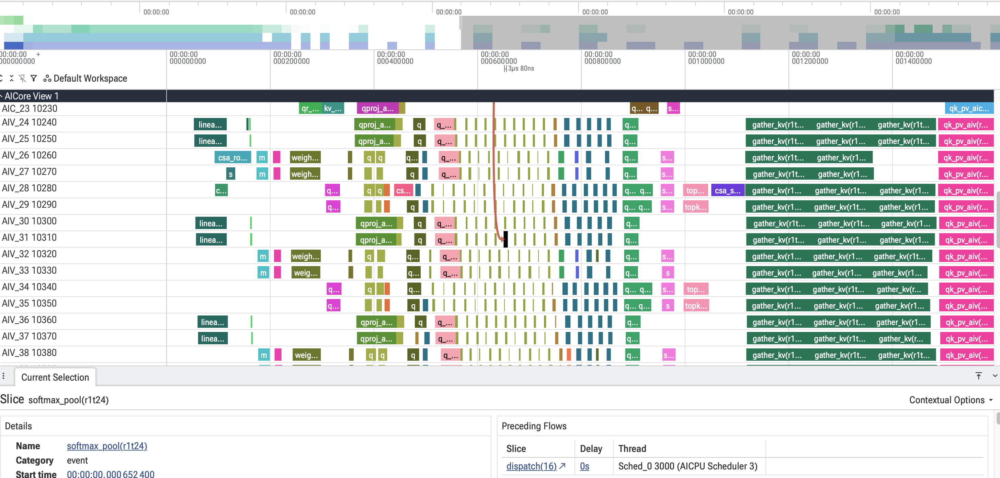｜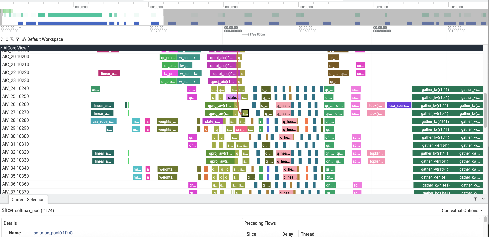
注意：改之后剩下的细 softmax_pool(r1t24) = if pos_b+S>=COMPRESS_RATIO 为假、被跳过的空 batch，是数据决定的 no-op，不是碎片化，无需也无法再优化

---

## 11. qr_rope 逐 batch 粗化（256→64 task）——in-kernel 索引构建摊薄

> `models/deepseek/v4/decode_indexer.py`，T=128, IDX_N_HEADS=64, S=2, ROPE_HEAD_DIM=64。
> 接第 10 节：那里把 softmax_pool 粗化后，`qr_rope` 成了 CSA 泳道里最小的核——`pl.spmd(T*IDX_N_HEADS//32)` = 256 个 32 行的碎 task，实算极少、几乎全是 in-kernel 索引构建 + 发射开销。

**改动前**（每 task 32 行；`swap_idx/sign/dup_idx` 用 `pl.arange`+cast 构建、`cos_il/sin_il` dup-gather，全部 per-task 重做）

```python
for idx in pl.spmd(T * IDX_N_HEADS // 32, name_hint="qr_rope"):
    o0 = idx * 32
    token_idx = o0 // IDX_N_HEADS
    batch_idx = token_idx // S
    cos_b = cos[batch_idx : batch_idx + 1, 0 : ROPE_HEAD_DIM // 2]
    sin_b = sin[batch_idx : batch_idx + 1, 0 : ROPE_HEAD_DIM // 2]
    qr_rope_slice = qr_proj_flat[o0 : o0 + 32, IDX_NOPE_HEAD_DIM : IDX_HEAD_DIM]
    rope_ones = pl.full([32, ROPE_HEAD_DIM], pl.FP32, 1.0)
    rope_col = ...                         # arange + cast 构建 swap_idx/sign/dup_idx（每 task 一遍）
    cos_b32 = pl.col_expand_mul(pl.full([32, ROPE_HEAD_DIM // 2], ...), cos_b)
    cos_il = pl.gather(cos_b32, dim=-1, index=rope_dup_idx)   # dup-gather（每 task 一遍）
    sin_il = pl.gather(sin_b32, dim=-1, index=rope_dup_idx)
    qr_swapped = pl.gather(qr_rope_slice, dim=-1, index=rope_swap_idx)
    rope_rot = pl.add(pl.mul(qr_rope_slice, cos_il), pl.mul(pl.mul(qr_swapped, rope_sign), sin_il))
    qr_rope_out[o0 : o0 + 32, :] = pl.cast(rope_rot, pl.BF16, "rint")
```

**改动后**（每 task 一个 batch = 128 行；索引/cos/sin 每 task 只建一次，内层 `pl.range(0,128,32)` 复用）

```python
ROPE_ROW_BLOCK = S * IDX_N_HEADS  # 128 行 = 一个 batch（独占连续 128 行 + 单行 cos/sin）
ROPE_ROW_TILE = 32
for idx in pl.spmd(T * IDX_N_HEADS // ROPE_ROW_BLOCK, name_hint="qr_rope"):
    o0 = idx * ROPE_ROW_BLOCK
    batch_idx = idx
    cos_b = cos[batch_idx : batch_idx + 1, 0 : ROPE_HEAD_DIM // 2]
    sin_b = sin[batch_idx : batch_idx + 1, 0 : ROPE_HEAD_DIM // 2]
    # 索引 swap_idx/sign/dup_idx + cos_il/sin_il：每 task 只建一次（ROPE_ROW_TILE 行）
    rope_ones = pl.full([ROPE_ROW_TILE, ROPE_HEAD_DIM], pl.FP32, 1.0)
    rope_col = ...
    cos_il = pl.gather(cos_b32, dim=-1, index=rope_dup_idx)
    sin_il = pl.gather(sin_b32, dim=-1, index=rope_dup_idx)
    for ro in pl.range(0, ROPE_ROW_BLOCK, ROPE_ROW_TILE):    # 4 个 32 行子块复用索引/cos/sin
        r0 = o0 + ro
        qr_rope_slice = qr_proj_flat[r0 : r0 + ROPE_ROW_TILE, IDX_NOPE_HEAD_DIM : IDX_HEAD_DIM]
        qr_swapped = pl.gather(qr_rope_slice, dim=-1, index=rope_swap_idx)
        rope_rot = pl.add(pl.mul(qr_rope_slice, cos_il), pl.mul(pl.mul(qr_swapped, rope_sign), sin_il))
        qr_rope_out[r0 : r0 + ROPE_ROW_TILE, :] = pl.cast(rope_rot, pl.BF16, "rint")
```

**原因**：这个 swap-gather rope 的索引构建（`pl.arange` + 多次 cast 出 `swap_idx/sign/dup_idx`，再 dup-gather 出 `cos_il/sin_il`）是**与行数无关的固定开销**，原来 256 个 32 行 task 各重做一遍 → 真正的 rope 运算很少，大头全是重复索引构建 + 发射。粗化到**一个 batch 一个 task**（一个 batch 独占连续 `S*IDX_N_HEADS=128` 行、共用单行 cos/sin），索引/cos/sin 每 task 只建一次、内层 `pl.range` 的 4 个 32 行子块复用。`batch_idx=idx`。逐行独立 + 单 batch cos/sin 广播成立 → **bit-identical**；内层 tile 仍 32 行，**Vec UB 占用不变**（避开一次性 128 行的 buffer 风险）。天花板 = 一个 batch（cos/sin 逐 batch 不同，不能跨 batch 合）。

结果（standalone `decode_indexer.py`，真机 a2a3，前后各一跑，均 PASS）：

| 指标 | 改动前 | 改动后 | 变化 |
|---|---|---|---|
| qr_rope task 数 | 256 | 64 | 4× |
| qr_rope 单 task Exec | 7.98us | 15.97us | ~2×（非 4×）|
| qr_rope 聚合 Exec | ~2043us | ~1022us | **砍半** |
| Total Test Time | 414.92us | 350.48us | **−15.5%** |

精度：`idx_kv_cache` / `score` / `topk_idxs` 全 PASS。

> **关键**：单 task Exec 只涨 ~2×（不是 4×）尽管行数 ×4——因为固定索引构建被摊薄 4×，聚合 Exec 直接砍半。**对「in-kernel 构建索引」的 rope scope，粗化省的不只是发射开销，还省掉 3/4 的冗余索引计算**。
>
> 验证备注：上表为跨 session 各一跑，Total 含 ~7% 抖动（cf [[feedback_pypto_perf_measurement_noise]]），qr_rope 的 256→64 + 聚合 Exec 砍半是确定的结构性归因。CSA 整图两次都 507018（已知间歇性 orchestrator 死锁，**非本改动**——standalone 稳定 PASS 即证）；要 CSA 新泳道需重试 `decode_attention_csa.py` 直到一次不 507018。

**泳道图**（standalone `decode_indexer.py`，非 CSA 整图）

| 改动前（qr_rope 256 task, Total 414.92us） | 改动后（qr_rope 64 task, Total 350.48us） |
|---|---|
| `build_output/_jit_indexer_test_20260610_155425/dfx_outputs/merged_swimlane_20260610_155433.json` | `build_output/_jit_indexer_test_20260610_155233/dfx_outputs/merged_swimlane_20260610_155239.json` |

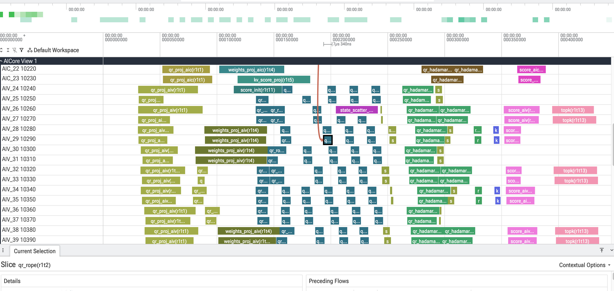｜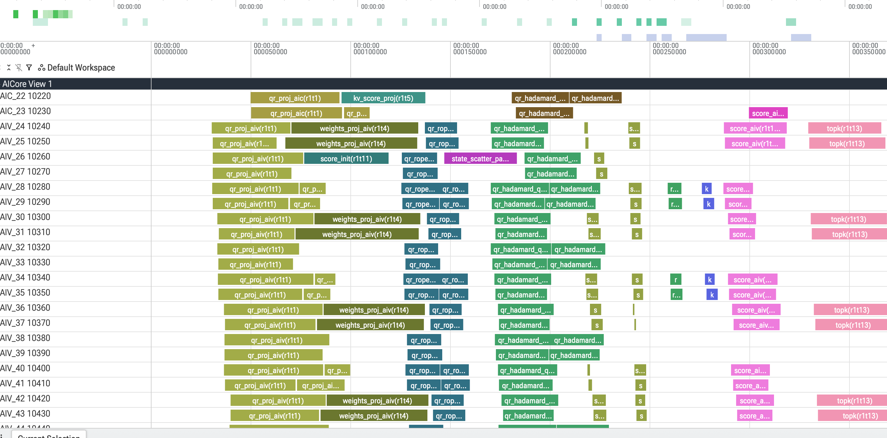

---

## 12. csa_sparse_idx_tile 切更细填满核池（gather_kv 提前 37us）

> `models/deepseek/v4/decode_attention_csa.py`，T=128。在 CSA 整图泳道里，`csa_sparse_idx_tile` 是 **gather_kv 前的最后一个 scope**，却只用 16 核 —— 关键路径尾巴上最「欠并行」的一个。

**改动前**

```python
CSA_TOPK_TOKEN_TILE = 8                                  # 16 task / 16 核，每 task ~97us（8 token 串行标量索引）
CSA_TOPK_BLOCKS = (T + CSA_TOPK_TOKEN_TILE - 1) // CSA_TOPK_TOKEN_TILE
for topk_block in pl.spmd(CSA_TOPK_BLOCKS, name_hint="csa_sparse_idx_tile"):
    topk_t0 = topk_block * CSA_TOPK_TOKEN_TILE
    for topk_dt in pl.range(CSA_TOPK_TOKEN_TILE):
        t_idx = topk_t0 + topk_dt
        ...  # 每个 t_idx 写自己的 cmp_sparse_indices[t_idx] 行（逐 token 独立）
```

**改动后**

```python
CSA_TOPK_TOKEN_TILE = 2                                  # 64 task / 48 核（同样的活摊到更多核）
```

**原因**：`csa_sparse_idx_tile` 是 gather_kv 前最后一关、在关键路径上，但 `CSA_TOPK_TOKEN_TILE=8` 只切出 16 个 task、占 16 核（共 ~48 核），每 task ~97us 的标量索引构建。每个 token 写自己的 `cmp_sparse_indices` 行、**逐 token 独立**，所以缩小 token tile 只是把同样的活铺到更多核 —— **bit-identical**。降到 2 → 64 task 填满 48 核。

结果（`decode_attention_csa.py`，真机 a2a3，x_out PASS，单调非噪声）：

| `CSA_TOPK_TOKEN_TILE` | task | 核 | csa_sparse_idx span | gather_kv 起跑 | Total |
|---|---|---|---|---|---|
| 8（原） | 16 | 16 | 110us | 834us | 2285us |
| 4 | 32 | 32 | 65us | 820us | 2269us |
| **2（采用）** | **64** | **48** | 67us | **797us** | **2249us** |

gather_kv **提前 37us**（834→797），Total **−1.6%**。span 在 ~65us 触底（已被 48 核封顶），所以 `=1`（128 task）只会多加发射开销，不再更快。

> **法则（「切更细」何时有用）**：只在 scope **同时满足 (1) 在关键路径上 (2) 核没用满** 时切细才赚。同轮对照：`kv_rms_norm` 切细（8→16 task）反而 span 17→28us 变差（早期、非瓶颈）；`attn_norm` 根本切不动（`[1,T_TILE]`FP32 tile 需 32B 对齐 → T_TILE 必须 ≥8，4 触发 `pto.alloc_tile` 16B 报错）；`qr_proj` 已 48 核 + `Q_OUT_TILE=256` buffer 顶满（低 Exec% 是依赖 tail-OH 不是欠并行）。

**泳道图**

| 改动前（16 task/16 核, gather_kv@834, Total 2285us） | 改动后（64 task/48 核, gather_kv@797, Total 2249us） |
|---|---|
| `build_output/_jit_attention_csa_test_20260611_114519/dfx_outputs/merged_swimlane_20260611_114546.json` | `build_output/_jit_attention_csa_test_20260611_121953/dfx_outputs/merged_swimlane_20260611_122020.json` |
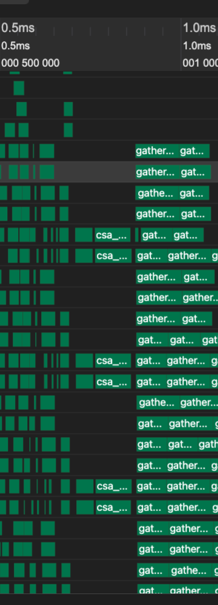｜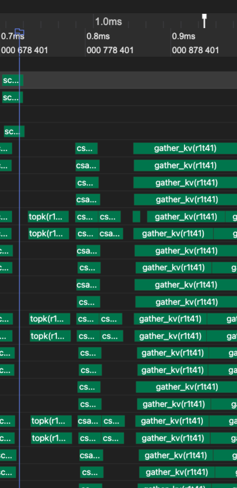

## 13. topk 切更细填满核池（gather_kv 关键路径前一关）

> `models/deepseek/v4/decode_indexer.py`，T=128。继 §12 把 `csa_sparse_idx_tile` 铺开后，泳道里 `topk` 成了 `csa_sparse_idx_tile` 前最后一个「欠并行」的细 scope：在 `score → topk → csa → gather_kv` 关键路径上**独占 ~52us**，却只用 8 核。

**改动前**

```python
TOPK_TILE = 16                                          # 8 task / 8 核，每 task ~47us（16 token 串行 sort）
for idx in pl.spmd(T // TOPK_TILE, name_hint="topk"):
    t0 = idx * TOPK_TILE
    for ti in pl.range(0, TOPK_TILE):
        t = t0 + ti
        ...  # 每个 t 写自己的 topk_idxs_flat[t] 行（逐 token 一次 sort32+mrgsort+gather，独立）
```

**改动后**

```python
TOPK_TILE = 4                                           # 32 task / 32 核（同样的活摊到更多核）
```

**原因**：`topk` 是 `pl.spmd(T // TOPK_TILE)`，`TOPK_TILE=16` 只切出 8 个 task、占 8 核（共 ~48 核），每 task 是 16 个 token 串行做 `sort32 + 3× mrgsort(1024) + gather`。每个 token 写自己的 `topk_idxs_flat[t]` 行、**逐 token 独立、无 loop-carry**，所以缩小 token tile 只是把同样的活铺到更多核 —— **bit-identical**（与 §12 的 `CSA_TOPK_TOKEN_TILE` 同一杠杆）。降到 4 → 32 task 正好填满 32 核。

结果（`decode_attention_csa.py`，真机 a2a3，x_out + kv_cache PASS，各 3 次取中位；同版本对照——csa 已是 `CSA_TOPK_TOKEN_TILE=2`）：

| `TOPK_TILE` | task | 核 | topk span | Total（中位） |
|---|---|---|---|---|
| 16（原） | 8 | 8 | 52us | 2266us |
| **4（采用）** | **32** | **32** | **28us** | **2216us** |
| 2 | 64 | 48 | 39us | 2210us |

topk span **−46%**（52→28us），Total **−2.2%**。

> **法则（再次印证「task 数 ≈ 核数」是甜点，不是越细越好）**：`TOPK_TILE=2`（64 task）反而比 `=4` 更差 —— 64 task 挤不进 48 核（两波）+ 每 task Tail OH，**span 涨回 39us、总工作量（sumdur）+20%**，Total 与 `=4` 持平仅在噪声内。同 §12 的 `=1` 触底逻辑一致：切到核数即止。另：wall 单次噪声大（~3–5%，`=4` 三次 2170–2302），**信 per-scope 的 `topk span`，别信单次 Total**。
>
> **同轮顺带结论（本轮不动）**：`csa_rope_step`(1 核 74us)/`csa_cmp_rope`/`state_scatter_paged`(1 核 53us) 看着是细串行，但都藏在并发的 hc_pre / qproj / qr_proj 底下、**不在关键路径**，并行它们 wall≈0；`softmax_pool` 保持现状（最终版不用 `pl.unroll`）；`qr_proj` 被「全行跨度列切分」串行到 par~3.5，但只比并发的 qproj 多伸 ~13us，改动大收益小，暂缓。

**泳道图**

| 改动前（8 task/8 核, topk span 52us, Total 2266us） | 改动后（32 task/32 核, topk span 28us, Total 2216us） |
|---|---|
| `build_output/_jit_attention_csa_test_20260611_164355/dfx_outputs/merged_swimlane_20260611_164423.json` | `build_output/_jit_attention_csa_test_20260611_163436/dfx_outputs/merged_swimlane_20260611_163502.json` |

同上

---

## 14. qproj **un-mix**（拆开融合的 matmul+dequant，把 vec 赶出关键窗、不抢 AIV）

> `models/deepseek/v4/decode_qkv_proj_rope.py`，T=128, H*HEAD_DIM=32768。反直觉案例：**un-fuse 反而更快**。qproj 原本是一个 matmul(cube)+dequant(vec) 融合 scope，dequant 被钉在每次 matmul 之后、跑在 qproj 自己的窗口 [~300-420us]，**抢走关键路径 `qr_proj_aiv`（indexer 的 q 投影）的 AIV 核**。而 qproj 的产物 `q` 有大把下游余量（~660us 备好，qk_pv ~1240us 才用）。

**改动前**（一个 scope：matmul 后紧跟 dequant，编译出 `qproj_aic`+`qproj_aiv` 融合 mix）

```python
q_proj_fp32 = pl.create_tensor([T, H * HEAD_DIM], dtype=pl.FP32)
for hg_idx in pl.spmd(((H * HEAD_DIM) // Q_PROJ_OUT_TILE) // 16, name_hint="qproj"):
    hg = hg_idx * 16
    col_acc = pl.create_tensor([T, Q_PROJ_OUT_TILE], dtype=pl.INT32)
    for h_inner in pl.pipeline(16, stage=2):
        for qb in pl.pipeline(0, Q_LORA // Q_PROJ_TILE, stage=2):
            ...  # matmul / matmul_acc -> col_acc (cube)
        for tc in pl.pipeline(0, T, QPROJ_T_TILE, stage=2):
            ...  # cast + col_expand_mul dequant -> q_proj_fp32 (vec)  ← 紧贴 matmul，钉在本窗口
```

**改动后**（拆成纯 matmul scope(cube→INT32 GM) + 独立 dequant scope(vec)）

```python
q_proj_fp32 = pl.create_tensor([T, H * HEAD_DIM], dtype=pl.FP32)
q_proj_i32 = pl.create_tensor([T, H * HEAD_DIM], dtype=pl.INT32)          # 多一个 INT32 GM scratch
for hg_idx in pl.spmd(((H * HEAD_DIM) // Q_PROJ_OUT_TILE) // 16, name_hint="qproj_matmul"):
    hg = hg_idx * 16
    for h_inner in pl.pipeline(16, stage=2):
        col_acc = pl.create_tensor([T, Q_PROJ_OUT_TILE], dtype=pl.INT32)
        for qb in pl.pipeline(0, Q_LORA // Q_PROJ_TILE, stage=2):
            ...  # matmul / matmul_acc
        q_proj_i32[:, (hg+h_inner)*Q_PROJ_OUT_TILE : ...] = col_acc       # cube -> GM

for hg_idx in pl.spmd(((H * HEAD_DIM) // Q_PROJ_OUT_TILE) // 16, name_hint="qproj_dequant"):
    hg = hg_idx * 16
    for h_inner in pl.pipeline(16, stage=2):
        for tc in pl.pipeline(0, T, QPROJ_T_TILE, stage=2):
            col_acc_t = q_proj_i32[tc:tc+QPROJ_T_TILE, ...]               # GM -> vec dequant
            ...  # cast + col_expand_mul -> q_proj_fp32
```

**原因**：融合 mix 把 dequant(vec) 钉死在 matmul 所在窗口 [~300-420us]，跟关键路径的 `qr_proj_aiv` 争同一批 AIV 核（mix 里 `qproj_aiv` 占 32 核、`qr_proj_aiv` 要 48 核 → 抢核）。拆开后 dequant 成独立 scope，**调度器把它推迟到 AIV 空闲的 [~485-566us]**（q 有 ~580us 余量随便挪）→ `qr_proj_aiv` 拿满 48 核、**442→369us 提前完成** → `gather_kv` 提前。数学不变（同 matmul + 同逐行 dequant，只是解耦），**bit-identical**。

结果（`decode_attention_csa.py`，真机 a2a3，x_out PASS；同 session 2×2 对照，区间不重叠 = 非噪声）：

| | run A | run B | 均值 | `qr_proj_aiv` 完成 | `gather_kv` 起跑 |
|---|---|---|---|---|---|
| MIX（原融合） | 2193.4 | 2251.5 | 2222.5us | 442us | 792us |
| **UN-MIX（采用）** | 2139.8 | 2167.0 | **2153.4us（−69us）** | **369us** | **760us** |

代价：多一个 `q_proj_i32 [T, H*HEAD_DIM]` INT32 GM scratch（一来一回 HBM），被 AIV 解放的收益盖过。

> **法则（反直觉：融合不总是更快）**：当被融的 vec 收尾**和关键路径的另一个 vec scope 抢同一批 AIV 核、而本 scope 的输出又有大把下游余量**时，**拆开**反让调度器把这段 vec 挪去空窗、把核让给关键路径。判断条件：(1) 融合 scope 的产物离它的消费点很远（有 slack）；(2) 它的 vec 部分与关键路径 vec scope 时间重叠抢核。两条都满足才值得 un-mix（qproj 满足：q@660 用@1240；qproj_aiv 与 qr_proj_aiv 在 [300-420] 重叠）。

**泳道图**（同 session 对照）

| 改动前（MIX, qproj_aiv 抢核, qr_proj_aiv 到 442, gather_kv@792, 2193us） | 改动后（UN-MIX, dequant 推迟到 [485-566], qr_proj_aiv 到 369, gather_kv@760, 2140us） |
|---|---|
| `build_output/_jit_attention_csa_test_20260611_190205/dfx_outputs/merged_swimlane_20260611_190235.json` | `build_output/_jit_attention_csa_test_20260611_190043/dfx_outputs/merged_swimlane_20260611_190110.json` |

看机理（标了 `qproj_matmul`/`qproj_dequant` 分离）：`build_output/_jit_attention_csa_test_20260611_173824/dfx_outputs/merged_swimlane_20260611_173854.json`，后者墨绿色是q_head_rms_nope的kernel

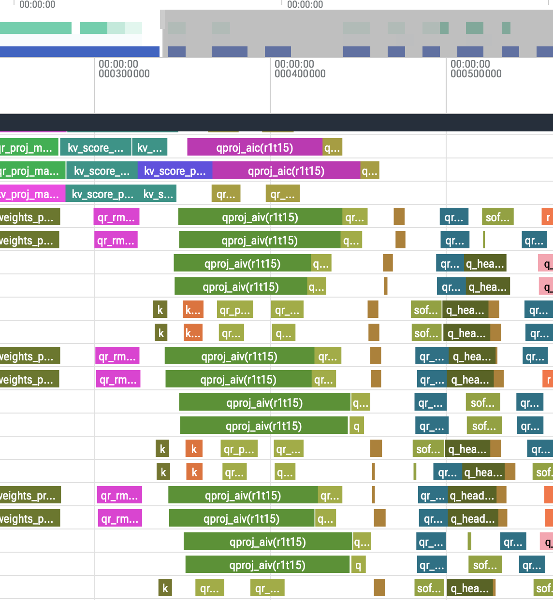｜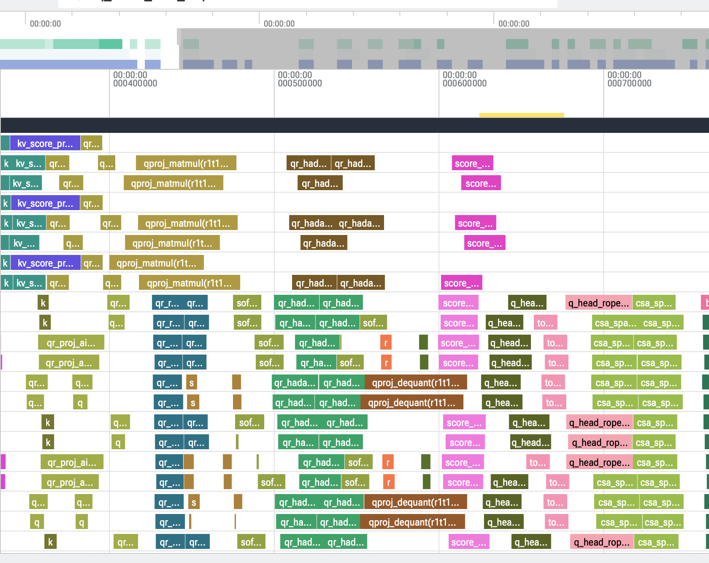

---

## 15. hc_pre 5 个 spmd scope 融成 1 个（matmul + epilogue 同 scope）

**改动前**（5 个 spmd scope，3 个 GM 中间体串接）

```python
mixes = pl.create_tensor([T_MAX, MIX_PAD])                       # GM 中间体①
for ob in pl.spmd(T_MAX // LINEAR_T_TILE, "linear"):            # ① RMS+matmul -> mixes
    ...
pre_val_store  = pl.create_tensor([T_MAX, HC_PAD])              # GM 中间体②
post_pad_store = pl.create_tensor([T_MAX, HC_PAD])              # GM 中间体③
comb_logits    = pl.create_tensor([T_MAX, HC_MULT*HC_MULT])     # GM 中间体④
for ob in pl.spmd(t_dim // T_TILE,    "split_pre_post"):        # ② mixes -> pre_val/post_pad/comb_logits
    ...
for ob in pl.spmd(t_dim // COMB_T_TILE, "write_post"):          # ③ post_pad_store -> post
    ...
for ob in pl.spmd(t_dim // COMB_T_TILE, "comb_sinkhorn"):       # ④ comb_logits -> comb
    ...
for ob in pl.spmd(t_dim // T_TILE,    "mix_x"):                 # ⑤ pre_val_store + x -> x_mixed
    ...
```

**改动后**（1 个 fused scope，per-tile 一气呵成，无 scope 间 GM 中间体）

```python
mixes_gm = pl.create_tensor([T_MAX, MIX_PAD])                   # 唯一 GM scratch
for ob in pl.spmd(t_dim // T_TILE, "hc_pre_1spmd"):            # 5 个 scope 全折进来
    t0 = ob * T_TILE
    # RMS + matmul -> mixes_gm[t0]                             （cube 写 GM）
    # pre = sigmoid(...)+eps（留 Vec，喂 mix_x，不落 GM）
    # post -> store；mix_x（pre 转置取每 head [TILE,1] 标量 * x）-> store
    # comb：从同一行 mixes_gm[t0] 8-wide 读 4 组 -> sinkhorn -> store
    # 没有 pre_val_store / post_pad_store / comb_logits
D_TILE = 256   # 融合后 mix_x 的 FP32 tile 与 matmul/sinkhorn 共用 Vec UB，512 溢出 192KB
```

**原因**：5 scope 之间是「串行 + GM 中转」——每段单独 dispatch、中间体写 GM 再读回。折成 1 个 spmd 后：① **5 次 dispatch → 1 次**；② **3 个 scope 间 GM 中间体往返消失**（pre_val/post_pad/comb_logits 不再写读 HBM）；③ per-tile 的 vec 收尾与下一 tile 的 matmul 在同 task 内重叠。matmul（AIC）写 `mixes_gm`、同 task 内 AIV 读回，靠 AIV 端 MTE3→MTE2 fence 保序。计算量不变（cube/vec 各分项 busy 几乎不动，`D_TILE 512→256` 不增加工作量），收益全部来自消除 scope 间开销，**精度全 PASS（x_mixed/post/comb）**。

> 依赖两个 codegen 修复才能把 cube→vec 融进一个 task：**#1761**（SplitVectorKernel 把 `split=0` 的 cube↔vec pipe 复制进两个 AIV subblock → 单生产双消费死锁 507018）、**#1768**(orchestration 把按动态 `t_dim` 定大小的注入式 GM pipe buffer 排在 `t_dim` 声明之前 → use-before-decl 编不过)。

结果（`hc_pre.py` decode T=128，真机 a2a3，各 3 次取中位数；per-run 区间不重叠 = 非噪声）：

| 指标 | 改动前（5 scope） | 改动后（1 fused） | Δ |
|---|---|---|---|
| 设备 span（端到端延迟） | 169.2us（165.7–170.9） | **134.9us（131.1–136.1）** | **−20%** |
| 总 busy（计算量） | ~1809us | ~1789us | ≈ 持平 |
| cube(matmul) busy | 463.5us | 469.2us | ≈ 持平 |
| vector busy | 1338.8us（分散 5 func） | 1336.3us（1 func） | ≈ 持平 |
| spmd scope / 子任务数 | 5 / 56 | 1 / 24 | 5 → 1 |

> **法则（与 case 14 互补）**：case 14 是「融合不总更快」——被融的 vec 和关键路径抢核、且自己有 slack 时,**拆开**更快。这里反过来:当 scope 间是**纯串行 + GM 中转**、且融合后**没有新增抢核**(matmul 是 cube、epilogue 是 vec,本就分核)时,**融合稳赚**——省的全是 dispatch + scope 间 GM 往返这类纯开销,计算量一点不涨。判据:(1) scope 间靠 GM 中间体串接(可消除);(2) 融进来的两段跑在不同核类(cube vs vec,不抢)。两条都满足 → 合。

**泳道图**

| 改动前（5 scope, 56 子任务, span ~169us） | 改动后（1 fused, 24 子任务, span ~135us） |
|---|---|
| `build_output/_jit_hc_pre_test_20260615_165503/dfx_outputs/merged_swimlane_20260615_165507.json` | `build_output/_jit_hc_pre_test_20260615_165034/dfx_outputs/merged_swimlane_20260615_165039.json` |

下游(内联 hc_pre)在 main 版上复验无回归:`decode_attention_csa.py`(kv_cache+x_out PASS)、`moe_ep.py`(x_next PASS, 2-rank)。PR: hw-native-sys/pypto-lib#533。

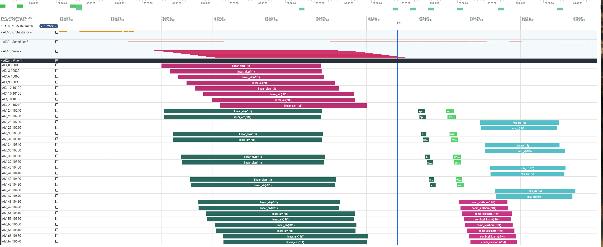
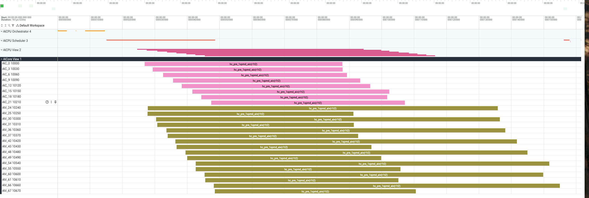

---

## 16. hc_pre sinkhorn 4 组堆叠 + mix_x 逐 head 累加（端到端 −5.6%，计算 −8.6%）

> `models/deepseek/v4/hc_pre.py`，decode B=64/S=2 与 prefill B=1/S=128（均 T=128）。D=4096, HC_MULT=4, HC_PAD=8, sinkhorn 20 轮。
> 接 §15：5 scope 融成单 spmd 后，泳道显示**瓶颈已从 matmul 转到 AIV 向量侧**——AIC(matmul) 仅 ~58us，重 AIV 子块 ~107us（subblock0 扛全部 mix_x 重读 x + sinkhorn）。本节攻这个 AIV 大头。

**改动前**（① sinkhorn：4 个 group 各一个 `[16,8]` tile，每轮 4×row_sum/4×row_expand_div；② mix_x：4 个 head 一次性全展开，D_TILE=256）

```python
# ① sinkhorn（每轮在 4 个独立 [16,4] tile 上重复）
for sk_it in pl.pipeline(HC_SINKHORN_ITER - 1, stage=2):
    row0_rowsum = pl.add(pl.row_sum(row0_cur, tmp), HC_EPS); ...  # 4× row_sum
    row0_norm = pl.row_expand_div(row0_cur, row0_rowsum); ...     # 4× row_expand_div
    col_sum = pl.add(pl.add(row0_norm, row1_norm), pl.add(row2_norm, row3_norm)) + eps
    row0_cur = pl.div(row0_norm, col_sum); ...                    # 4× div

# ② mix_x：4 个 head 的 x_fp32 + y 同时驻留（峰值 ~144KB → D_TILE 封顶 256）
D_TILE = 256
x0 = cast(load 0*D); x1 = cast(load 1*D); x2 = cast(load 2*D); x3 = cast(load 3*D)  # 4× [16,256] FP32
y0 = row_expand_mul(x0, pre0); ...; y3 = row_expand_mul(x3, pre3)                    # 4× [16,256] FP32
y_tile = pl.add(pl.add(y0, y1), pl.add(y2, y3))
```

**改动后**（① 堆叠成 `[64,8]`：每组一行，row_sum 一次算完；② mix_x 逐 head 累加，腾出 UB 把 D_TILE→512）

```python
# ① sinkhorn：concat 拼成 padded [16,32]，FREE reshape 到 [64,8]（每组一行）
for sk_it in pl.pipeline(HC_SINKHORN_ITER - 1, stage=2):
    sr = pl.reshape(c32, [SINK_ST, HC_PAD])                       # [16,32]→[64,8]，零成本
    sr_sum = pl.add(pl.row_sum(sr, tmp), HC_EPS)                  # 1× row_sum（替 4×）
    c32 = pl.reshape(pl.row_expand_div(sr, sr_sum), [T_TILE, SINK_W])  # 1× row_expand_div
    cs = c32[:,0:8]+c32[:,8:16]+c32[:,16:24]+c32[:,24:32] + eps   # col-norm：3 add（沿 group）
    c32 = pl.div(c32, pl.concat(pl.concat(cs, cs), pl.concat(cs, cs)))  # concat 复制 col_sum 回 32 宽

# ② mix_x：逐 head load→cast→乘→加进 y→释放（任意时刻 ~1 x_fp32 + y 存活 → D_TILE 翻倍）
D_TILE = 512
y = pl.row_expand_mul(pl.cast(pl.load(x_flat, [t0, 0*D+d0], [T_TILE, D_TILE], Vec), pl.FP32), pre0)
y = pl.add(y, pl.row_expand_mul(pl.cast(pl.load(x_flat, [t0, 1*D+d0], ...), pl.FP32), pre1))
y = pl.add(y, pl.row_expand_mul(pl.cast(pl.load(x_flat, [t0, 2*D+d0], ...), pl.FP32), pre2))
y = pl.add(y, pl.row_expand_mul(pl.cast(pl.load(x_flat, [t0, 3*D+d0], ...), pl.FP32), pre3))
```

**原因**：
- **① sinkhorn 堆叠**：comb 是每 token 一个 4×4 矩阵，sinkhorn 交替「行归一化(沿 j)/列归一化(沿 g)」20 轮，在 4 个独立 `[16,4]` 小 tile 上是**延迟受限**的串行链。把 4 组 col-wise `pl.concat` 拼成 padded `[16,32]`，再 `pl.reshape` 到 `[64,8]`（每个 group 一行）——`row_sum` 沿列一次就把 4 个 group 的「沿 j 求和」全算完，**4×→1×**（softmax 同理）。沿 g 的 col-norm 在宽布局用 3 个 add + `concat` 复制 col_sum 实现。pad 到 8 列（非 4）因 ptoas 要求 row-major tile 行 ≥32B（`[*,4]`FP32=16B 被拒）。pad 列全程保持 0 → **bit-identical**。
- **② mix_x 逐 head 累加**：Vec UB peak 在 mix_x——旧版 4 个 head 的 x_fp32(64KB)+4 个 y(64KB) 同时驻留 ~144KB，把 D_TILE 封在 256（sinkhorn 段与 mix_x 生命周期不重叠，不是 peak，所以 ①腾不到 mix_x 的 UB）。改成逐 head `load→cast→乘→加进 y→释放`，任意时刻只 ~1 x_fp32 + y 存活（live-set ~3×↓），腾出空间把 `D_TILE 256→512`：D-loop 迭代 16→8，MTE 传输更大更少 → AIV 关键路径 **107→96us**。左到右求和顺序恰好匹配 golden 的 `y += x[:,h]·pre`，**bit-identical**。

结果（`hc_pre.py` decode T=128，真机 a2a3，**同 session 交错 A/B 4 轮**，每对 FULL < 同对 BASE = 非噪声；decode+prefill 三输出全 PASS）：

| 指标 | 改动前（BASE） | 改动后（FULL） | Δ |
|---|---|---|---|
| 端到端 ALL-events span | 166.4us | **157.2us** | **−5.6%** |
| AICore 计算 span | 127.1us | 116.2us | −8.6% |
| AIV 最大单任务 | 113.3us | 100.0us | −12% |
| Vec UB | 151KB/78.6% | 160.8KB/83.7%（D_TILE=512 装下） | — |

> **法则 1（UB peak 是「同时存活最多 tile」的那段，不是各段之和）**：mix_x「4 head 全展开」是 peak；改成顺序累加复用同一块 buffer，peak 砍 ~3× → 解锁更大的 D_TILE。腾别的段（sinkhorn）的 UB 对 mix_x peak 无效（生命周期不重叠，分配器本就复用）。
> **法则 2（UB tile 拼接/复制/物化工具箱）**：`pl.assemble` 只能用于 GM Tensor，**不能拼 UB tile**；UB 里用 `pl.concat`（列拼接，也当行内复制用）+ `pl.reshape`（免费换轴，把要 reduce 的维摆到列上）+ `pl.mul(_,1.0)`（物化 sub-view，让 `set_validshape` 认）。别把 sim/IR 报错当死路——在真机上逐个 codegen 错往下推（本节连解 4 个：局部 Var 当 runtime / assemble 仅 GM / 16B<32B 行对齐 / set_validshape 不吃 sub-view）。
> **失败尝试（已排除，勿重试）**：(a) 去 mix_x 的 `transpose` 改列切片喂 row_expand_mul → 运行时 507018/507046 死锁 5/5（transpose load-bearing）；(b) `pl.spmd(optimizations=[pl.split(UP_DOWN)])` 想救活退化的 subblock1 → 编译崩 6/6（memory_reuse 溢出）；(c) **粗化 spmd（T_TILE 16→32）攻 dispatch → Vec 247KB 爆编译失败**，且即使硬塞也会回归——墙钟由单 task 计算时长(~96us)定，粗化让单 task 翻倍(~190us)远超省下的 ~20us dispatch。「dispatch 占 29%」是 scheduler CPU、大部分与计算重叠，**非墙钟关键路径**。

**泳道图**（同 session 交错 A/B 的代表性一对；端到端单次方差大，看 per-scope）

| 改动前（BASE, 端到端 166.5us, AIV max 107us） | 改动后（FULL, 端到端 157.7us, AIV max 96us） |
|---|---|
| `build_output/_jit_hc_pre_test_20260616_141903/dfx_outputs/merged_swimlane_20260616_141909.json` | `build_output/_jit_hc_pre_test_20260616_141948/dfx_outputs/merged_swimlane_20260616_141954.json` |

机理参考（D_TILE=512、AIV 96us 那次）：`build_output/_jit_hc_pre_test_20260616_122317/dfx_outputs/merged_swimlane_20260616_122323.json`。PR: hw-native-sys/pypto-lib#545。

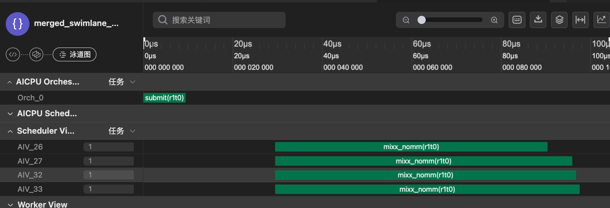|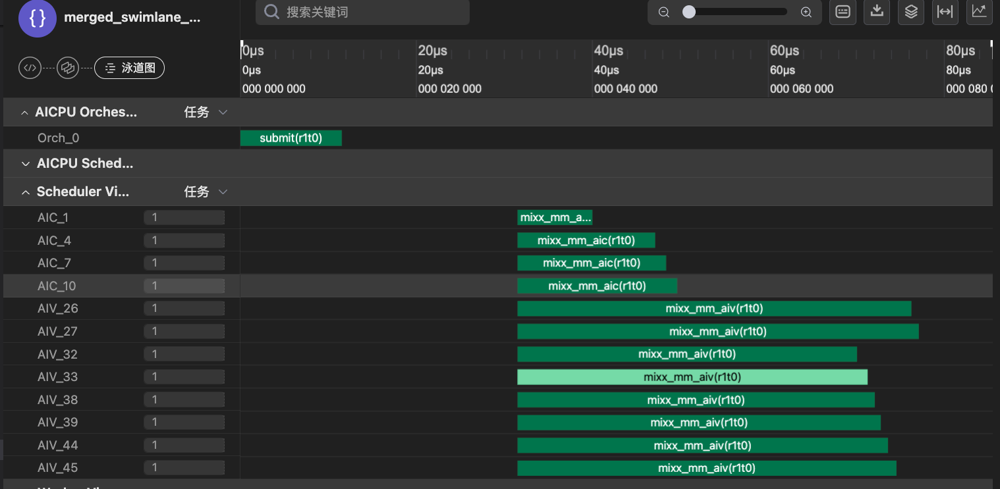
---

## 17. UP_DOWN「咬合」靠 cube：注入哑 matmul 救活 subblock1，原地切 mix_x 实测 −25%（更正 §16「失败尝试 (b)(c)」）

> 例子：`models/deepseek/v4/_tmp_updown_dummymm.py`（单 spmd，切 vs 不切 隔离）+ `_tmp_setvalidshape_split.py`（唯一真墙的最小复现）。
> **更正 §16 结尾「失败尝试 (b)(c)」**：那两条说 `pl.split(UP_DOWN)` "编译崩 memory_reuse 溢出"、"T_TILE 16→32 爆 Vec 247KB" 当成死路——**不是死路**：那只是 UB 溢出（可过），且 UP_DOWN 根本没在纯向量 scope 上生效（白挂）。隔离后原地切 mix_x **实测 −25%**。

### 17.1 关键机理：UP_DOWN 只在「含 cube(matmul)」的 scope 上咬合

`pl.split(SplitMode.UP_DOWN)` 想把行劈到两个 AIV 子块（让闲着的 subblock1 干活）。但**它只在 scope 里有 cube(matmul) 时才生成「任务内子块切分」**；挂在**纯向量 scope** 上是 **no-op（白挂，不报错也不生效）**。

判据（编译期，不上设备）——看生成的 AIV C++ 有没有子块 id：
```bash
python models/deepseek/v4/_tmp_updown_dummymm.py -p a2a3 --compile-only
BD=$(ls -dt build_output/_jit_mixx_with_mm_* | head -1)
grep -c get_subblockid $BD/kernels/aiv/*.cpp     # >0 = 真咬合；0 = 白挂
```
- `mixx_no_mm`（纯 mix_x + UP_DOWN）→ `get_subblockid = 0`（白挂）。
- `mixx_with_mm`（+ 哑 matmul）→ `get_subblockid = 3` + `get_sub_block_id = 1`（真咬合）。

> codegen 出处 `pypto/python/pypto/backend/pto_backend.py`：子块 id 三模式（fixed / runtime_bridge / 无）。纯向量 spmd 拿到「无」。注：`get_subblockid()` 是 body 宏、`get_sub_block_id(args)` 是 wrapper 取**逻辑** lane id；别直接调底层原生 intrinsic（返回的是物理子块号，A2A3 mixed-task 下 ≠ 逻辑 lane，会算错）。

### 17.2 哑 matmul 技巧：给纯向量 scope 塞个微型 matmul 把 UP_DOWN 翻成真咬合

```python
# 例：mix_x scope 本是纯向量 → 塞一个哑 matmul，UP_DOWN 就生效，mix_x 行被劈到两子块
for ob in pl.spmd(T // T_TILE, name_hint="mixx_mm", optimizations=[pl.split(pl.SplitMode.UP_DOWN)]):
    t0 = ob * T_TILE
    # —— 哑 matmul：只为让 cube 在场、UP_DOWN 咬合；输出存到 dummy_out 逃过 DCE ——
    acc = pl.matmul(pl.cast(xb[t0:t0+T_TILE, 0:128], pl.FP32), wd, b_trans=True, out_dtype=pl.FP32)
    dummy_out[t0:t0+T_TILE, 0:16] = acc      # 必须被「用」一下，否则死代码消除会删掉它
    # —— 真正要切的 mix_x（纯向量），现在被劈到 veccore0/veccore1 各一半 ——
    ... pre（row_sum 取 col-major）... mix_x D-loop -> x_mixed ...
```

两个硬约束：
- **T_TILE ≥ 32**：UP_DOWN 劈半后 cube 要 ≥16 行（fractal 下限，否则 `boxed tile rows multiple of innerRows(16) got 8`）。
- 哑 matmul 维度 **cube-legal**：N 为 16 的倍数（我一开始 N=8 也被拒）。
- 哑 matmul 很便宜（in-core ~1.3us）。

### 17.3 实测：原地切 mix_x = **−25%**（单 spmd 隔离，无 de-fusion 干扰）

`_tmp_updown_dummymm.py` 两函数都是**单 spmd**，唯一差别 = 有没有哑 matmul：

| 单 spmd 版本 | in-core | L2 (`--enable-l2-swimlane`) |
|---|---|---|
| 不切（mix_x 跑单子块，UP_DOWN no-op） | veccore0 满载 / veccore1 闲 | **56.76us** |
| 切（哑 mm 咬合，mix_x 50/50） | **veccore0 = veccore1 = 22us（各 567 指令、87% util）** | **42.42us** |

→ **−25%。subblock1 真被填满、向量尾 44→22us 真 halved。** 注意必须**隔离测**：把 mix_x 拆成独立 scope 再切（de-fused），mix_x 那 −14us 会被拆 scope 的 GM 往返（~+16us/桥）赔光（3-scope 实测 109us > 融合 92.6）——所以**收益要原地（融合内）切才拿得到**。

### 17.4 完整 hc_pre 原地切的「四堵墙」——前三堵可过，真墙只剩 `set_validshape`

把 hc_pre 融合 scope `NONE→UP_DOWN` 直接编（**不用加哑 matmul，真 RMS+linear matmul 已在场、自己咬合**），逐层 dump 完整报错：

| # | 墙 | 报错 | 过法 |
|---|---|---|---|
| 1 | transpose | `UP_DOWN but contains a tile.transpose that swaps the split axis` | 换 row_sum 取列（逐 head GM 读 → row-major sigmoid → `row_sum` 出 col-major [T,1]） |
| 2 | cube 16 行下限 | `boxed tile rows multiple of innerRows(16) got 8` | `T_TILE = 32` |
| 3 | **UB 溢出**（= §16 误判的"memory_reuse 崩"） | `Vec buffer 193344 > 188416`（只超 ~4KB） | mix_x **顺序累加** + `LINEAR_K_TILE 256→128`（缩 x_lin） |
| 4 | **`set_validshape`** | `set_validshape op expects row operand <= shape dim (16)` | ❌ **唯一真墙，源码无解** |

> **法则（UP_DOWN 切分排雷顺序）**：先确认咬合（§17.1 grep get_subblockid，纯向量要塞哑 matmul）；再过 cube 16 行下限（T_TILE≥32）；再过 UB（顺序累加 + 缩 K-tile，**别把 UB 溢出当死路**）；最后大概率卡在 `set_validshape`（窄列写）。

### 17.5 唯一真墙：`set_validshape × UP_DOWN`（窄列写）——最小复现

- **机理**：FP32 UB tile 行须 ≥32B（≥8 列），所以 `[T,4]` 这种**窄输出**只能用 8 宽 tile + `pl.set_validshape(tile, T_TILE, 4)` 写出 4 个有效列（=「窄列写」，post/comb 都这么写）。UP_DOWN 把行劈给两子块、每块物理只剩 16 行，但 `set_validshape` 的 **row 参数写死 T_TILE=32**、split pass 没改写它 → `32 > 16` 报错。
- **最小复现** `models/deepseek/v4/_tmp_setvalidshape_split.py`（自包含 ~60 行）：`--no-split`(NONE) **PASS**；默认(UP_DOWN) **报错**，差别仅一个 `optimizations=[pl.split(UP_DOWN)]`。已报 pypto issue。
- **修复方向**：① split pass 把 `set_validshape` 的 row 操作数自动改写成劈后行数（T_TILE→T_TILE/2）；② 让 UP_DOWN 支持窄列写。

### 17.6 桌上的收益 & 给 hc_pre 用时的注意

- **原地切 mix_x = −25%（实测）**；前三堵墙都能过；唯一拦路 = `set_validshape × UP_DOWN`。修了它，完整 hc_pre 大概率 **92.6 → ~78us（−15%）**。
- **hc_pre 不用加哑 matmul**——真 RMS+linear matmul 已在融合 scope 里，UP_DOWN 自己咬合。哑 matmul 只用于「想切一个没有 matmul 的纯向量 scope」（隔离测 / de-fused，但 de-fused 路亏）。
- **还没验的点**：真 matmul 在切分 scope 里**自己也被劈半**（M=32→16），`T_TILE=32` 下 cube 下限满足，但 **matmul+RMS 的 row_sum 在行劈下数值对不对没验过**（卡在 set_validshape 前没跑成）。set_validshape 修好后，**第一件事是验 x_mixed/mixes 数值正确性**，别只看编过。
前后泳道图：
 

---

## 18. ratio4 compressor softmax_pool 头维加宽（8×[1,64] → 1×[1,512]，busy −48%）

> `models/deepseek/v4/decode_compressor_ratio4.py`，standalone compressor，B=64, HEAD_DIM=512, HEAD_TILE=64, STATE_LEN=8。
> **接第 10 节**：§10 把 task 数从 512 粗化到 64（`pl.spmd(B)` + 内层 `pl.range(HEAD_DIM//HEAD_TILE)`，攻的是 **task 发射开销 + 解放核给 qr_rope**）。本节在 §10 的成果之上，进一步把那个内层 `pl.range` 的 8 个 `[1,HEAD_TILE=64]` 碎 tile **塌成单个 `[1,HEAD_DIM=512]` 整 tile**，攻的是**每 task 内部的 op 发射 + GM transaction 笔数**。同一个 scope、不同的杠杆、叠加。

**改动前**（§10 形态：内层 8 次 `pl.range`，每轮 online-softmax 在 `[1,64]` 上跑）

```python
for hb in pl.range(HEAD_DIM // HEAD_TILE):           # 8 轮
    h0 = hb * HEAD_TILE
    mi = compress_state_flat[last_row:last_row+1, OUT_DIM+HEAD_DIM+h0 : ...+HEAD_TILE]  # [1,64]
    li = pl.exp(pl.sub(mi, mi)); oi = compress_state_flat[..., HEAD_DIM+h0 : ...+HEAD_TILE]
    for s in pl.range(0, COMPRESS_RATIO):            # front 窗
        if prev_abs >= 0: ... mi/li/oi 各 [1,64] 的 max/exp/mul/add ...
    for s in pl.range(0, COMPRESS_RATIO - 1):        # back 窗
        ... [1,64] 上 fold ...
    pooled_kv[c_idx:c_idx+1, h0:h0+HEAD_TILE] = pl.div(oi, li)
```

**改动后**（去掉 hb 循环，所有 tile 宽 = 整 HEAD_DIM，列范围用符号常量；online fold 数学一字未改）

```python
mi = compress_state_flat[last_row:last_row+1, OUT_DIM+HEAD_DIM : COMPRESS_STATE_DIM]  # [1,512]
li = pl.exp(pl.sub(mi, mi)); oi = compress_state_flat[..., HEAD_DIM : OUT_DIM]
for s in pl.range(0, COMPRESS_RATIO):                # front 窗
    if prev_abs >= 0:
        front_score = compress_state_flat[prev_row:prev_row+1, OUT_DIM : OUT_DIM+HEAD_DIM]
        front_kv    = compress_state_flat[prev_row:prev_row+1, 0 : HEAD_DIM]
        ... mi/li/oi 各 [1,512] 的 max/exp/mul/add ...
for s in pl.range(0, COMPRESS_RATIO - 1):            # back 窗
    back_score = compress_state_flat[cur_row:cur_row+1, OUT_DIM+HEAD_DIM : COMPRESS_STATE_DIM]
    back_kv    = compress_state_flat[cur_row:cur_row+1, HEAD_DIM : OUT_DIM]
    ... [1,512] 上 fold ...
pooled_kv[c_idx:c_idx+1, 0 : HEAD_DIM] = pl.div(oi, li)
```

**原因（为什么 bit-identical）**：online softmax 是**逐列独立**的——512 个 head-dim 列各自带自己的 `mi/li/oi`，列与列之间无交互；front_kv / back_kv / front_score / back_score 在 state 里各是一整条**连续的 HEAD_DIM 宽 slab**。所以 `[1,512]` 切片读到的数据 = 8 个 `[1,64]` 拼起来，逐元素算结果完全一致。纯 tiling 变化，不动逻辑。

**原因（为什么变快）**：宽化把 **vector op count** 和 **GM load transaction 笔数**各砍 8×（HEAD_DIM/HEAD_TILE）。ALU 干的活、搬的字节数都不变——消掉的是每条向量指令的固定发射开销、每笔访存的地址生成/描述符开销。`[1,64]` FP32 只 256B、向量 ~1 cycle 就算完却要付整份发射开销；`[1,512]` 一条指令喂满流水 8 cycle 只付 1 份。**busy −48% 说明原来差不多一半时间是过路费，不是有效工作**——这是碎 tile 的典型病。

> **法则——`busy` 和 `span` 是两个量，别混**：`busy = Σ dur`（所有 task 实例时长求和 = 跨核总工作量，串到 1 核要花的时间）；`span = max(finish) − min(dispatch)`（并行后的墙钟时间窗）。本节 busy 砍 48% 但 span 只砍 17%——总工作量减半了，墙钟窗口还被「单 task 内部的串行依赖链 + 调度/straggler」托着，那些没变。**比 perf 优先看 busy**（两次跑 task 数同口径、最干净），span/wall 掺并行+调度噪声。

结果（standalone `decode_compressor_ratio4.py`，真机 a2a3，**同-session A/B**，softmax_pool scope）：

| 指标 | 改动前(online) | 改动后(widen) | 变化 |
|---|---|---|---|
| softmax_pool task 实例数 | 128 | 128 | 同口径 |
| softmax_pool vector busy（Σdur） | 2299.5us | 1189.2us | **−48.3%** |
| softmax_pool span | 45.5us | 37.8us | **−17%** |
| compressor 总 wall | 320.3us | 320.6us | **中性** |

**总 wall 为什么不动**：softmax_pool **不在关键路径**——它在调度里叠在 `kv_score_proj`（占 ~61% wall）底下被 overlap 掉。砍它的 busy = 释放一批 vector cycle，但没缩短决定总时长的那条链。属于「省了电、没省时」：现在 wall 中性、vector 占用降半；将来 kv_score_proj 真被压下去（ratio128 路线）、softmax_pool 浮上关键路径时，这 −48% 直接兑现成 wall 收益。

> **踩坑（同-session baseline 是铁律）**：第一次我拿一个旧 build（`_jit_compressor_test_20260626_102331`，kv_score_proj 16 task / 总 wall 205us）当 baseline 对比，结构和当前代码（64 task / 320us）根本不同，得出「widen 无效（busy 只 −4%）」的**错误结论**。git stash 出原版、在同环境背靠背重跑后才看出真实 −48%。**比 perf 必须同 session、其余代码一致**，否则 cross-run 漂移直接把结论带歪。

精度：standalone 三输出（kv / compress_state / cmp_kv_cache）全 PASS。

> **失败的姊妹尝试（Lever B：two-pass，已 park）**：试过把 online 串行 fold 整个换成 ratio128 式 two-pass（`row_max → exp(row_expand_sub) → row_sum → row_expand_div → row_sum(kv·prob)` + transpose，沿 STATE_LEN 归约、HEAD_DIM 行并行，理论上连串行依赖链都干掉）。但 ① 全 HEAD_DIM 版 UB 溢出（296960 > 188416）；② POOL_TILE=256 分块版编过但**精度 FAIL**（kv + cmp_kv_cache 挂、compress_state PASS，疑 `pl.full(-inf)` 掩码在 overlap 双窗下没对齐 online 的 prev_abs guard 语义）。两版躺在 stash，待日后 debug。Lever A(widen) 和 B(two-pass) 打的不是同一个点：A 攻 op/transaction 笔数、保留串行链；B 攻串行链本身。

> 验证 build：baseline `build_output/_jit_compressor_test_20260626_173729`，widen `..._172915`（dfx_outputs/merged_swimlane_*.json）。解析法：读 traceEvents 取 `ph=="X"` 且 name 以 `softmax_pool(` 开头的事件，`busy=Σdur`、`span=max(ts+dur)−min(ts)`。已提 PR **hw-native-sys/pypto-lib#624**。
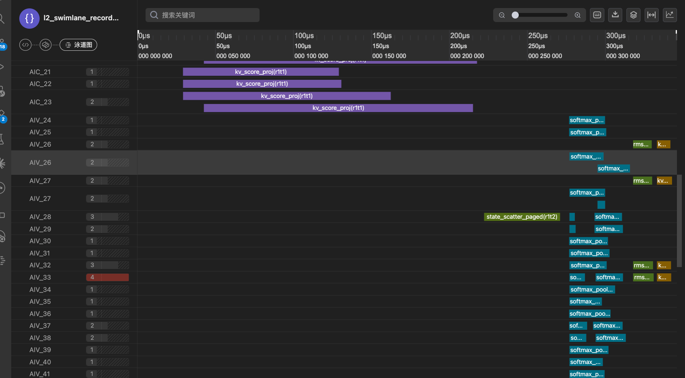，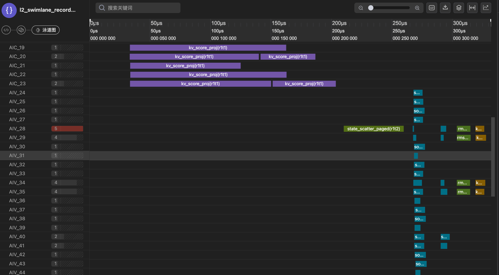
---

## 19. kv_score_proj 权重转置 + b_trans（ND2NZ→DN2ZN，−14% busy / −7% compressor wall）

> `models/deepseek/v4/decode_compressor_ratio4.py` 的 `kv_score_proj`（compressor 关键路径，~61% wall），standalone，B_TILE=64, K_TILE=512, OUT_TILE=64。
> 起因：incore op-sim 看 `kv_score_proj.clean.json`，发现它**死死 MTE2-load-bound**——MTE2 5 条子队列并集 23.58us **0 gap（100% 占满）**，CUBE 只 4.8us/23%。所有 load 都是 `MOV_OUT_TO_L1_MULTI_ND2NZ`（ND→NZ fractal 转换）。

**诊断链（关键，避免走错路）**：
1. **不是 per-lane gap 可压**：5 条 lane 平均并发 3.62/5，但并集 0 gap。想填满 lane → 加深 pipeline，但 **stage=3 实跑 `Mat buffer 576KB > 512KB` L1 溢出**，stage=2 已是极限。
2. **不是裸带宽墙**：每 load ~21GB/s/lane，远低于 HBM 天花板 → **transaction-bound**（ND2NZ 把 row-major `[K,N]` 拼 16×16 fractal 块 = 大量短 strided burst）。
3. **NZ 预打包绕不过**：cube L0B 要 NZ、GM 只能 ND；声明 `pl.Tensor[...,pl.NZ]` 输入 **codegen 静默忽略**（probe `_tmp_nz_weight_probe.py`：NZ vs ND 生成的 `.pto` 逐字节相同）。

**真正的杠杆 = `b_trans`**：weight 存成 `[OUT_DIM, D]`（转置）+ `pl.matmul(..., b_trans=True)`，把 load 从 ND2NZ 变 **DN2ZN**。

```python
# 改前（ND2NZ）：weight [D, OUT_DIM]，读 [K_TILE, OUT_TILE] → 沿 K 是 256 个 64 宽碎 burst
wkv_tile = wkv[k0 : k0 + K_TILE, o0 : o0 + OUT_TILE]
kv_acc = pl.matmul_acc(kv_acc, x_tile, wkv_tile)
# 改后（DN2ZN）：weight [OUT_DIM, D]，读 [OUT_TILE, K_TILE] → 每行 K 个连续 = 长 burst
wkv_tile = wkv[o0 : o0 + OUT_TILE, k0 : k0 + K_TILE]
kv_acc = pl.matmul_acc(kv_acc, x_tile, wkv_tile, b_trans=True)
```

fractal 转换仍在做，但 **碎 burst → 长 burst，transaction 笔数大减**。

结果（同-session A/B，**busy 为准**——span/wall 带 ~10% run 噪声）：

**standalone `decode_compressor_ratio4`**（2 跑干净，真机 a2a3，rebase 到含 #624 widen 的 main 上）：

| 指标 | ND2NZ | b_trans(DN2ZN) | 变化 |
|---|---|---|---|
| kv_score_proj busy（Σdur） | 6456us | 5479us | **−15.1%** |
| compressor 总 wall | 294.6us | 270.2us | **−8.3%** |

**完整 `decode_attention_csa` 整图**（3 跑取中位数，真机 a2a3）：

| 指标 | ND | b_trans | 变化 |
|---|---|---|---|
| kv_score_proj busy | 1299us | 912us | **−29.8%** |
| 整图 total wall | 4304us | 3750us | **−12.9%** |

> CSA 整图 wall 的绝对值 session 敏感（idle gap 撑大，不同 session 差 ~2.7×）；**单跑不可信**（曾出现 +20% 假象），3 跑中位数方向稳健（b_trans 全部低于 ND），量级 ≈ −10%（区间 −8~−15%）。standalone −8.3% 与 busy 降幅是硬数。

精度：standalone 三输出 + `decode_attention_csa` 整图（x_out / kv_cache）+ `decode_fwd` 全 PASS（a2a3 上板 CI 绿）。

> **法则**：matmul scope 若 incore 看到 `MOV_OUT_TO_L1_MULTI_ND2NZ` 且 per-lane GB/s 偏低 → 先试 `b_trans`（weight 转置存，host 端一次性免费）再下"带宽墙"结论。这**推翻**了之前"kv_score_proj levers exhausted"——有可回收的 transaction 开销，只是不在 NZ-prepack（框架 no-op）或 pipeline 深度（L1 墙）上。
>
> **全链传播（耦合坑，血泪）**：`compressor_ratio4` 被整条 decode CSA 链共享，改权重签名必须**一路传播**否则 caller OOB/编译崩：
> - `decode_compressor_ratio4`：wkv/wgate → `[OUT_DIM, D]`，matmul `b_trans=True`
> - `decode_attention_csa`：cmp_wkv/cmp_wgate → `[MAIN_OUT_DIM, D]`（含 golden/specs）
> - `decode_layer`：csa_cmp_wkv/wgate → `[.., MAIN_OUT_DIM, D]`
> - `decode_fwd`：stacked `[NUM_LAYERS*MAIN_OUT_DIM, D]`，per-layer slice 偏移改 `loop_i*MAIN_OUT_DIM`
> 不动：HCA 走 `compressor_ratio128`、inner 走 `indexer_compressor` —— 都不是 `compressor_ratio4`，**不要误改**。只漏改 decode_layer/decode_fwd 时：列越界 → 运行时 **507018**（device drain，非 shape 报错，迷惑性强）。
>
> **排查弯路（记一笔，省下次的命）**：传播后 CI 上板报 `Subscript-write shape mismatch: window expects 0, source has 128`，定位发现是 **`decode_attention_swa.py:180`（跟 b_trans 无关！）**——我的分支基于**旧 base**带旧 SWA，在**新 pypto 的严检查**下越界；新 main（#629 SWA 重写）不会。decode_fwd/decode_layer 走 SWA 才中招，compressor/CSA 不碰 SWA 所以一直绿。**修复 = rebase 到新 main**，不是改 b_trans。教训：① 报错文件名要看准（别假设是自己改的文件）；② 本地复现不出 CI 报错先查 **pypto 版本偏差**（CI 用 `ci.yml` pin 的 origin HEAD，本地可能落后；`python -c "import pypto;print(pypto.__file__)"` + `git -C <pypto> rev-list --count HEAD..origin/main`）；③ 本地编译干净 ≠ CI 干净（CI `rm -rf build_output` 全新 trace，本地有缓存）。
>
> 验证 build：standalone ND `_jit_compressor_test_20260627_115352`、b_trans `..._115315`；CSA 3 跑见 `csa_{btrans,ndbase}_x3_626.log`。PR **hw-native-sys/pypto-lib#628**（`perf/dsv4-compressor-btrans-load`，a2a3 上板 CI 绿；sim 不看护、忽略）。probe：`models/deepseek/v4/_tmp_nz_weight_probe.py`（`PROBE_NZ`/`PROBE_TRANS`）。

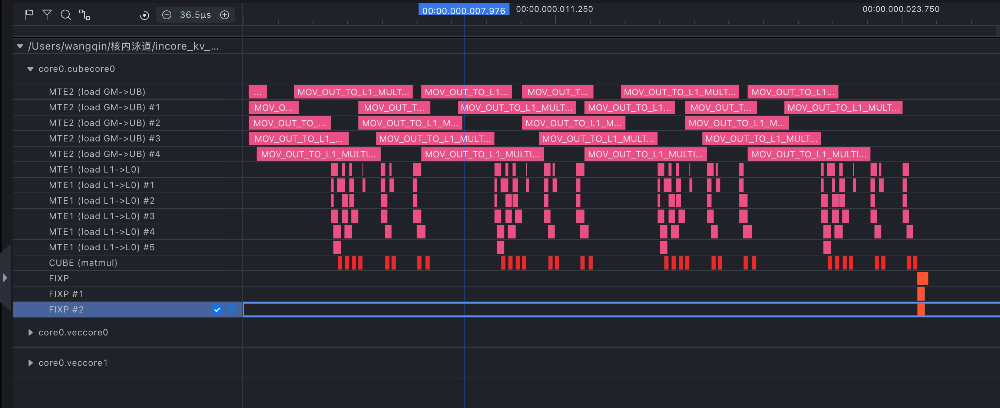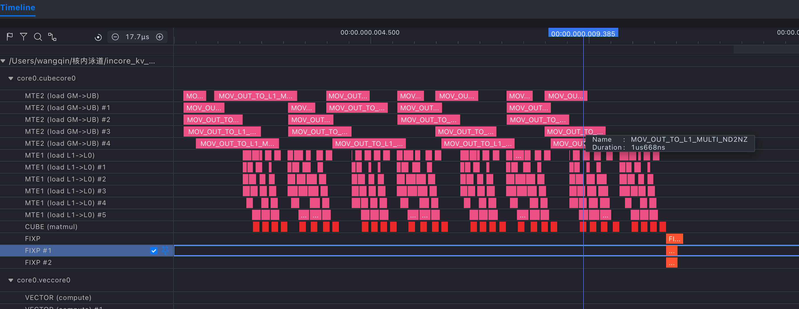


---

## 20. ratio128 softmax_pool 按块批量加载 + 列归约去转置（hca 整图 wall −8.7%）

> `models/deepseek/v4/decode_compressor_ratio128.py` 的 `softmax_pool`，B=64, HEAD_DIM=512, STATE_LEN=128, COMPRESS_STATE_BLOCK_SIZE=8（每页 8 个 state 行）, COMPRESS_STATE_DIM=1024, OUT_DIM=512, HEAD_TILE=64。
> 起因：incore op-sim 看 `softmax_pool.clean.json`，发现它 **MTE2-load-bound**——veccore span 20.58us 里 MTE2 占 69%（**256 笔 `[1,64]` 散读**，每笔 ~211ns），VECTOR 占 63% 但**绝大部分是搬运不是算**（`MOV_UB_TO_UB` 逐行 staging + `VNCHWCONV` 两次转置，真 softmax 算子 VEXP/VDIV/VCADD 合计 <1us）。
> **与 §18 的区别**：§18 是 ratio4、online-softmax 形态、且 softmax_pool **不在关键路径**（叠在 kv_score_proj 下，wall 中性）。本节是 ratio128、two-pass softmax 形态，且在 hca 整图里 softmax_pool 是**第 2 忙 scope**（9495us，>40% of qk_pv）——所以这里的优化**直接兑现成 wall**，**推翻**了 §18「softmax_pool off critical path」的假设在 ratio128/hca 上不成立。两轮叠加。

### Round 1 — 逐行散读 → 按物理块批量读

**关键观察（为什么块对齐永远成立）**：`STATE_LEN=128` 个连续 state 位置，起点 `state_pos0 = (first_pos // COMPRESS_RATIO) * COMPRESS_RATIO`，必是 `COMPRESS_RATIO=128` 的倍数 ⇒ 必是 `COMPRESS_STATE_BLOCK_SIZE=8` 的倍数。所以这个窗口**恰好覆盖 `NUM_STATE_BLOCKS = 128/8 = 16` 个完整物理块，无残头残尾**。

**改动前**（每 s 一行散读 + 逐行 staging，128 轮）

```python
for idx in pl.spmd(b_dim * HEAD_DIM // HEAD_TILE, name_hint="softmax_pool"):
    softmax_score_state = pl.create_tensor([STATE_LEN, HEAD_TILE], dtype=pl.FP32)
    softmax_kv_state    = pl.create_tensor([STATE_LEN, HEAD_TILE], dtype=pl.FP32)
    for s in pl.pipeline(STATE_LEN, stage=2):                 # 128 轮，每轮 2 个 [1,64]
        state_blk_id = ...block_table[gc, state_pos // 8]...  # 每行查一次 block table
        kv_col0 = state_intra * COMPRESS_STATE_DIM + h0
        slot_score = compress_state_flat[blk:blk+1, OUT_DIM+kv_col0 : +HEAD_TILE]  # [1,64] 散读
        slot_kv    = compress_state_flat[blk:blk+1,         kv_col0 : +HEAD_TILE]  # [1,64]
        softmax_score_state[s:s+1, :] = slot_score           # 逐行 staging（MOV_UB_TO_UB）
        softmax_kv_state[s:s+1, :]    = slot_kv
    softmax_score_state_t = pl.transpose(softmax_score_state, axis1=0, axis2=1)    # 转置 ×2
    softmax_kv_state_t    = pl.transpose(softmax_kv_state,    axis1=0, axis2=1)
    score_max  = pl.row_max(softmax_score_state_t)
    score_exp  = pl.exp(pl.row_expand_sub(softmax_score_state_t, score_max))
    score_sum  = pl.row_sum(score_exp)
    score_prob = pl.row_expand_div(score_exp, score_sum)
    pooled_chunk_t = pl.row_sum(pl.mul(softmax_kv_state_t, score_prob))
    pooled_kv[gc:gc+1, h0:h0+HEAD_TILE] = pl.reshape(pooled_chunk_t, [1, HEAD_TILE])
```

**改动后**（每块一次 `[8,64]` 跨步读，16 轮；block table 每块查一次；softmax 数学不变）

```python
compress_state_rows = pl.reshape(compress_state,
    [compress_state_block_num * COMPRESS_STATE_BLOCK_SIZE, COMPRESS_STATE_DIM])  # 每个 slot 一行
NUM_STATE_BLOCKS = STATE_LEN // COMPRESS_STATE_BLOCK_SIZE                         # 16
for idx in pl.spmd(b_dim * HEAD_DIM // HEAD_TILE, name_hint="softmax_pool"):
    ...
    base_logical_blk = state_pos0 // COMPRESS_STATE_BLOCK_SIZE                    # 窗口块对齐
    for blk_i in pl.pipeline(NUM_STATE_BLOCKS, stage=2):                          # 16 轮，每轮 2 个 [8,64]
        state_blk_id = ...block_table[gc, base_logical_blk + blk_i]...            # 每块查一次
        row0 = state_blk_id * COMPRESS_STATE_BLOCK_SIZE
        s0   = blk_i * COMPRESS_STATE_BLOCK_SIZE
        slot_score = compress_state_rows[row0:row0+8, OUT_DIM+h0 : OUT_DIM+h0+HEAD_TILE]  # [8,64] 跨步
        slot_kv    = compress_state_rows[row0:row0+8,        h0 :        h0+HEAD_TILE]    # [8,64]
        softmax_score_state[s0:s0+8, :] = slot_score                             # 整块落，无逐行 staging
        softmax_kv_state[s0:s0+8, :]    = slot_kv
    # transpose + row-reduce 段不变
```

**为什么 bit-identical**：`reshape [block,8,1024] → [block*8,1024]` 后，一个物理块的 8 个 state 行在 flat 布局里就是 8 行连续；`[8,64]` 跨步读到的元素 = 原来 8 次 `[1,64]` 散读拼起来，落进 `softmax_score_state[s0:s0+8]` 的同一批位置。纯加载粒度变化，softmax 段一字未动。设备验证 `max_error_ratio=0.0`。

**为什么变快**：MTE2 **transaction 笔数 8×↓**（256→32），且每笔从 `[1,64]`（256B 短 strided）变 `[8,64]`（更长 burst）；逐行 `MOV_UB_TO_UB` staging 消失（整块直接落 UB）。incore（a2a3 op-sim 单 task，position_ids 喂 127 激活 gate）：

| 指标 | 改前（逐行） | 改后（块读） | 变化 |
|---|---|---|---|
| MTE2 cycles（跨核求和） | 450249 | 43474 | **−90.3%** |
| MTE2 load 笔数 | 256 | 32 | **8× 更少** |
| VECTOR cycles | 473236 | 91948 | **−80.6%**（staging 消失） |
| veccore0 span | 20.58us | 7.73us | **−62.4%** |

### Round 2 — 列归约去转置 → HEAD_TILE 加宽 64→128

转置（`VNCHWCONV` 1.05us）存在的唯一原因是 `row_max/row_sum` 只沿**最后一维**归约，而 softmax 要沿 **state 轴**归约。改用**列归约**（沿行/axis-0 归约）就不需要转置。转置一去，UB 省出来 → `POOL_HEAD_TILE` 可加宽到 128，每块加载冗余从 8×（HEAD_DIM/64）降到 4×（HEAD_DIM/128）。

**改动后**（独立常量 `POOL_HEAD_TILE=128`，保留 HEAD_TILE=64 给 rmsnorm_rope）

```python
POOL_HEAD_TILE = 128                                          # 4 个 head-tile/batch（原 8）
for idx in pl.spmd(b_dim * HEAD_DIM // POOL_HEAD_TILE, ...):  # 任务数 512→256
    softmax_score_state = pl.create_tensor([STATE_LEN, POOL_HEAD_TILE], ...)  # [128,128]
    softmax_kv_state    = pl.create_tensor([STATE_LEN, POOL_HEAD_TILE], ...)
    ...  # 块读同 R1，宽度换成 POOL_HEAD_TILE
    # 沿 state 轴（行）直接列归约，去掉两次 transpose：
    score_max  = pl.col_max(softmax_score_state)                       # [1,128]，沿行求 max
    score_exp  = pl.col_expand_expdif(softmax_score_state, score_max)  # 融合 exp(x - col_max)
    score_sum  = pl.col_sum(score_exp)                                 # [1,128]
    score_prob = pl.col_expand_mul(score_exp, pl.recip(score_sum))     # /sum = ×recip(sum)
    pooled_chunk = pl.col_sum(pl.mul(softmax_kv_state, score_prob))    # [1,128]，已是目标形状
    pooled_kv[gc:gc+1, h0:h0+POOL_HEAD_TILE] = pooled_chunk            # 无需 reshape
```

> **坑——`col_expand_sub` / `col_expand_div` 没有 codegen**：Python API 里有，但 `tile.col_expand_sub` 报 `No codegen registered`。能用的列广播只有 `col_expand_mul`（codebase 64 处验证过）。绕法：① 减 max 用 **`col_expand_expdif`**（融合算 `exp(x - col_vec)`，正好是 stable-softmax 的 exp，省一步且避开 sub）；② 除 sum 用 **`col_expand_mul(x, recip(sum))`**。两者都 bit-identical PASS。

**为什么 bit-identical**：列归约沿 state 轴、逐 head-dim 列独立，归约的是同一批 128 个 state 值、同样顺序 ⇒ 结果与「转置后 row 归约」逐元素一致。HEAD_TILE 加宽只是切片更宽。`max_error_ratio=0.0`。

**代价（诚实记一笔）**：列归约比「转置 + 行归约」更吃 vector——per-task VECTOR 4.85→13.46us，kernel 从 MTE2-bound 变 **VECTOR-bound**（span 由 VECTOR 主导）。但因为同时砍掉转置 + head 数翻倍（每 task 干 2× 的 head、任务数减半），**净 per-batch core-time −30%**（incore 61.8→43.3us/batch）。`POOL_HEAD_TILE=256` 装不下（`3×[128,256] FP32 > 192KB` UB），128 是上限。

### 整图结果（decode_attention_hca，真机 a2a3，3 跑，**噪声受控**）

整图全程 bit-identical（`x_out` / `kv_cache` 容差内 PASS）。wall 从 `l2_swimlane_records.json` 重建（这几次 swimlane 的 Latency/Total 列没采到=0，需 `runtime_debug_mode=1`+`DUMP_DEVICE_PERF`；wall = `max(finish)−min(dispatch)`，`field[1]`=func key 偏移 2^32，tick@50MHz）。

| 版本 | 整图 wall | softmax_pool core-time | qk_pv（无关 scope，判噪声） |
|---|---|---|---|
| 原始（逐行 + 转置） | 1303.6us | 9495us（**第 2 忙**, avg18.54, n512） | 22301us |
| R1 块读 HT64 | 1276.2us | 3203us（avg6.26, n512） | **19754us**（这次跑得偏快） |
| **R2 块读 + 列归约 HT128** | **1190.1us** | **2792us**（avg10.91, n256, **−71%**） | 21918us（≈原始） |
| **Δ（R2 vs 原始）** | **−113.5us (−8.7%)** | **−71%** | matched ⇒ 非噪声 |

> **法则——wall A/B 必须用「匹配的无关 scope」判噪声**：这次差点被骗。R1 单看 wall 1276 比原始 1304 只降 27us，且 R1 那次 `qk_pv`（跟 softmax_pool 完全无关）跑出 19754us，比正常的 ~22000 低了 2500us——**R1 的 wall 收益大半是那次 session 的 qk_pv 偶然跑得快，不是我的改动**。正确做法：拿原始 vs R2 比，因为两者 `qk_pv` 几乎一致（22301 vs 21918），**−114us wall 才是真实归因**。其它无关 scope（state_scatter / off3 / off12 等）三跑稳定在 ~1-2% 内，也佐证 R2 这次不是「快 session」。**单跑 wall 不可信，且不能只看自己改的 scope——锚一个不该变的大 scope。**

> **法则——按块批量加载是 paged-pool MTE2-bound 的标准杠杆**：分页 KV/state 池的 pooling，若窗口块对齐（起点是 block_size 倍数），就把「逐行 `[1,N]` 散读」换成「逐块 `[block_size, N]` 跨步读」——transaction 笔数 ÷block_size、burst 变长、省掉逐行 staging。比改算法便宜得多。

> **incore profiling 踩坑（数据依赖 kernel 会假装很快）**：softmax_pool 有 gate `position_ids % 128 >= 128-S`（S=2 ⇒ 需 ≥126），auto-golden 把 `position_ids` 清零 ⇒ gate 不进、跑 0 轮 ⇒ 退化 trace（skill 报 `degenerate trace`）。修法：在生成的 case 里把 `v1.bin`（position_ids）写成 127，手动重跑 `msprof op simulator`（见 incore-profiling skill 的 Caveats）。per-instruction cost 与数据无关，只需让控制张量真实。

精度：standalone `decode_compressor_ratio128`（kv / compress_state / cmp_kv_cache）+ `decode_attention_hca` 整图（x_out / kv_cache）全 PASS，两轮均 `max_error_ratio=0.0`。

> 验证 build：原始 `_jit_attention_hca_test_20260629_150217`、R1 `..._161532`、R2 `..._165013`（`dfx_outputs/l2_swimlane_records.json`）；incore `build_output/incore_softmax_pool_ratio128_blockload_20260629`（R1）、`..._colreduce_ht128_20260629`（R2，含 `summary.txt` 记录复现条件）。PR **hw-native-sys/pypto-lib#641**（`perf/dsv4-compressor-softmax-pool-blockload`，基于 main，不依赖在途的 #628 b_trans 分支——改的是不同行）。


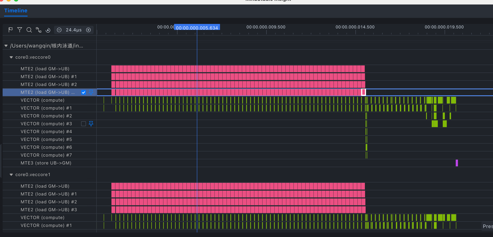
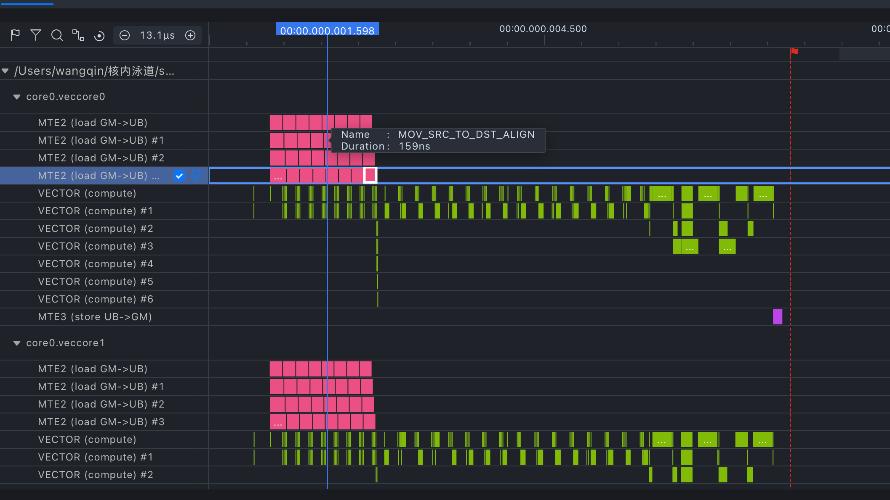
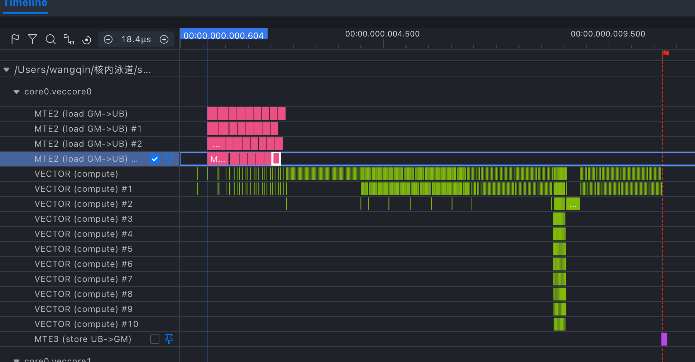
三次的泳道图对比：
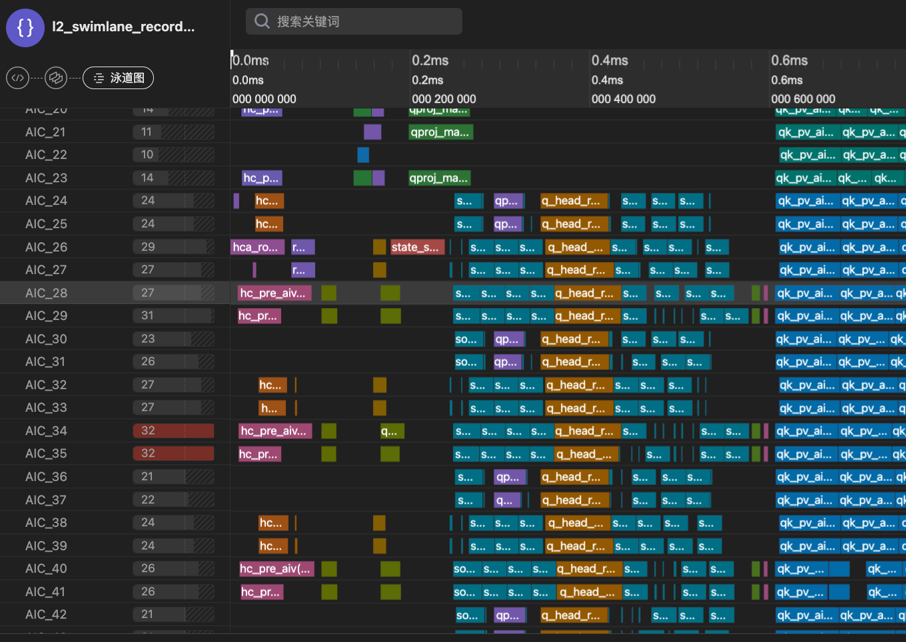
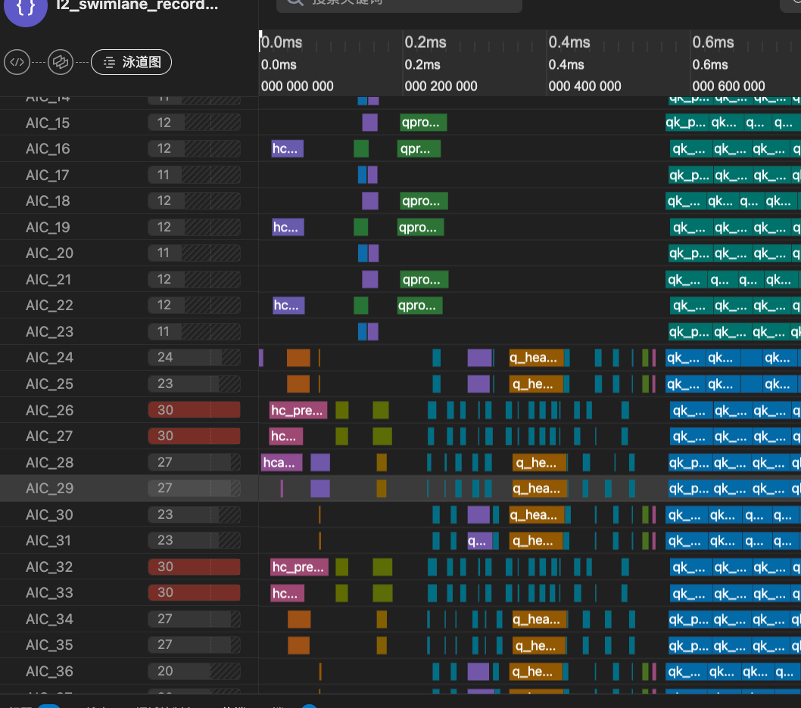，
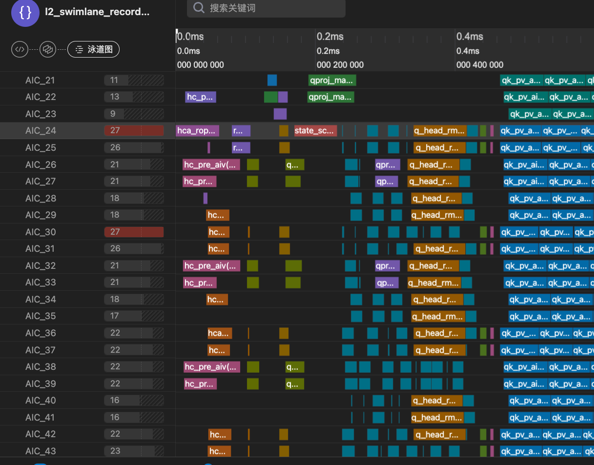