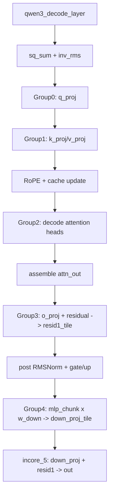
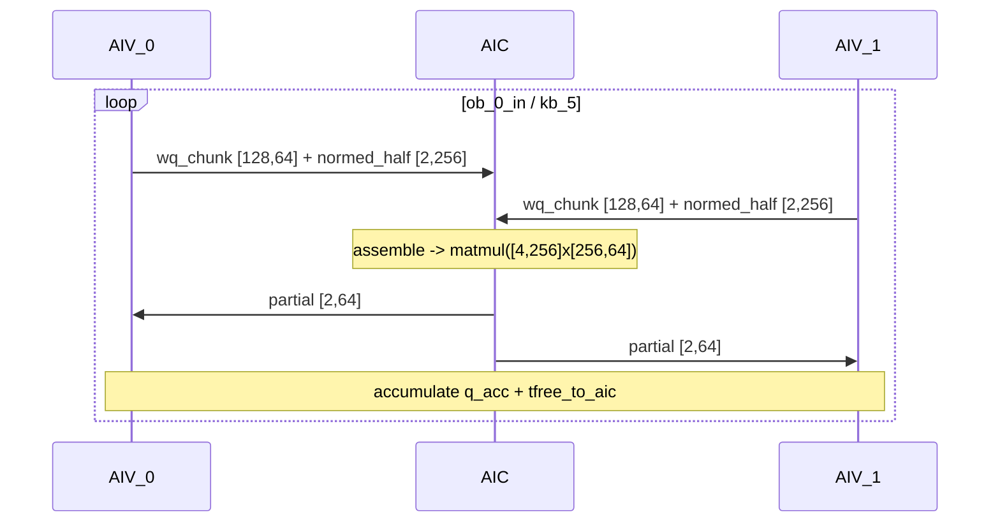
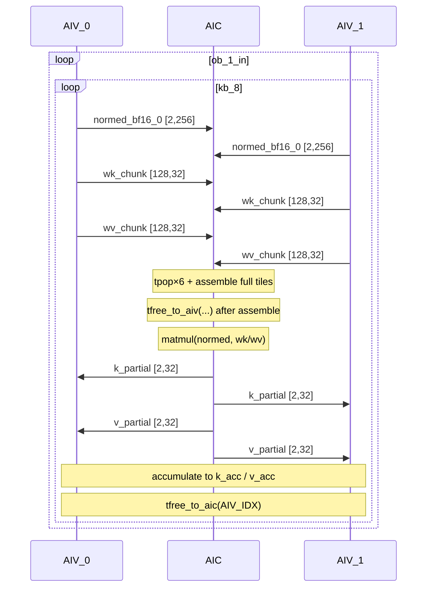
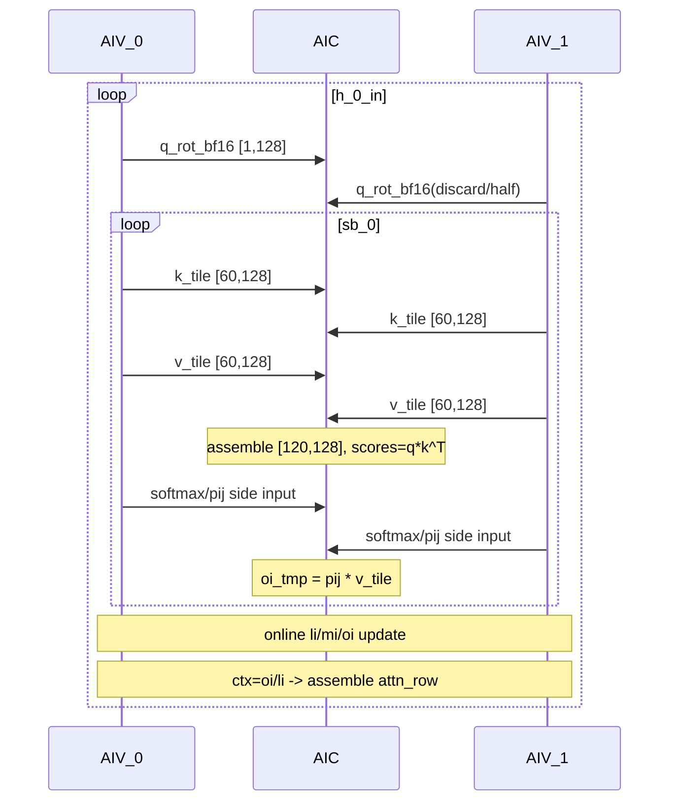
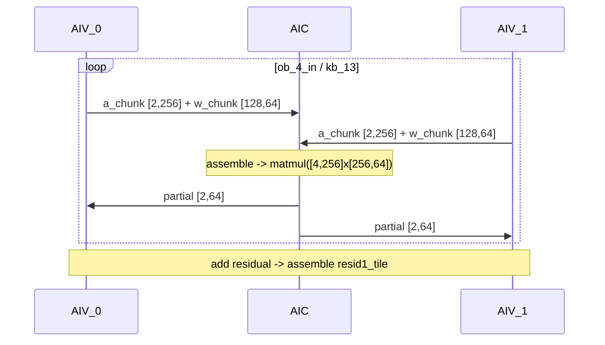
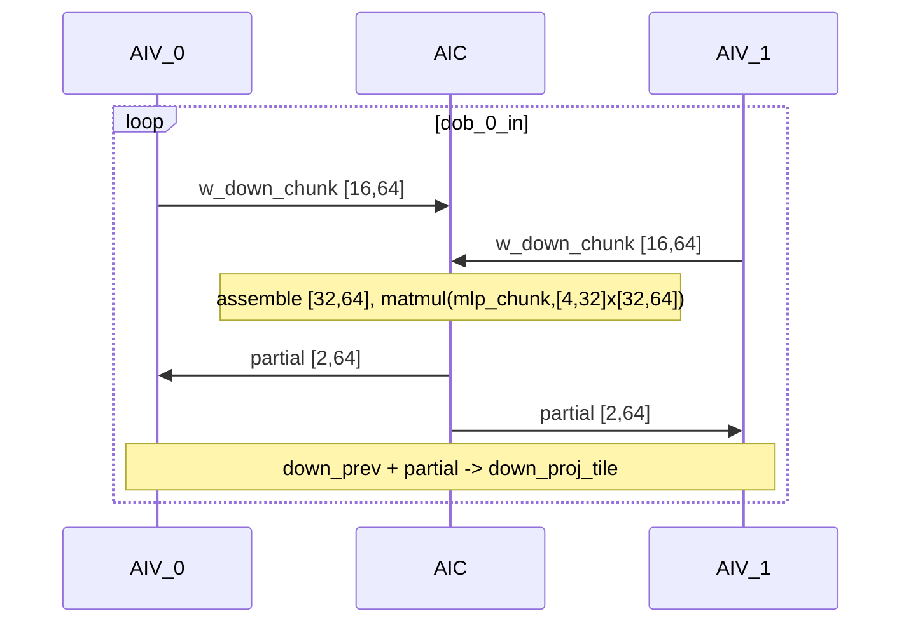

# Qwen3 Decode Kernel Flow Analysis (Pass 08: ExpandMixedKernel)

## Overview

`08_after_ExpandMixedKernel.py` 将 Qwen3 decode 中的 mixed InCore 逻辑拆分为 `AIC + AIV` 协同执行的 function_group。  
和 `pa4` 一样，通信基于 `tpush / tpop / tfree` 三段式协议：

1. `tpush_*`：生产者写入 ring buffer slot  
2. `tpop_*`：消费者读取并持有 slot  
3. `tfree_*`：消费者释放 slot

本版本（当前 pass 8）共包含 5 个 mixed group：

| Group | Kernel | 角色 | 主要职责 |
|------|------|------|------|
| `incore_0_group` | `incore_0_aic` + `incore_0_aiv` | Q 投影 | `normed x wq -> q_proj` |
| `incore_1_group` | `incore_1_aic` + `incore_1_aiv` | KV 投影 | `normed x wk/wv -> k_proj/v_proj` |
| `incore_2_group` | `incore_2_aic` + `incore_2_aiv` | Decode attention | RoPE + `QK^T` + softmax + `PV`（online 累积） |
| `incore_3_group` | `incore_3_aic` + `incore_3_aiv` | O 投影+残差 | `attn_out x wo + residual` |
| `incore_4_group` | `incore_4_aic` + `incore_4_aiv` | MLP down 投影 | `mlp_chunk x w_down` 并回写 `down_proj_tile` |

另有 `incore_5` 为单 kernel（非 mixed）：最终 `down_proj + resid1 -> out`。

---

## Top-Level Flow (Orchestration)



---

## Side-by-Side Mixed Kernel Pattern

下图给出 pass 8 中 mixed group 的通用执行骨架（`incore_0/1/3/4` 都符合这个模式）：

```
   AIV_0 (Vector 0)            │         AIC (Cube)             │   AIV_1 (Vector 1)
════════════════════════════════╪════════════════════════════════╪══════════════════════════════
 aiv_initialize_pipe()          │ aic_initialize_pipe()          │ aiv_initialize_pipe()
 for outer_in in parallel(...)  │ for outer_in in parallel(...)  │ for outer_in in parallel(...)
   for kb in range(...)         │   for kb in range(...)         │   for kb in range(...)
     view/cast split-half       │     tpop_from_aiv(0/1)         │     view/cast split-half
     tpush_to_aic(..., IDX) ───▶│     assemble full tile         │◀─── tpush_to_aic(..., IDX)
                                │     tfree_to_aiv(0/1)
                                │     matmul(full, full)
                                │     split view half0/half1
     tpop_from_aic(IDX) ◀───────│──── tpush_to_aiv(half0/half1) ─│───────▶ tpop_from_aic(IDX)
     consume + accumulate       │                                 │ consume + accumulate
     tfree_to_aic(IDX)          │                                 │ tfree_to_aic(IDX)
```

---

## Communication Summary by Group

### Group 0 (`qwen3_decode_layer_incore_0_group`)

| COMM | Direction | Tensor | AIV shape | AIC shape | 说明 |
|---|---|---|---|---|---|
| G0-C1 | AIV→AIC | `wq_chunk_0` | `[128, 64]` BF16 | `[256, 64]` BF16 | 两个半块拼成 full K tile |
| G0-C2 | AIV→AIC | `_t6` (normed BF16) | `[2, 256]`/half | `[4, 256]` BF16 | 输入激活半块拼接 |
| G0-C3 | AIC→AIV | matmul partial | `[2, 64]` BF16 | `[4, 64]` BF16 | AIV 接回 partial 并累加到 `q_acc` |

### Group 1 (`qwen3_decode_layer_incore_1_group`)

| COMM | Direction | Tensor | AIV shape | AIC shape | 说明 |
|---|---|---|---|---|---|
| G1-C1 | AIV→AIC | `normed_bf16_0` | `[2,256]`/half | `[4,256]` BF16 | split 激活 |
| G1-C2 | AIV→AIC | `wk_chunk_0` | `[128,32]` | `[256,32]` BF16 | K 权重分半拼接 |
| G1-C3 | AIV→AIC | `wv_chunk_0` | `[128,32]` | `[256,32]` BF16 | V 权重分半拼接 |
| G1-C4 | AIC→AIV | K partial | `[2,32]` BF16 | `[4,32]` BF16 | 写回 `k_acc` |
| G1-C5 | AIC→AIV | V partial | `[2,32]` BF16 | `[4,32]` BF16 | 写回 `v_acc` |

### Group 2 (`qwen3_decode_layer_incore_2_group`)

| COMM | Direction | Tensor | AIV shape | AIC shape | 说明 |
|---|---|---|---|---|---|
| G2-C1 | AIV→AIC | `q_rot_bf16_0` | `[1,128]` | `[1,128]` | query RoPE 结果送入 AIC |
| G2-C2 | AIV→AIC | `k_tile_0` | `[60,128]` | `[120,128]` | KV cache tile 分半拼接 |
| G2-C3 | AIV→AIC | `v_tile_0` | `[60,128]` | `[120,128]` | KV cache tile 分半拼接 |
| G2-C4 | AIV→AIC | softmax 侧输入 `_t34` | (由 AIV 生成) | `[1,120]` BF16 | AIC 消费 softmax 输出参与 `PV` |

> 注：pass 8 的 attention 子图在该 dump 中是“展开中间态”，控制流与部分中间变量命名较粗糙（例如 `if/else` 片段与 `_t34`）。但 ring-buffer 通信方向和 tile 粒度可直接读出。

### Group 3 (`qwen3_decode_layer_incore_3_group`)

| COMM | Direction | Tensor | AIV shape | AIC shape | 说明 |
|---|---|---|---|---|---|
| G3-C1 | AIV→AIC | `a_chunk_0` | `[2,256]` BF16 | `[4,256]` BF16 | `attn_out` 分半 |
| G3-C2 | AIV→AIC | `w_chunk_0` | `[128,64]` BF16 | `[256,64]` BF16 | `wo` 分半 |
| G3-C3 | AIC→AIV | matmul partial | `[2,64]` BF16 | `[4,64]` BF16 | AIV 累加后与 residual 相加 |

### Group 4 (`qwen3_decode_layer_incore_4_group`)

| COMM | Direction | Tensor | AIV shape | AIC shape | 说明 |
|---|---|---|---|---|---|
| G4-C1 | AIV→AIC | `w_down_chunk_0` | `[16,64]` BF16 | `[32,64]` BF16 | `w_down` 分半 |
| G4-C2 | AIC→AIV | matmul partial | `[2,64]` BF16 | `[4,64]` BF16 | AIV 与 `down_prev` 累加 |

---

## Mermaid Sequence (All Groups)

### Group 0 (`qwen3_decode_layer_incore_0_group`)



### Group 1 (`qwen3_decode_layer_incore_1_group`)



### Group 2 (`qwen3_decode_layer_incore_2_group`)



### Group 3 (`qwen3_decode_layer_incore_3_group`)



### Group 4 (`qwen3_decode_layer_incore_4_group`)



### InCore 5 (`qwen3_decode_layer_incore_5`, non-mixed)

```mermaid
flowchart LR
    A[down_proj_tile view [4,64]]
    B[resid1_tile view [4,64]]
    C[add]
    D[cast BF16]
    E[assemble to out[b0,*]]
    A --> C
    B --> C
    C --> D --> E
```

---

## Key Observations

1. **统一 split 轴策略**：mixed group 基本都在 batch/head 的第 0 维做 2-way split（AIV0/AIV1 各处理一半），AIC 侧拼回 full tile 做 matmul。  
2. **AIC 专注 GEMM，AIV 专注切片/累加**：AIV 负责 view/cast/partial accumulate，AIC 负责高密度矩阵运算。  
3. **slot 生命周期可控**：在 `incore_0/1/3/4` 中，`tfree_to_aiv` 紧跟 assemble；`tfree_to_aic` 紧跟 partial consume，典型 hold 时长较短。  
4. **attention group（incore_2）最复杂**：同时包含 RoPE、KV tile 流、softmax/PV 的跨核数据依赖，是后续性能与 SRAM 调优的优先分析点。

---

## Source

- Pass dump: `examples/qwen3_32b_dump/passes_dump/08_after_ExpandMixedKernel.py`
- Format reference: `pypto/docs/pa4_kernel_flow_analysis.md`
