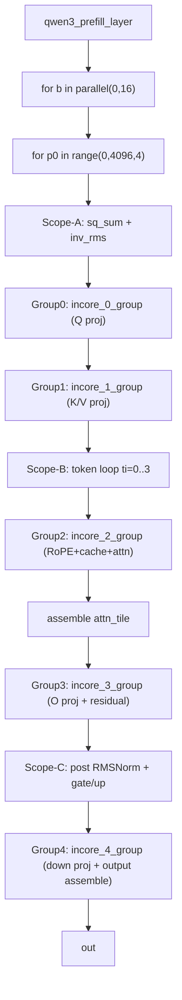
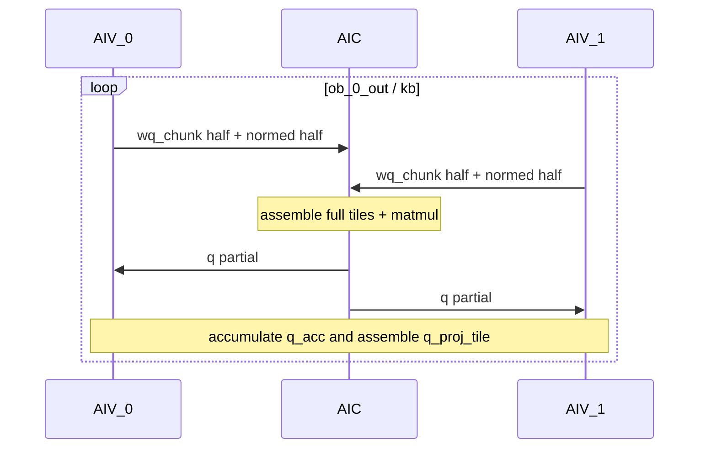
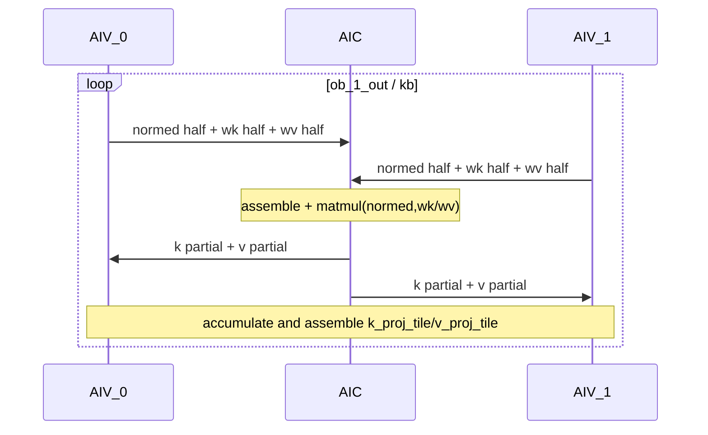
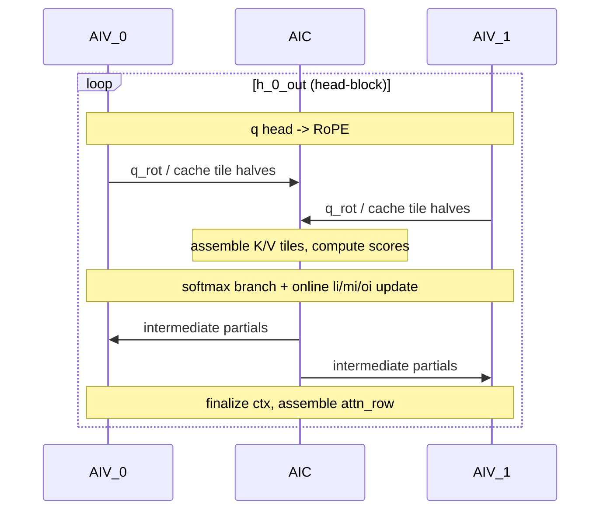
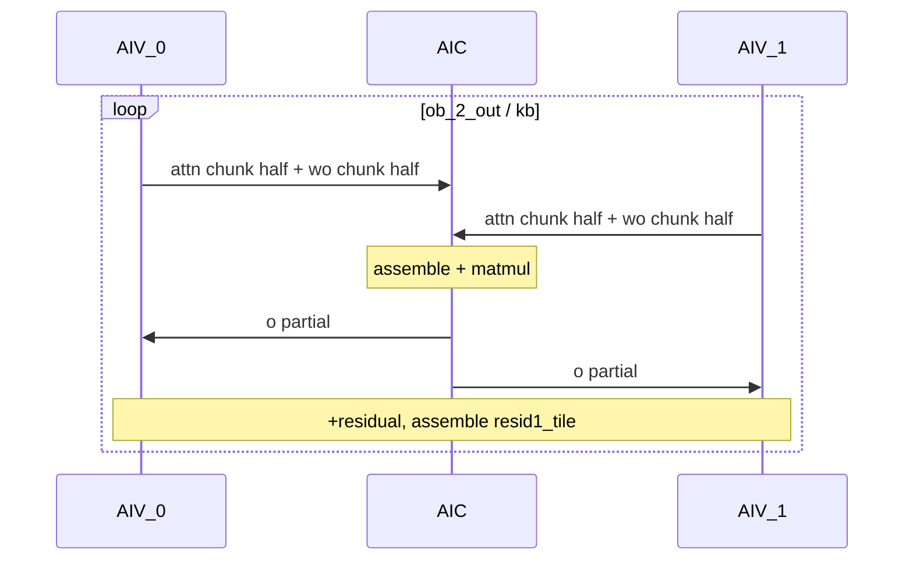
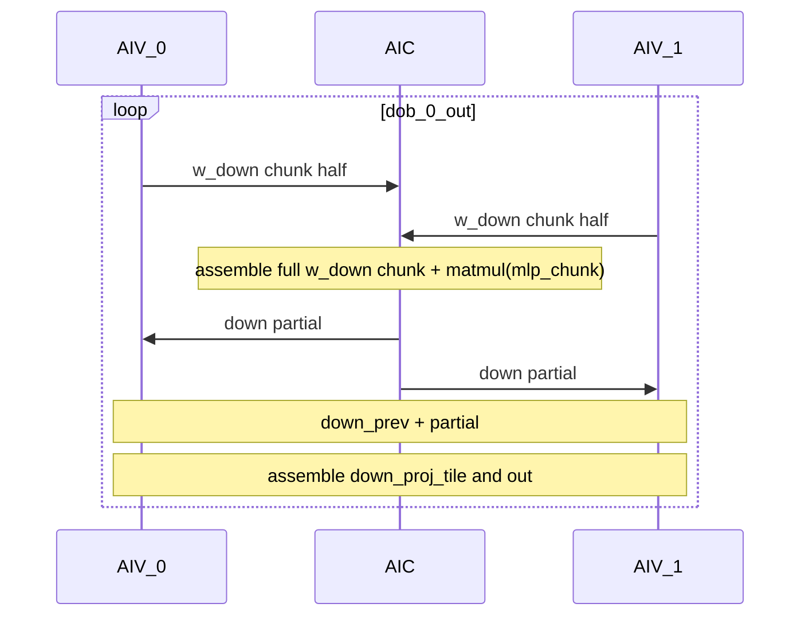

# Qwen3-32B Prefill Kernel Flow Analysis (Pass 08)

基于 `passes_dump/08_after_ExpandMixedKernel.py`，当前 prefill 已展开为 5 个 mixed kernel group：

- `qwen3_prefill_layer_incore_0_group` (AIC+AIV): Q projection
- `qwen3_prefill_layer_incore_1_group` (AIC+AIV): K/V projection
- `qwen3_prefill_layer_incore_2_group` (AIC+AIV): RoPE + cache update + attention core
- `qwen3_prefill_layer_incore_3_group` (AIC+AIV): O projection + residual
- `qwen3_prefill_layer_incore_4_group` (AIC+AIV): MLP down + final residual/writeback

---

## 1) Top-Level Flow (Orchestration)

---

## 2) Group-by-Group Flow Charts

### Group 0: `qwen3_prefill_layer_incore_0_group`

### Group 1: `qwen3_prefill_layer_incore_1_group`

### Group 2: `qwen3_prefill_layer_incore_2_group`

### Group 3: `qwen3_prefill_layer_incore_3_group`

### Group 4: `qwen3_prefill_layer_incore_4_group`

---

## 3) Notes

- 当前 pass 8 结果下，原先特别小的 solo kernel 已被并入 mixed group，不再单独存在。
- 从执行路径看，`incore_2_group` 仍是最复杂链路（RoPE、cache、attention、online 更新交织），是后续性能调优优先点。
- `incore_4_group` 已显著放大（AIC/AIV 均提升），并承担最终输出写回路径。
